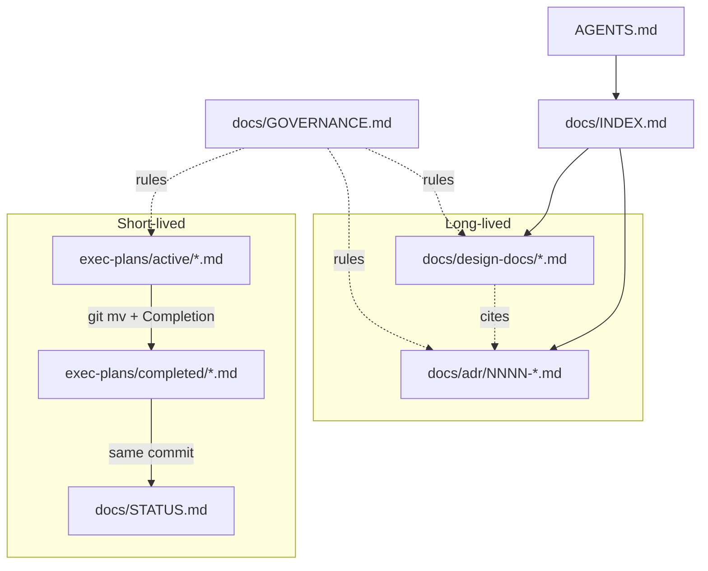

# SlotRogue — 문서 구조 지도

> **대상**: 새 기여자, 리뷰어, AI 에이전트.
> **목적**: 문서가 *어디에* 있고, *각 아티팩트 타입이 무엇을 위한 것이며*, *서로 어떻게 관련되는지* 설명한다 — 프로젝트 상태나 결정 본문은 중복하지 않는다.
> **이 문서가 다루지 않는 것**: 현재 마일스톤·진행 작업·ADR 본문 → [`docs/STATUS.md`](docs/STATUS.md) 와 [`docs/adr/INDEX.md`](docs/adr/INDEX.md) 참조.

---

## 언어

| 위치 | 언어 |
|------|------|
| 모든 문서 (`AGENTS.md`, `DOCS-STRUCTURE.md`, `docs/`, `references/`) | **한국어** |
| 코드 / 주석 / 식별자 / 파일명 | **영어** |

기술 용어는 원문 유지 (Addressables, ScriptableObject, asmdef, UniTask, DOTween 등).

---

## 저장소 문서 레이아웃

```
SlotRogue/
├── AGENTS.md                 # 에이전트/사람 진입점: 규칙, ADR 인덱스, 거버넌스 요약
├── DOCS-STRUCTURE.md         # ← 이 파일 — 구조 지도 (메타, 상태 아님)
├── .editorconfig             # C# 포매팅 권위 (Allman / var 정책 / 네이밍)
├── .git-blame-ignore-revs    # format-only 커밋 skip 목록
│
├── docs/
│   ├── INDEX.md              # 허브: 카테고리, 읽기 순서, 컨벤션
│   ├── GOVERNANCE.md         # 허브: 각 아티팩트 타입 작성·갱신 규칙 (+ 팀 규칙 A~G)
│   ├── STATUS.md             # 살아있는 보드: 포커스, 주차 마일스톤, active/completed plan
│   │
│   ├── adr/                  # 결정 (파일당 결정 1건, append-only 번호)
│   │   ├── INDEX.md
│   │   ├── TEMPLATE.md
│   │   └── NNNN-kebab-case-title.md
│   │
│   ├── design-docs/          # 시스템 narrative (ADR 인용, ADR을 대체 X)
│   │   └── INDEX.md          # 기획 문서 확정 후 시스템별 doc 추가
│   │
│   ├── exec-plans/
│   │   ├── active/           # 진행 중 체크리스트 (비어있을 수 있음)
│   │   └── completed/        # 완료된 plan (Completion 섹션 채워 보관)
│   │
│   └── guides/               # 운영 how-to (Unity 셋업, 코딩 스타일 등)
│       └── *.md
│
└── references/
    └── INDEX.md              # 외부 자료 — 포인터만, 사본 박제 금지
```

**문서로 취급하지 않을 경로** (검색·grep에서 배제):

- Unity 자동 생성: `Library/`, `Temp/`, `Logs/`, `obj/`, `Build/`, `Builds/`, `UserSettings/`, `MemoryCaptures/`
- IDE: `.vs/`, `.idea/`, `.vscode/`, `*.csproj`, `*.sln`
- 외부/벤더: `Assets/Plugins/` 하위 third-party
- 바이너리: `*.unitypackage`, `*.apk`, `*.aab`, 큰 이미지/오디오/모델

---

## 4가지 아티팩트 타입 (핵심 모델)

자명하지 않은 모든 변경은 **paper-trail**을 남긴다. 네 종류의 파일이 서로 다른 질문에 답한다:

| 아티팩트 | 답하는 질문 | 수명 | 위치 |
|----------|-------------|------|------|
| **ADR** | *무엇*을 *왜* 결정했나? (결정 1건/파일) | 길다 — append-only, supersede만 허용 | `docs/adr/` |
| **design-doc** | 시스템이 *어떻게* 맞물려 돌아가나? (narrative, ADR 인용) | 길다 — 시스템 진화에 맞춰 갱신 | `docs/design-docs/` |
| **exec-plan** | 구현이 *지금 어디까지* 왔나? (체크리스트) | 짧다 — 작업 끝나면 completed/로 | `docs/exec-plans/active/` → `completed/` |
| **STATUS.md** | 프로젝트가 *지금* 뭘 하고 있나? | 항상 최신 | `docs/STATUS.md` |



**코드**는 *무엇*이 구현되었는지 답한다. **문서**는 *왜*, *어떻게*, *진행*을 답한다.

---

## 허브 문서 (먼저 읽을 것)

| 파일 | 역할 |
|------|------|
| [`AGENTS.md`](AGENTS.md) | 에이전트 자동 로드 가이드: 언어 규칙, 코딩 절대 규칙, ADR 인덱스, 거버넌스 요약 |
| [`docs/INDEX.md`](docs/INDEX.md) | `docs/` 정식 진입점 — 카테고리, 기여자 읽기 순서 |
| [`docs/GOVERNANCE.md`](docs/GOVERNANCE.md) | 전체 규칙: 각 아티팩트 작성/갱신 시점, 네이밍, 날짜, 팀 규칙, 안티패턴 |
| [`DOCS-STRUCTURE.md`](DOCS-STRUCTURE.md) | 구조 지도 (이 파일) — 상태에 손대지 않고 안전하게 읽을 수 있음 |

**허브 문서**(`AGENTS.md`, `docs/INDEX.md`, `docs/GOVERNANCE.md`)를 편집할 땐, 해당 문서를 인용하는 inbound 링크를 repo 전체에 grep하고 **같은 변경 안에서** 갱신할 것. 안정된 앵커(파일 경로 + 섹션 제목) 우선, 깨지기 쉬운 숫자 섹션 ID 회피.

---

## `docs/adr/` — Architecture Decision Records

- **결정 1건/파일**: `NNNN-kebab-case-title.md` (zero-pad 4자리).
- **번호는 append-only** — renumber, reuse, delete 금지.
- **Supersede, 재작성 금지**: 본질이 바뀌면 새 ADR. 옛 ADR은 `Status: superseded`, `Superseded by: ADR-XXXX`.
- **템플릿**: [`docs/adr/TEMPLATE.md`](docs/adr/TEMPLATE.md) — Context, Decision, Alternatives (1개 이상 권장), Consequences.
- **INDEX**: [`docs/adr/INDEX.md`](docs/adr/INDEX.md) — 새 ADR 또는 status 변경과 같은 커밋에 갱신.

**ADR vs design-doc**: 구속력 있는 결정 본문은 ADR에. design-doc은 navigation용 한 줄 요약(`ADR-0001 — 슬롯 RNG는 결정론적 시드 기반`)은 허용하나 rationale 전체 재서술 금지.

**ADR을 쓸 시점**: 거절된 대안이 1개 이상 있는 단일 선언적 결정 (추상화 수준, 경계 계약, 소유권 모델, 글로벌 정책).

---

## `docs/design-docs/` — 시스템 narrative

**현재 상태**: 기획 문서 확정 후 작성. [`docs/design-docs/INDEX.md`](docs/design-docs/INDEX.md)에 후보 목록만 두었다.

각 파일은 다음 헤더로 시작:

```markdown
# <Title>
**Status**: draft | accepted | superseded
**Last updated**: YYYY-MM-DD
## Purpose
...
```

큰 접근 변경: 옛 doc을 `superseded`로 마크하고 앞으로 링크 — 조용한 재작성 금지.

**작성 시점**: 새 서브시스템의 자명하지 않은 구현 전, 또는 아키텍처 변경 시.

---

## `docs/exec-plans/` — 구현 진행

| 디렉터리 | 의미 |
|----------|------|
| `active/` | 진행 중 — 작업 단위당 `.md` 1개, 체크리스트는 항상 최신 |
| `completed/` | 완료 — `Completion` 섹션을 채워 옮긴 파일 |

**네이밍**: `feature-<short-name>.md` (예: `feature-spin-core.md`, `feature-meta-map.md`, `feature-shop.md`).

**섹션**: Goal → Checklist → Notes → Completion (Completion은 `completed/`로 이동 시에만 채움).

**Completion 워크플로** (같은 커밋):

1. `Completion` 채우기 (Finished date, Outcome, Follow-ups).
2. `git mv docs/exec-plans/active/<file>.md docs/exec-plans/completed/<file>.md`.
3. [`docs/STATUS.md`](docs/STATUS.md) 갱신 (active 목록, recently completed, 필요 시 focus).

`active/`에 `README.md`만 있는 상태도 정상이다 (진행 중인 plan이 없다는 뜻).

---

## `docs/guides/` — 운영 how-to

시스템 narrative도 exec-plan도 아닌 실용 절차:

| 가이드 | 토픽 |
|--------|------|
| [`unity-setup.md`](docs/guides/unity-setup.md) | Unity 버전, 패키지(Addressables/UniTask/DOTween), 프로젝트 설정 체크리스트, asmdef 분할 |
| [`coding-style.md`](docs/guides/coding-style.md) | C#/Unity 네이밍, MonoBehaviour 패턴, 비동기, 트윈, 로깅 |

**필요해지면 추가**: `mobile-build.md`, `unity-profiling.md`, `addressables-workflow.md`, `package-setup.md` 등.

가이드 갱신은 실제 관행 변경과 **같은 커밋**에.

---

## `docs/STATUS.md` — 프로젝트 보드

단일 살아있는 스냅샷: 마지막 갱신 날짜, 현재 포커스, 주차 마일스톤(체크박스), active exec-plans, recently completed, 블로커, 테스팅 단계.

- **필수 갱신**: exec-plan이 `completed/`로 이동할 때.
- **권장**: 새 active plan 생성, 새 블로커, 테스팅 단계 변경.
- ADR 또는 design-doc의 대체로 사용 금지.

---

## `references/` — 외부 자료 인덱스

[`references/INDEX.md`](references/INDEX.md)는 외부 자료(Unity 매뉴얼 섹션, 게임 디자인 자료, SDK 문서)에 *언제 참조하는지*를 적는다 — 사본을 박제하지 않는다.

**규칙**:

1. 외부 자료를 손대기 전 `references/INDEX.md`부터 읽는다.
2. 외부 repo는 grep으로 좁힌 뒤 필요한 부분만. 벤더 트리를 문서로 통째로 읽지 않는다.
3. `AGENTS.md` §4의 제외 경로 규칙을 동일하게 적용.

---

## 권장 읽기 순서

### 사람 또는 에이전트 — 첫 세션

1. [`AGENTS.md`](AGENTS.md) — 규칙과 결정 인덱스
2. [`DOCS-STRUCTURE.md`](DOCS-STRUCTURE.md) — 이 지도 (선택, `AGENTS.md`로 충분하면 skip)
3. [`docs/INDEX.md`](docs/INDEX.md) — 문서 카테고리
4. [`docs/GOVERNANCE.md`](docs/GOVERNANCE.md) — 작업 중 문서 유지 방법
5. [`docs/STATUS.md`](docs/STATUS.md) — *현재 포커스가 필요할 때만*

### 특정 시스템을 변경하기 전

1. 관련 `docs/design-docs/<system>.md`
2. 거기서 인용된 ADR → `docs/adr/NNNN-*.md`
3. 해당 영역을 건드리는 `docs/exec-plans/active/` plan
4. 빌드/디버그/셋업이 얽히면 `docs/guides/`

### 새로운 것을 구현하기 전

1. 결정 미정? → ADR (필요 시 design-doc) **먼저**
2. 다중 세션 작업? → `docs/exec-plans/active/feature-<name>.md`
3. 그 다음 코드. 체크리스트와 Notes를 작업과 같이 갱신.

---

## 컨벤션 (빠른 참조)

| 토픽 | 규칙 |
|------|------|
| 파일명 | `kebab-case.md` |
| 날짜 | 절대 표기 `YYYY-MM-DD` — "어제" / "지난주" 금지 |
| 상호 참조 | `docs/adr/NNNN-title.md` 또는 섹션 제목. 채팅 코드(`C-2`, `B-4-①`) 박제 금지 |
| ADR status | `proposed` \| `accepted` \| `superseded` \| `rejected` |
| design-doc status | `draft` \| `accepted` \| `superseded` |
| 급할 때 최소 | 사소/국지적 변경엔 design-doc 불요. STATUS 갱신은 plan completion 시 **필수** |

---

## 안티패턴

- ADR rationale을 design-doc에 재서술
- ADR의 Decision을 in-place로 수정 (supersede 안 함)
- 완료된 작업을 `exec-plans/active/`에 방치
- `STATUS.md`가 `active/` / `completed/`와 어긋남
- 빈 채로 한 번도 갱신 안 된 exec-plan
- 한 줄 결정에 ADR/design-doc 과잉 작성
- 허브 문서 재구조화 후 grep sweep 누락 → inbound 링크 깨짐

---

## 관련 경로 (`docs/` 밖)

| 경로 | 문서와의 관계 |
|------|---------------|
| `AGENTS.md` | 한국어 허브, `docs/`로 진입 |
| `references/INDEX.md` | 외부 학습 자료 인덱스 |
| `docs/adr/`, `docs/design-docs/` | *왜*의 source of truth |
| `docs/exec-plans/`, `docs/STATUS.md` | *진행*의 source of truth |
| `.editorconfig` | C# 포매팅·네이밍 권위 (코딩 스타일 강제) |
| `.git-blame-ignore-revs` | format-only 커밋 skip 목록 (`git blame` 노이즈 제거) |
| `Assets/_Project/Scripts/` _(권장)_ | 구현 — 채택된 ADR과 정렬되어야 함 |

권위 있는 워크플로 상세는 항상 이 요약보다 [`docs/GOVERNANCE.md`](docs/GOVERNANCE.md) 우선.
