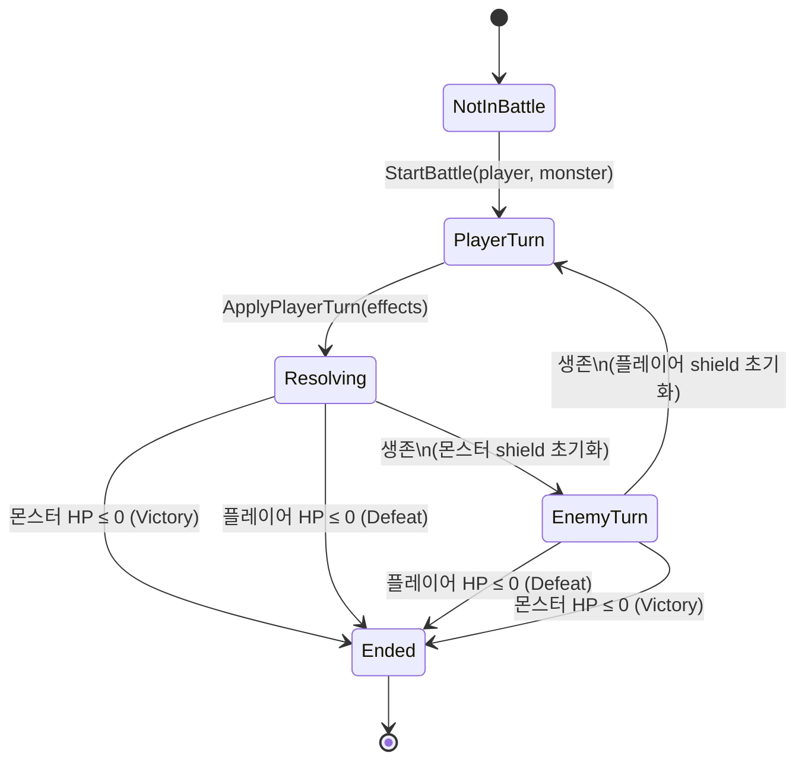
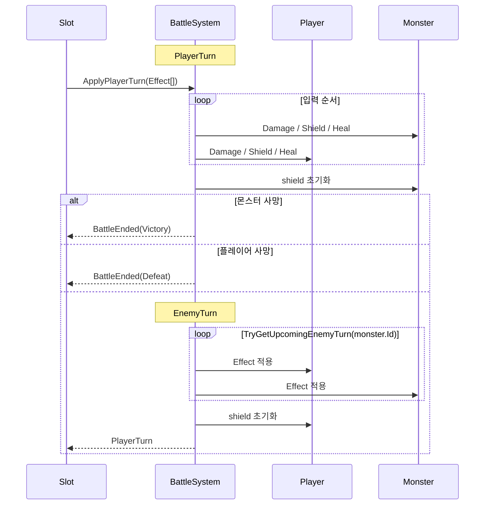
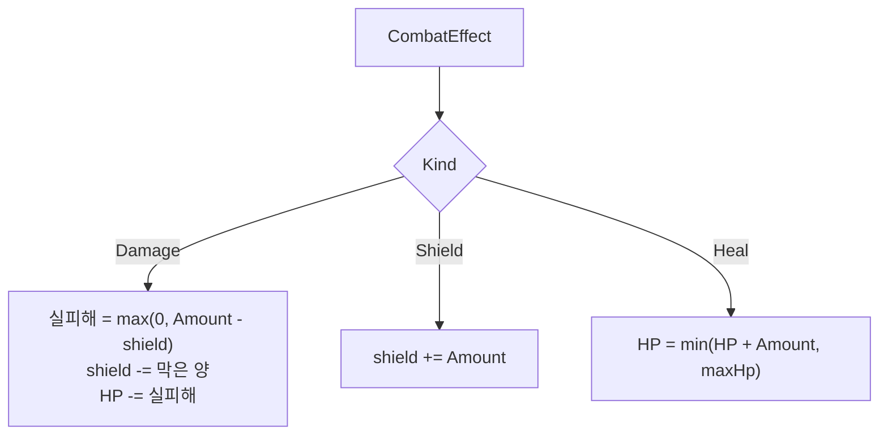
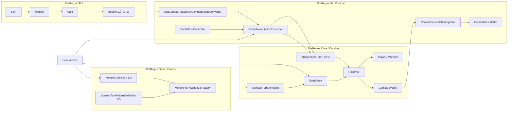
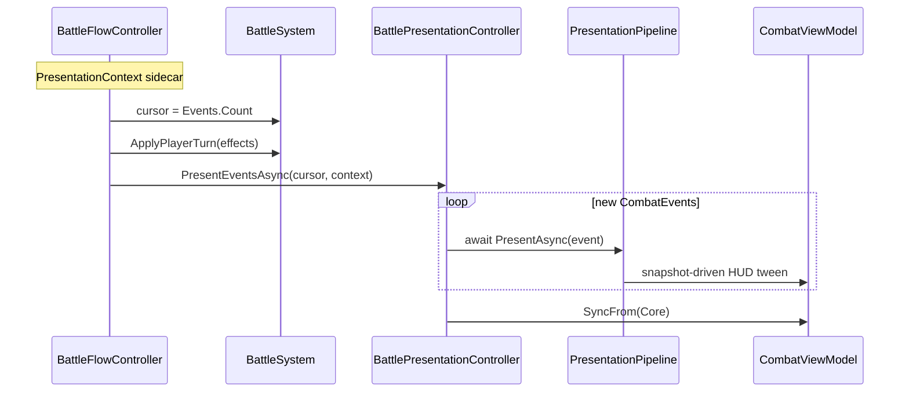

# 전투 코어 (Combat Core)

**Status**: draft  
**Last updated**: 2026-06-14 (BattleSystem EnemyRuntime 전환)

## Purpose

슬롯 1스핀 = 전투 1턴 구조에서, **이미 계산된 Effect 목록**을 받아 HP·방어도·턴 진행·승패만 처리하는 순수 전투 코어를 정의한다. 슬롯 RNG·패턴·유물 수치 계산은 슬롯/메타 계층에 두고, 전투는 Participant 상태와 턴 파이프라인에 집중한다.

## Decisions

| # | 결정 | 요약 |
|---|------|------|
| C1 | [ADR-0001](../adr/0001-combat-turn-effect-pipeline.md) | 1스핀=1턴, Effect 목록 파이프라인, Shield-only 방어, Participant 소유 상태, CombatEvent 로그 |
| C2 | **슬롯 계산 / 전투 진행 분리** | 슬롯 asmdef는 Combat 타입을 참조하지 않는다 (`slot-core.md` S4). 연동 계층에서 `Effect[]` 변환. |
| C3 | **Resolver 순수 로직** | `BattleResolver`는 MonoBehaviour·UI 없이 EditMode 테스트 가능. |
| C4 | **플레이어·몬스터 동일 Effect 타입** | 행동 주체는 다르지만 `Kind + Amount + Target` 구조 공유. |
| C5 | [ADR-0003](../adr/0003-combat-presentation-replay.md) | MVP 연출: Replay — 동기 `ApplyPlayerTurn` 후 `CombatEvent` 순차 재생; HUD는 `CombatViewModel`; `EffectApplied` 스냅샷 |
| C6 | [ADR-0004](../adr/0004-multi-participant-combat.md) | 다인전은 participant id 기반 roster, `TargetMode + TargetParticipantId`, 적 턴 좌→우 순차, player team 1명(MVP) |

## Turn pipeline

### Phase

| Phase | 설명 | 스핀 가능 |
|-------|------|-----------|
| `NotInBattle` | 전투 밖 | — |
| `PlayerTurn` | 플레이어 입력 대기 | ✓ |
| `Resolving` | 플레이어 Effect 적용 중 | ✗ |
| `EnemyTurn` | 몬스터 Effect 적용 중 | ✗ |
| `Ended` | Victory / Defeat | ✗ |

### 1턴 사이클

**플레이어 턴**

1. 슬롯 → `CombatEffect[]` 수신 (`ApplyPlayerTurn`)
2. 목록 순서대로 Effect 적용 (몬스터 shield가 있으면 Damage 감소·소진)
3. 몬스터 HP ≤ 0 → `Ended(Victory)`
4. 플레이어 HP ≤ 0 → `Ended(Defeat)`
5. 몬스터 **shield = 0**
6. `EnemyTurn`

**적 턴**

1. 이번 턴 **미리 정해진** 몬스터 Effect 목록 순서대로 적용
2. 사망 체크 (플레이어 Defeat / 몬스터 Victory)
3. 플레이어 **shield = 0**
4. `PlayerTurn`

## Runtime data

### CombatEffect (MVP)

| 필드 | MVP | Later |
|------|-----|-------|
| `Kind` | `Damage`, `Shield`, `Heal` | `ApplyStatus`, `GainGold`, … |
| `Amount` | int | — |
| `Target` | `Self`, `Enemy` | `TargetMode` (`Self`, `SelectedEnemy`, `AllEnemies`, `RandomEnemy`) + `TargetParticipantId` |
| _(optional)_ | — | `Element`, `Status`, `Duration` |

### Kind 동작

| Kind | 동작 |
|------|------|
| `Damage` | `실피해 = max(0, Amount - target.shield)` → shield 차감 → HP 감소 |
| `Shield` | `target.shield += Amount` |
| `Heal` | `target.hp = min(target.hp + Amount, target.maxHp)` |

스탯 방어력은 없다. 방어도는 `Shield` Effect로만 얻는다.

### Participant

플레이어·몬스터가 `currentHp`, `maxHp`, `shield`를 내부 관리한다. Resolver는 Participant에 Effect를 적용한다.

### EnemyActionPlan

`EnemyActionPlan`은 몬스터 한 턴에 실행할 확정된 `CombatEffect` 목록을 보관하는 Core 타입이다. 행동을 선택하거나 실행하지 않으며, 외부 조회는 `EnemyUpcomingTurn.Plan.Effects`를 통해 이뤄진다.

### EnemyActionContext

`EnemyActionContext`는 Planner가 다음 행동을 고를 때 필요한 읽기 전용 전투 정보를 전달한다. `BattleSystem` 전체를 참조하지 않고 `Self`, `Player`, `Enemies`, `TurnNumber`처럼 현재 필요한 최소 정보만 담는다.

### IEnemyActionPlanner

`IEnemyActionPlanner`는 `EnemyActionContext`를 받아 다음 `EnemyActionPlan`을 생성하는 Core 계약이다. 피해·Shield·상태이상 적용이나 UI 갱신은 하지 않는다.

### FixedSequenceEnemyActionPlanner

`FixedSequenceEnemyActionPlanner`는 기존 `MonsterTurnSchedule`과 같은 고정 순환 행동 계획을 제공한다. 입력된 계획 목록은 생성 시점에 복사해 외부 컬렉션 변경으로부터 내부 순서를 보호한다.

### EnemyRuntime

`EnemyRuntime`은 전투 중 하나의 Enemy에 대해 `CombatParticipant`, 내부 `IEnemyActionPlanner`, `UpcomingPlan`을 묶는다. 생성 직후 `UpcomingPlan`은 빈 계획이며, `PlanNextAction()` 호출 후 Planner 결과로 갱신된다. `BattleSystem`은 적별 `EnemyRuntime`을 보관하고, UI 조회와 적 턴 실행 모두 저장된 `UpcomingPlan`을 기준으로 처리한다.

현재 Data/GameFlow 생성 경로는 아직 `MonsterTurnSchedule`을 만들기 때문에, `BattleSystem.StartBattle()`은 임시 어댑터로 legacy schedule을 `FixedSequenceEnemyActionPlanner`와 `EnemyRuntime`으로 변환한다. 이 어댑터는 Data/GameFlow가 `EnemyRuntime`을 직접 생성하게 되면 제거한다.

### Shield 지속

| 주체 | 유효 구간 | 초기화 |
|------|-----------|--------|
| 플레이어 shield | 적 턴 전체 | 적 턴 **모든** Effect 적용 후 |
| 몬스터 shield | 플레이어 턴 전체 | 플레이어 턴 **모든** Effect 적용 후 |

### Monster pattern (ScriptableObject)

몬스터 턴 패턴은 **불변 SO**로 저장하고, 전투 시작 시 런타임 `MonsterTurnSchedule`을 생성한다. 순환 index는 SO·asset에 두지 않는다.

| 타입 (SlotRogue.Data.Combat) | 역할 |
|------------------------------|------|
| `CombatEffectStep` | SO 직렬화용 step (`kind`, `amount`, `target`) |
| `MonsterTurnPatternDefinition` | 턴별 `CombatEffectStep[]` 배열 (불변 패턴) |
| `MonsterDefinition` | `maxHp`, `turnPattern` 참조 |
| `MonsterTurnScheduleFactory` | pattern SO → `new MonsterTurnSchedule(...)`; `StartBattle` 내부 `Reset()` |

- SO asset: `Assets/_Project/Data/Combat/` (예: Goblin + GoblinTurnPattern).
- 과거 `Dev_Battle`은 `BattleDevHarness`로 `MonsterDefinition` SO를 검증했다. 해당 씬과 하네스는 본편 통합 완료 후 제거했다.
- 본편: encounter/run bootstrap에서 동일 Factory 경로를 재사용한다.
- 구현: [`feature-monster-pattern-so`](../exec-plans/completed/feature-monster-pattern-so.md).

## System boundary

`SlotRogue.Core`는 Data/UI 계층과 Unity scene object에 의존하지 않는다. 다만 현재 asmdef는 UnityEngine 참조를 허용하므로, Core 내부에서 `Debug.LogWarning`, `Mathf`, `Vector2` 같은 진단·값 타입·수학 유틸 사용은 허용한다. `MonoBehaviour`, `GameObject`, `Transform`, `ScriptableObject`, `Sprite`처럼 scene/object lifecycle 또는 asset 계층에 묶이는 타입은 Core 전투 로직에서 참조하지 않는다.

슬롯 MVP는 `SlotCombatRequest` DTO를 출력하고, 변환은 `SlotRogue.UI.Combat` 연동 계층에서 수행한다 (아래 Q1 **닫음**).

## Battle API (MVP sketch)

| API | 역할 |
|-----|------|
| `StartBattle(player, monster, monsterTurnSchedule)` | 전투 시작 → `PlayerTurn`. 스케줄은 SO→Factory 또는 테스트에서 생성 |
| `ApplyPlayerTurn(IReadOnlyList<CombatEffect> effects)` | 플레이어 턴 처리. `PlayerTurn`이 아니면 거부 |
| `CurrentPhase` | UI·슬롯 스핀 가능 여부 |
| `TryGetUpcomingEnemyTurn(participantId, out EnemyUpcomingTurn)` | 특정 생존 Enemy의 저장된 `EnemyActionPlan` 조회. 없는 id·사망 Enemy는 `false` |

`StartBattle`의 파라미터 vs BattleSystem 멤버 보유는 구현 plan에서 확정한다.

## CombatEvent (MVP)

Resolver가 턴 처리 중 append한다. UI·디버그·테스트가 동일 소스를 구독한다.

| Kind | MVP 연출 |
|------|----------|
| `PhaseChanged` | 파이프라인 순차 await (연출 최소 가능) |
| `EffectApplied` | Kind별 Presenter; **Before/After HP·Shield 스냅샷** (ADR-0003, [`feature-combat-presentation`](../exec-plans/completed/feature-combat-presentation.md) 완료) |
| `ShieldReset` | 전용 Presenter |
| `BattleEnded` | 마지막 Damage 연출 **후** Result UI |

`EffectApplyResult` delta(`damageDealt`, `shieldConsumed`, …)는 로그·연출 보조용. HP 바 애니메이션의 권위는 **스냅샷**이다.

## Multi-participant extension (ADR-0004)

이번 섹션은 다인전 확장 구현 전, 팀 합의된 최소 규칙을 고정한다. 구현 세부 타입명은 plan에서 조정 가능하지만 동작 규칙은 이 문서를 기준으로 유지한다.

### Scope

- 이번 범위는 **Enemy 다인전** 중심이다. player team은 1명만 지원한다.
- 1:1 전투는 roster 기반 구조의 특수 케이스로 유지한다.

### Data model

- 전투 참가자는 `_player` / `_monster` 고정 필드 대신 `CombatParticipantId`를 가진 roster로 표현한다.
- 각 participant는 `CombatTeam` 또는 동등한 팀 정보로 승패/타겟 후보를 판정한다.
- 이벤트 대상 표시는 `IsPlayerParticipant` bool 대신 `TargetParticipantId`를 사용한다.

### Targeting

- 플레이어 공격 기본 타겟은 자동 선택이 아니라 **직접 선택(SelectedEnemy)** 이다.
- 타겟 모델은 `TargetMode + TargetParticipantId` 조합을 사용한다.
- MVP `TargetMode`: `Self`, `SelectedEnemy`, `AllEnemies`, `RandomEnemy`.
- `SelectedEnemy`는 UI가 선택한 `TargetParticipantId`를 Effect에 명시한다.
- Core는 object handle 참조가 아니라 id 기반으로 대상 해석/검증을 수행한다.

### Turn rules

- 적 턴 적용 순서는 speed/initiative 없이 **왼쪽→오른쪽 고정 순차**다.
- 몬스터 사망 시 남은 몬스터의 schedule index는 유지하고, 사망한 몬스터만 스킵한다.
- 다음 턴 조회는 전역 “첫 생존 몬스터” 기준이 아니라 `CombatParticipantId` 기준 `TryGetUpcomingEnemyTurn()`으로 한다.

### Multi-hit retarget

- 기본 규칙은 **한 대상 반복 타격**이다.
- 연속 타격 중 대상이 사망하면 남은 타수는 다른 생존 Enemy로 자동 전환한다.
- 대체 대상이 없으면 남은 타수는 소멸한다.

### Validation rules (Core)

- `TargetMode.SelectedEnemy`는 `TargetParticipantId`가 필수다.
- `TargetParticipantId`가 사망 상태이거나 Enemy team이 아니면 invalid target으로 처리한다.
- invalid target 시 Core는 **살아 있는 Enemy 중 roster 순서상 첫 대상으로 fallback** 한다 (턴 거부·재선택 유도 없음). `BattleSystemMultiParticipantTests`로 고정.

### Test checklist (EditMode)

- `SelectedEnemy` 정상 경로: 선택 대상 1명에게 의도한 Effect 적용.
- `SelectedEnemy` 비정상 경로: 죽은 대상/잘못된 팀/없는 id 입력 처리.
- 멀티히트 재타겟: 3타 중 2타에 사망 시 남은 1타가 생존 적으로 전환.
- 대체 대상 없음: 남은 타수 소멸 확인.
- 적 턴 순차 처리: 좌→우 적용 + 사망 participant 스킵 + 생존 participant index 유지.

## Presentation layer (Replay)

ADR-0003. Core는 연출을 모른다. UI `BattlePresentationController`가 턴당 이벤트 큐를 순차 재생한다.
플로팅 데미지 텍스트 prefab/anchor 자산화 구현 기록은 [`feature-floating-combat-text`](../exec-plans/completed/feature-floating-combat-text.md)를 참조한다.

| UI 타입 | 역할 |
|---------|------|
| `BattlePresentationController` | 새 `CombatEvent` Replay, 입력 잠금, 최종 ViewModel 동기화 |
| `CombatPresentationPipeline` | `CombatEvent` → Presenter |
| `CombatViewModel` | 화면 HP/Shield (Core `Participant` 직접 바인딩 금지) |
| `PresentationContext` | crit, `PatternName` 등 — `CombatEffect` 비확장 |

**연출 규칙:** 이벤트·Effect **간** 순차; Effect **내** VFX/SFX/HUD 기본 `WhenAll`. Later Step API(`BattleTurnSession`) 도입 시 Presenter 계층 유지.

구현 plan (완료): [`feature-combat-presentation`](../exec-plans/completed/feature-combat-presentation.md) (Dev_Battle), [`feature-run-battle-presentation`](../exec-plans/completed/feature-run-battle-presentation.md) (`RunBattleController` + `battle/presentation-overlay`).

## Open questions

| ID | 질문 | 비고 |
|----|------|------|
| ~~Q1~~ | ~~`SlotCombatRequest` → `CombatEffect[]` 변환 규칙~~ | **닫음 (2026-05-31).** Shield→Heal→Damage×N, 0값 스킵, `AttackCount`≤0이면 1타. `IsCritical`/`PatternName`은 Effect 없음(Console Request 로그만). 구현: `SlotCombatRequestToCombatEffectsConverter`. 상세: [`feature-combat-dev-scene`](../exec-plans/completed/feature-combat-dev-scene.md) 변환 MVP |
| ~~Q2~~ | ~~몬스터 행동 **배열 + 순환 인덱스**~~ | **닫음 (2026-05-31, 2026-06-11 다인전 조회 API 갱신).** `MonsterTurnSchedule` — 턴 세트 `CombatEffect[][]`, 적용 후 index 순환. 조회는 `TryGetUpcomingEnemyTurn(participantId, out EnemyUpcomingTurn)` 기준. **패턴 SO:** `MonsterTurnPatternDefinition` + `MonsterDefinition` + `MonsterTurnScheduleFactory` ([`feature-monster-pattern-so`](../exec-plans/completed/feature-monster-pattern-so.md)). RNG·가중치는 Later. 스케줄 런타임: [`feature-monster-turn-schedule`](../exec-plans/completed/feature-monster-turn-schedule.md) |
| Q3 | `StartBattle` 시그니처 vs BattleSystem 멤버 | Participant 참조 전달 방식 |
| Q4 | Effect optional 필드 (`Element`, `Status`) 도입 시점 | 속성·DoT 추가 시 별도 ADR |
| Q5 | Kind별 Resolver 재정렬 필요 여부 | 디버프·상태가 많아지면 검토. MVP는 입력 순서 유지 (ADR-0001) |
| Q6 | 전투 asmdef 이름·Core 하위 네임스페이스 | `SlotRogue.Core.Combat` vs 별도 asmdef |

## Alternatives considered

### 단일 DTO 입력 — 거절

`SlotCombatRequest` 하나를 전투가 직접 소비하면 필드별 분기가 Resolver에 고정된다. Effect 목록 + 공통 Kind가 확장에 유리하다 (ADR-0001).

### 몬스터 전용 행동 타입 — 거절

`MonsterAction` enum과 플레이어 Effect 이중 Resolver를 피하고 동일 `CombatEffect`로 통합한다.

### 스탯 방어력 + Shield — 거절

MVP는 Shield Effect만 사용한다. 상시 방어력 스탯은 Later.

## Related docs

- [`slot-core.md`](./slot-core.md) — 슬롯 MVP, S4 전투 참조 금지
- [`../adr/0001-combat-turn-effect-pipeline.md`](../adr/0001-combat-turn-effect-pipeline.md)
- [`../adr/0003-combat-presentation-replay.md`](../adr/0003-combat-presentation-replay.md)
- [`../exec-plans/completed/feature-combat-presentation.md`](../exec-plans/completed/feature-combat-presentation.md)
- 개인 scratch 다이어그램: `docs/_scratch/combat-turn-pipeline-diagrams.md` (gitignored)
