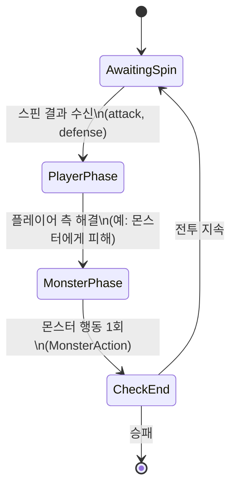
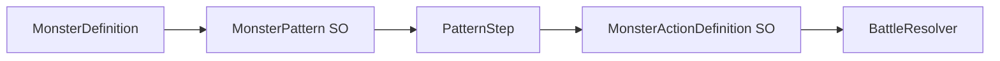
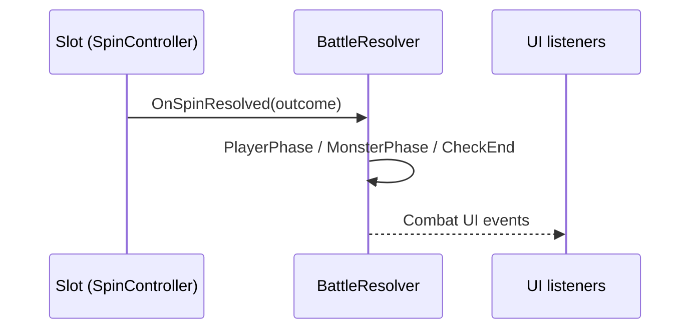

# 전투 코어 (Combat Core)

**Status**: draft  
**Last updated**: 2026-05-26 _(C10 반영 — MVP 전투 설계 합의 완료)_

## Purpose

상단 화면의 1인칭 몬스터 전투를 담당한다. 하단 슬롯 머신이 한 스핀마다 산출한 **공격·방어 수치**를 입력으로 받아, 같은 턴 안에서 피해를 계산·적용한다. 슬롯 연출·페이라인 로직과 분리된 **순수 전투 상태·해결(resolver)** 가 이 문서의 범위다.

## Decisions

_(ADR 없음 — 팀 합의 초안. 본질 변경 시 ADR 추가 검토.)_

| # | 결정 | 요약 |
|---|------|------|
| C1 | **1 스핀 = 1 턴** | 플레이어가 스핀을 완료하면 전투도 정확히 한 턴 진행한다. 스핀 없이 전투만 진행하는 턴은 없다(초기 예외는 Open questions). |
| C2 | **방어는 당턴 피해만 감소** | 해당 턴에 적용되는 피해에만 `defense`가 반영된다. 다음 턴까지 지속되는 방어 버프·실드 누적은 없다. |
| C3 | **같은 턴, 플레이어 후 몬스터 행동** | 스핀 결과로 플레이어 측을 먼저 해결한 뒤, **같은 턴**에 몬스터가 행동 1회를 실행한다. |
| C4 | **몬스터 행동 ≠ 공격만** | 몬스터 턴은 “반격” 고정이 아니라 **행동(MonsterAction)** 이다. 공격·버프·방어·특수기 등 행동 종류는 데이터로 정의한다. |
| C5 | **고정 패턴 (data-driven)** | 몬스터별 **턴 순서 테이블**을 ScriptableObject로 두고, 전투 턴 인덱스에 맞춰 행동을 고른다. 런타임 RNG·반응형 AI는 MVP에서 제외. **“고정”은 런타임 규칙**(인덱스 순환)이지, 데이터를 못 바꾼다는 뜻이 아님 — 아래 C5bis·C6. |
| C6 | **행동 수치도 SO·인스펙터** | 패턴 칸은 `MonsterActionDefinition` SO를 가리키고, 공격력·버프 등 payload는 **에셋 필드**로 튜닝. 코드 상수·하드코딩 금지(Q8). |
| C7 | **몬스터 Defend = 당턴·1회 피해 감소** | `Defend` 행동의 `DefendValue`는 **몬스터가 맞는 피해 1회**에만 C2와 동일식 적용. 다음 턴 이월·누적 없음. C3(플레이어 선행) 때문에 **다음 스핀 PlayerPhase**에 소비(아래). |
| C8 | **승패 = HP 0만 (MVP)** | 플레이어 HP≤0 → 패배, 몬스터 HP≤0 → 승리. 도주·턴 제한·시간 제한 없음. 추후 메타/러닝에서 확장. |
| C9 | **0 공격·0 방어도 턴 진행** | `attack`/`defense`가 0이어도 스핀=1턴(C1). PlayerPhase·MonsterPhase·CheckEnd 모두 수행. 미스·스킵 없음(MVP). |
| C10 | **슬롯→전투: 인터페이스 / UI: 이벤트** | 스핀 결과는 `ISpinCombatConsumer` **단일 호출**. HP·행동·승패 등 **표시·연출**은 전투→UI 이벤트(또는 SO Event Channel). 슬롯↔전투 global event 금지(MVP). |

### C2 — 피해 계산 (당턴)

플레이어가 몬스터에게 가하는 피해, 몬스터가 플레이어에게 가하는 피해 모두 동일 규칙을 쓴다(역할만 다름).

```
actualDamage = max(0, rawAttack - defense)
```

- `rawAttack`: 그 턴 공격 측의 공격력(슬롯에서 온 `attack`, `MonsterAction.RawAttack`, 등).
- `defense`: 그 **피해 1회**를 받는 쪽 방어(슬롯 `defense`, 몬스터 `DefendValue` 소비분, 등).
- 결과는 0 미만이 되지 않는다.

**대칭 (C7)** — 플레이어·몬스터 동일 규칙, 적용 **시점**만 다름(C3).

| 받는 쪽 | 방어 수치 출처 | 소비 시점 |
|---------|----------------|-----------|
| 플레이어 | 이번 스핀 `CombatSpinOutcome.Defense` | 같은 스핀 **MonsterPhase** (몬스터가 Attack 등으로 줄 때) |
| 몬스터 | `MonsterActionDefinition.DefendValue` (`Defend` 행동) | **다음 스핀 PlayerPhase** (플레이어 `attack`으로 맞을 때) |

### C7 — 몬스터 `Defend` (당턴·1회)

- `Defend` 실행 시 `BattleState.PendingMonsterDefense = DefendValue` 설정. **이미 쌓인 방어와 합산하지 않음** — 새 Defend가 이전 pending을 덮어쓴다(MVP).
- **다음 스핀** `PlayerPhase`에서 몬스터가 피해를 받을 때:

```
damageToMonster = max(0, playerAttack - PendingMonsterDefense)
```

- 소비 후 `PendingMonsterDefense = 0`. 플레이어 `attack`이 0이면 방어는 **소비되지 않고** 전투 턴 종료 시 만료(다음 스핀까지 유지 vs 만료 — 구현 기본값: **유지**, PlayMode 튜닝 시 변경 가능).
- 플레이어 방어(C2)와 같이 **버프·다음 턴 이월 없음**. “당턴” = **준비된 방어가 실제로 막아 주는 피해 1회분**까지.

**C3 때문에 같은 스핀 안에서는** MonsterPhase `Defend`가 **이미 지난** PlayerPhase 피해에는 소급 적용하지 않는다. (소급 적용이 필요하면 순서 변경이 필요 — MVP 제외.)

### C8 — 승패 (MVP)

`CheckEnd`는 **HP만** 본다.

| 조건 | 결과 |
|------|------|
| `monsterHp <= 0` | **승리** — 전투 종료, 다음 노드/보상 등은 메타(`roguelike-meta.md` 추후) |
| `playerHp <= 0` | **패배** — 런 종료 또는 continue 정책은 메타에서 정의 |
| 둘 다 ≤0 (동시 사망) | **패배 우선** (MVP 단순 규칙). 추후 동시 사망 처리 ADR 가능. |

- `MonsterDefinition.MaxHp`, 플레이어 최대 HP는 데이터(SO/런 상태). 전투 시작 시 현재 HP = Max.
- 도주 버튼, 최대 턴 수, 시간 제한: **MVP 없음**.

### C9 — 0 수치 · 턴 스킵 없음

- `attack == 0`: PlayerPhase에서 몬스터 HP **변경 없음**. 턴은 **계속** → MonsterPhase 실행(C3).
- `defense == 0`: 플레이어가 피해를 받을 때 C2에서 `max(0, rawAttack - 0)` — 방어 없음과 동일.
- **미스 / 스핀 무효 / 턴 취소**: MVP 없음. 슬롯이 0을 내도 전투는 한 바퀴 돈다.
- `PendingMonsterDefense > 0`인데 `attack == 0`: C7 기본값 — pending **유지**(다음 스핀까지).

### C1 · C3 · C4 — 턴 순서

한 턴은 **항상** 아래 순서다. 동시 정산하지 않는다.



| 단계 | 담당 | 내용 (초안) |
|------|------|-------------|
| **PlayerPhase** | 슬롯 → 전투 | `CombatSpinOutcome` 반영. `attack==0`이면 몬스터 HP 변화 없음(C9). `defense`는 플레이어가 피해 받을 때만 C2 적용. |
| **MonsterPhase** | 전투 AI/데이터 | 몬스터 **행동 1회** 실행(C4). 행동이 피해를 주면 플레이어 `defense` 적용(C2). 행동이 공격이 아니면 피해 계산 없음. |
| **CheckEnd** | 전투 | C8: HP≤0 승패 판정. |

- 스핀 결과는 `attack`, `defense`를 최소 포함한다(추가 필드는 슬롯 design-doc과 합의).
- **한 턴 안에서** 방어(C2)는 그 턴에 들어오는 각 피해 계산에만 쓰인다.

```csharp
public enum MonsterActionKind
{
    Attack,   // 플레이어에게 rawAttack (C2로 defense 적용)
    Defend,   // C7 — PendingMonsterDefense, 다음 스핀 PlayerPhase에 소비
    Buff,
    Special,
}
```

- 턴당 **정확히 1개** `MonsterAction` 실행(C3).
- 행동 **선택**은 C5, **수치**는 C6.

### C5 · C5bis — 고정 패턴 · 데이터 주도 · 이후 변경 가능

**코드에 패턴·수치를 하드코딩하지 않는다.** 인스펙터에서 보이는 SO만 수정해도 밸런스·순서가 바뀐다.

| 용어 | 의미 |
|------|------|
| **고정 패턴 (C5)** | 전투 중 몬스터 행동 선택이 **결정론적** — `patternIndex`로 `MonsterPattern.Steps[]`를 순서대로 읽음. RNG 없음. |
| **수정 가능 (C5bis)** | 언제든 (1) 패턴 SO의 Steps 순서·참조 변경, (2) `MonsterDefinition`이 가리키는 패턴 SO 교체, (3) 개별 `MonsterActionDefinition` 수치 변경. **재컴파일 불필요.** 전투 중 인덱스만 유지 — 이미 시작된 전투는 로드된 SO 스냅샷을 쓸지·라이브 참조를 쓸지는 구현 시 선택(PlayMode 튜닝이면 라이브 참조도 가능). |

| 개념 | 역할 |
|------|------|
| `MonsterDefinition` | 최대 HP, 표시 id, **기본 패턴 SO 참조**. (추후) HP별 패턴 목록 |
| `MonsterActionDefinition` | 행동 1종의 **재사용 카탈로그** — Kind + 인스펙터 필드(payload) |
| `MonsterPattern` | `PatternStep[]` — 각 칸이 **어떤 행동 SO를 쓸지** 순서만 정의 |
| `PatternStep` | `action` 참조 + (선택) 인스펙터 오버라이드 |
| `BattleState.PatternIndex` | 0-based. `MonsterPhase`마다 +1 |

**선택 규칙 (MVP)**

1. `MonsterPhase` → `Resolve(actionDef, optionalOverride)` — payload는 **SO에서 읽음**(C6).
2. `patternIndex++`. 끝 + `Loop == true` → 0.
3. `BattleResolver`는 **인덱스 증가 + SO 해석**만 담당. 밸런스·순서 변경은 데이터 작업.

**나중에 확장 (Resolver는 그대로, 데이터만 추가)**

| 확장 | 방법 |
|------|------|
| HP 50% 이하 다른 패턴 | `MonsterDefinition`에 `MonsterPattern[]` + 간단 `IPatternSelector`(데이터 또는 SO) |
| 랜덤 행동 | `PatternStep`이 `WeightedAction[]` 참조 — **MVP 이후** |
| 시즌/밸런스 패치 | 동일 SO 파일 수정 또는 Addressables로 SO 교체 |

### C6 — 행동 payload (Q8 해결)

**Q8 결론**: 공격력 등 수치는 **전부 data-driven** — `MonsterActionDefinition` SO + Unity 인스펙터. MVP는 **고정 정수 `rawAttack`** 필드를 인스펙터에 노출. `baseAttack × 배율`은 필드 추가만으로 확장(Resolver 공식 1곳).

**2계층 구조**



1. **카탈로그** — `Assets/_Project/Data/Combat/Actions/`  
   - 예: `GoblinSlash.asset` (Attack, rawAttack=12), `GoblinGuard.asset` (Defend, …)
2. **패턴** — `Assets/_Project/Data/Combat/Monsters/GoblinPattern.asset`  
   - Steps: [Slash, Guard, Slash, SpecialRef, …]

```csharp
// SlotRogue.Data — 스케치
[CreateAssetMenu(menuName = "SlotRogue/Combat/Monster Action")]
public sealed class MonsterActionDefinition : ScriptableObject
{
    public MonsterActionKind Kind;
    [Header("Attack")]
    public int RawAttack;           // Kind == Attack
    [Header("Defend (C7)")]
    public int DefendValue;         // Kind == Defend → PendingMonsterDefense
    public string BuffId;
    // 추후: public DamageMode Mode; public float Multiplier;
}

[CreateAssetMenu(menuName = "SlotRogue/Combat/Monster Pattern")]
public sealed class MonsterPattern : ScriptableObject
{
    public PatternStep[] Steps = Array.Empty<PatternStep>();
    public bool Loop = true;
}

[Serializable]
public sealed class PatternStep
{
    public MonsterActionDefinition Action;
    [Tooltip("체크 시 아래 필드로 이 스텝만 덮어씀. 밸런스 스파이크용")]
    public bool OverrideRawAttack;
    public int OverrideRawAttackValue;
}
```

- **런타임 DTO** `MonsterAction`은 SO를 **복사한 읽기 전용 스냅샷**(테스트·결정론 유지). SO 참조를 전투 중에 직접 mutate 하지 않음.
- Kind별로 안 쓰는 인스펙터 필드는 MVP에서 그대로 두고, Custom Editor(`SlotRogue.Editor`)는 **나중에** Kind에 맞게 필드 숨김.
- `PatternStep` 오버라이드: 새 SO 없이 한 턴만 숫자 바꿀 때 — 선택 기능, 없어도 MVP 가능.

**자산 위치**: 정의 클래스 `SlotRogue.Data` asmdef · 인스턴스 `Assets/_Project/Data/Combat/`.

**테스트**: EditMode — (1) 패턴 인덱스 루프, (2) `MonsterActionDefinition` → `rawAttack` resolve, (3) OverrideRawAttack 적용.

### C4 — MonsterAction (런타임 DTO)

SO가 아니라 **한 턴 실행 시점의 해석 결과**. `BattleResolver`가 `MonsterActionDefinition`(+ optional override)에서 생성.

```csharp
public readonly struct MonsterAction
{
    public MonsterActionKind Kind { get; }
    public int RawAttack { get; }  // Attack일 때만 사용, C2 적용
    public int DefendValue { get; } // Defend일 때 — resolver가 pending에 기록
    // Buff/Special — 추후
}
```

## 슬롯 ↔ 전투 · 전투 ↔ UI (C10)

### 슬롯 → 전투 (인터페이스)

계약·DTO·인터페이스는 **`SlotRogue.Core`** (asmdef 최하단 공유). 슬롯 모듈은 `BattleResolver` 클래스를 참조하지 않는다.

```csharp
namespace SlotRogue.Core.Combat
{
    public readonly struct CombatSpinOutcome
    {
        public int Attack { get; }
        public int Defense { get; }
    }

    /// <summary>슬롯이 스핀 결과 확정 후 호출. 구현체: BattleResolver (전투).</summary>
    public interface ISpinCombatConsumer
    {
        void OnSpinResolved(CombatSpinOutcome outcome);
    }
}
```

| 규칙 | 내용 |
|------|------|
| 호출 횟수 | 스핀당 **정확히 1회** `OnSpinResolved` (C1) |
| 호출 주체 | 슬롯 `SpinController`(가칭) — 페이라인/RNG **확정 후** |
| 타이밍 | 로직 확정 → `OnSpinResolved`(전투 턴 진행) → 릴/UI 연출은 병렬·지연 가능 (`slot-core.md`에서 상세) |
| 연결 | 씬/bootstrap에서 `ISpinCombatConsumer` 구현체 주입. `[SerializeField]` + 인터페이스 또는 생성자 주입 |
| 테스트 | `FakeSpinCombatConsumer` / Mock `BattleResolver` |



### 전투 → UI (이벤트)

**게임 로직 경로(C10)와 분리.** UI·VFX·사운드는 구독만 하고 전투 상태를 mutate 하지 않는다.

| 이벤트 (예시) | 발행 시점 | 구독 예 |
|---------------|-----------|---------|
| `PlayerHpChanged` | 피해/회복 후 | 상단 HP 바 |
| `MonsterHpChanged` | 피해 후 | 몬스터 HP·히트 연출 |
| `MonsterActionExecuted` | MonsterPhase 후 | 1인칭 공격/방어 애니 |
| `BattleEnded` | C8 승패 확정 | 결과 팝업 |

구현 선택 (MVP 하나로 통일):

- **권장**: `BattlePresenter`가 C# `event` 또는 `Action` 발행 — `SlotRogue.UI`가 구독 (`OnDisable`에서 구독 해제).
- **대안**: ScriptableObject Event Channel — 씬 간 느슨 결합이 필요해질 때.

**금지 (MVP)**

- `SpinResolved`를 **static/global bus**로 쏴서 전투가 구독 — 디버깅·중복·씬 전환 누수 위험.
- UI가 `ISpinCombatConsumer`를 구현해 스핀을 가로채기 — 로직 이중 실행.

### asmdef 의존 (목표)

| asmdef | 알아야 하는 것 |
|--------|----------------|
| `SlotRogue.Core` | DTO, `ISpinCombatConsumer`, `BattleResolver`, UI 이벤트 args |
| `SlotRogue.Slot` _(또는 Core.Slot)_ | `ISpinCombatConsumer`만 |
| `SlotRogue.UI` | 전투 이벤트·표시 DTO. **슬롯 직접 참조 불필요** |

- 전투는 `CombatSpinOutcome`을 **한 턴에 한 번** 수신한다(C1·C10).

## Open questions

MVP 전투 코어 설계 질문은 **모두 Decisions로 승격됨**. 남은 것:

| ID | 질문 | 비고 |
|----|------|------|
| — | 슬롯 `OnSpinResolved` vs 릴 애니 선후 | `slot-core.md` 작성 시 슬롯 팀과 확정 |
| — | UI 이벤트 전송 방식 (C# event vs SO Channel) | 구현 착수 시 하나 선택 |

## Alternatives considered

## Alternatives considered

### 방어 지속형(버프) — 거절

- **내용**: `defense`가 다음 턴까지 남거나 누적 실드로 쌓임.
- **거절 이유**: 슬롯 1스핀=1턴과 맞추기 단순하고, 플레이어가 “이번 스핀 방어”를 직관적으로 읽기 쉽다(C2).

### 스핀과 전투 턴 분리 — 거절

- **내용**: 여러 스핀 후 한 번에 전투 정산, 또는 스핀 없이 적만 행동하는 턴.
- **거절 이유**: UI(하단 슬롯 / 상단 전투) 리듬을 1:1로 맞추기 위해(C1).

### 몬스터 턴 = 공격만 — 거절

- **내용**: 플레이어 스핀 후 몬스터는 항상 `rawAttack`으로만 플레이어를 때림.
- **거절 이유**: 전투 변주·몬스터 개성을 위해 행동 카탈로그가 필요(C4). 공격은 그중 한 종류.

### 플레이어·몬스터 동시 정산 — 거절

- **내용**: 스핀 결과와 몬스터 행동을 한 번에 해결.
- **거절 이유**: 연출·피드백 순서(플레이어 결과 → 몬스터 반응)와 `defense`가 “이번 턴 받는 피해”에만 쓰이는 해석이 순차 흐름과 맞음(C3).

### 몬스터 행동 — 런타임 RNG / 반응형 AI (MVP) — 거절

- **내용**: 매 턴 가중치 추첨, 플레이어 공격력에 따른 즉석 분기.
- **거절 이유**: 1달 MVP에서 디버깅·밸런스 반복 비용이 큼. C5 고정 패턴 SO로 기획·튜닝 경로를 단순화. 필요 시 C5 “선택기” 레이어만 추가.

### 패턴을 C# switch로 몬스터별 하드코딩 — 거절

- **내용**: `GoblinAI`, `SlimeAI` 클래스에 턴별 행동 나열.
- **거절 이유**: C5 data-driven 목표와 충돌. 새 몬스터마다 재컴파일·머지 부담.

### Q8 — 패턴 칸에 `Kind + int Value`만 인라인 — 거절

- **내용**: `PatternStep`에 enum과 정수만 두고 SO 참조 없음.
- **거절 이유**: 행동 재사용·인스펙터 튜닝·이후 수치 스키마 확장(배율 등)이 어렵다. C6(카탈로그 SO + 패턴 참조) 채택.

### Q8 — 수치를 Resolver 코드 상수로 — 거절

- **내용**: `const int GoblinTurn2Damage = 12`.
- **거절 이유**: C6·프로젝트 data-pipeline 방침(`design-docs/INDEX.md`)과 충돌.

### 몬스터 Defend — 지속 버프 / 실드 누적 — 거절

- **내용**: Defend가 여러 턴 유지되거나 `DefendValue`가 합산됨.
- **거절 이유**: 플레이어 `defense`(C2)와 규칙을 맞추기 위해 1회 소비·비누적(C7).

### 몬스터 Defend — 같은 스핀 PlayerPhase 피해에 소급 — 거절 (MVP)

- **내용**: 플레이어 공격 직후 MonsterPhase Defend로 방금 받은 피해 감소.
- **거절 이유**: C3(플레이어 선행)와 순서 충돌. MVP는 **다음 스핀**에 소비. 연출상 소급이 필요하면 턴 순서 ADR 검토.

### 승패 — 도주 / 턴 제한 / 시간 제한 (MVP) — 거절

- **내용**: N턴 지나면 패배, 도주 성공, 제한 시간 등.
- **거절 이유**: MVP 범위 축소(C8). 로그라이크 메타 설계 시 별도 추가.

### Q5 — 0 공격 시 턴 스킵 / 미스 — 거절

- **내용**: `attack==0`이면 MonsterPhase 생략, 또는 스핀을 무효 처리.
- **거절 이유**: C1(1스핀=1턴)과 몬스터 패턴 인덱스(C5)가 항상 맞물려야 함. C9 — 0이어도 턴 전체 진행.

### Q6 — 슬롯→전투 global 이벤트 / 직접 호출 — 거절

- **내용**: `CombatEvents.SpinResolved` static 구독, 또는 `SpinController`가 `BattleResolver` 직접 참조.
- **거절 이유**: 팀 분리·1스핀=1턴 단일 경로·테스트 용이성 — C10(인터페이스) 채택. UI 다중 구독은 전투→UI 이벤트로만.

### Q6 — 전투 로직도 전부 이벤트 — 거절

- **내용**: `BattleResolver`도 이벤트만 듣고 턴 진행.
- **거절 이유**: 턴 순서(C3)·승패(C8) 추적이 불명확. 스핀 입력만 인터페이스, 이후는 동기 resolver.
