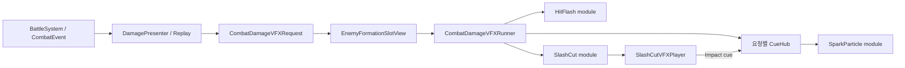
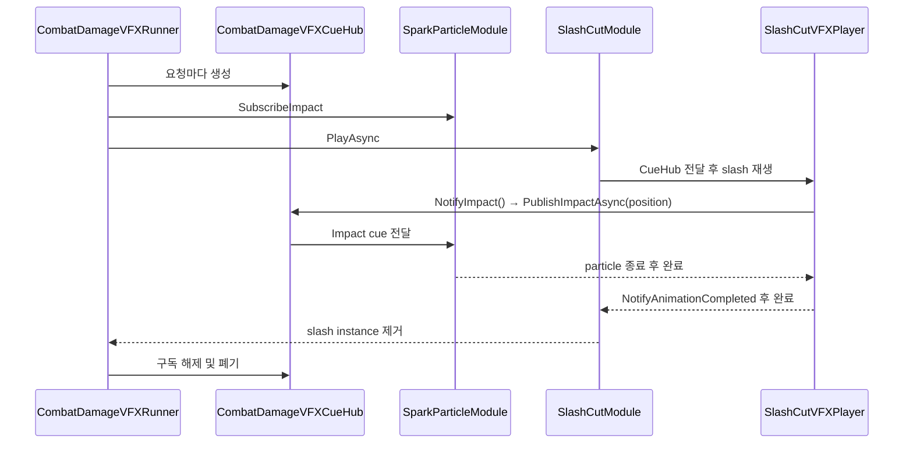

# 전투 피해 VFX

**Status**: draft  
**Last updated**: 2026-07-11

## Purpose

전투 Core가 확정한 피해 결과를 변경하지 않고, `CombatEvent` Replay의 presentation 계층에서 피해 종류별 VFX를 조합·재생한다. 이 문서는 `PlayerDirectDamage` profile을 기준으로 VFX module의 호출 방식, slash 애니메이션 cue와 Spark 같은 종속 연출의 동기화, 요청별 수명과 정리 책임을 정의한다.

## Decisions

| # | 결정 | 요약 |
|---|---|---|
| V1 | [ADR-0003](../adr/0003-combat-presentation-replay.md) | 피해 결과는 Core의 `EffectApplied` Replay에서 시작하며, Core는 Unity VFX·Animation Event·비동기 수명을 알지 않는다. |
| V2 | [ADR-0003](../adr/0003-combat-presentation-replay.md) | Effect 내부의 독립 연출은 병렬 재생할 수 있고, 인과 관계가 있는 연출만 presentation 계층에서 순차 대기한다. |

## Scope

- `PlayerDirectDamage` profile의 HitFlash, SlashCut, SparkParticle 조합.
- `EnemyFormationSlotView`의 Damage VFX Effect Root 아래에서 재생하는 월드 VFX.
- Slash clip의 Animation Event로 명중 프레임을 조절하는 방식.

## Non-goals

- 상태 피해·반사 피해·크리티컬·처치·shield block 전용 VFX profile.
- 전투 Core의 `CombatEffect` 또는 `CombatEvent`에 VFX 전용 필드 추가.
- 최종 아트·파티클 리소스의 제작 또는 pool 도입.

## System boundary

`DamagePresenter`는 직접 피해 조건을 충족한 `EffectApplied`를 `CombatDamageVFXRequest`로 만든다. 기존 presentation command 경로가 대상 `EnemyFormationSlotView`까지 요청을 전달하며, slot의 `CombatDamageVFXRunner`가 profile에 맞는 Inspector 직렬화 module을 실행한다.

Core는 피해량·대상·사망 여부의 권위만 가진다. `CueHub`, Animator, `ParticleSystem`, prefab, sorting layer, 위치 보정은 모두 UI presentation 계층에 둔다.

## Profile과 module 조합

`EnemyFormationSlotView`의 `CombatDamageVFXSet`은 profile과 `MonoBehaviour[]` module을 Inspector에서 연결한다.

| Module | 시작 시점 | 완료 기준 | 역할 |
|---|---|---|---|
| `HitFlashDamageVFXModule` | Damage VFX 요청 직후 | flash tween 종료 | 대상 sprite RGB를 white override하고 alpha를 보존한다. |
| `SlashCutDamageVFXModule` | Damage VFX 요청 직후 | slash clip 완료 및 Impact 반응 완료 | slash prefab을 Effect Root 아래에 생성한다. |
| `SparkParticleDamageVFXModule` | `Impact` cue 수신 | particle lifetime 종료 | 명중 월드 위치에 non-looping particle prefab을 생성한다. |

일반 module은 `ICombatDamageVFXModule.PlayAsync(context, cancellationToken)`을 구현한다. cue만 수신하는 module은 `ICombatDamageVFXCueSubscriber.Subscribe(context, cueHub, cancellationToken)`을 구현한다. 한 module은 필요하면 두 계약을 모두 구현할 수 있지만, 현재 Spark는 cue subscriber만 구현한다.

## CueHub 호출 흐름

`CombatDamageVFXCueHub`은 피해 요청 하나에만 존재하는 순수 C# 중계 객체다. runner가 생성하고, cue subscriber를 먼저 등록하며, VFX 완료·취소 뒤 구독을 해제하고 폐기한다. scene object나 static event가 아니므로 다른 적·다른 피해 요청으로 신호가 섞이지 않는다.

### Cue 규약

- `NotifyImpact`는 slash clip의 명중 프레임 Animation Event에서 한 번만 호출한다.
- cue payload는 현재 `WorldPosition`이다. Spark는 이를 `DamageVFXEffectRoot`의 local 좌표로 변환해 생성한다.
- `NotifyAnimationCompleted`는 마지막 Animation Event다. Impact 이후 particle이 남아 있으면 완료를 미뤄, slash와 Spark의 정리 순서를 보장한다.
- cue subscriber는 Slash module이나 `SlashCutVFXPlayer`를 직접 참조하지 않는다. 이후 타격음·camera shake·추가 파편도 같은 cue를 구독할 수 있다.

## Lifetime, cancellation, validation

- Damage VFX 요청의 `CancellationToken`은 slash와 particle의 대기에 전달한다.
- `SlashCutDamageVFXModule`과 `SparkParticleDamageVFXModule`은 비활성화·파괴 시 자신이 만든 runtime instance를 중지하고 제거한다.
- `HitFlashDamageVFXModule`은 취소·비활성화 시 `MaterialPropertyBlock`의 flash amount를 0으로 복구한다.
- profile, module, Effect Root, Spark prefab이 누락되면 조용히 대체하지 않고 명확한 오류를 남긴다.
- Spark prefab은 non-looping `ParticleSystem`이어야 한다. loop particle은 `IsAlive` 대기를 끝내지 못하게 하므로 금지한다.

## Inspector authoring

1. `DamageVFXModules` GameObject에 module component를 추가한다.
2. `EnemyFormationSlot`의 `PlayerDirectDamage` set에 해당 component를 등록한다.
3. Slash prefab의 clip에 `NotifyImpact`와 `NotifyAnimationCompleted` Animation Event를 넣는다.
4. Spark module의 `_sparkPrefab`에 non-looping particle prefab을 연결한다.
5. RunGame에서 위치, sorting order, lifetime, 연속 피격·사망·다음 적 등장 시 정리 상태를 확인한다.

## Extension rules

- 새 피해 종류는 먼저 `CombatDamageVFXProfile`과 해당 profile의 VFX set을 추가하고, Core의 이벤트 타입을 늘리지 않는다.
- 새 명중 반응은 기존 `Impact` cue를 구독한다. cue 의미가 다른 경우에만 별도 cue와 payload를 추가한다.
- VFX 간 순서를 고정 delay로 맞추지 않는다. 아트가 정한 접촉 프레임은 Animation Event로 둔다.
- module이 서로를 직렬화 참조하지 않는다. 상호작용은 request context 또는 CueHub를 통해서만 전달한다.
- 동일 profile에서 동시 피해가 빈번해져 Instantiate 비용이 문제가 된 뒤에만 prefab pool을 검토한다. pool이 도입돼도 CueHub의 요청 단위 수명과 구독 해제 책임은 유지한다.

## Verification

- 플레이어 직접 피해와 `DamageDealt > 0`인 경우에만 profile 요청이 발생한다.
- shield에 완전히 막힌 피해, 상태 피해, 반사 피해, 몬스터 공격은 현재 profile을 재생하지 않는다.
- `NotifyImpact` 프레임에서만 Spark가 생성되고, particle 종료 뒤 instance가 제거된다.
- 연속 피격·슬롯 비활성화·대상 사망에도 flash property, slash, particle instance가 남지 않는다.

## Open questions

- `Impact` 외 cue 종류와 payload(방향, normal, 강도)가 실제 연출 요구에 따라 필요한가?
- Spark·사운드·camera shake의 완료를 모두 slash 종료에 포함할지, 일부를 fire-and-forget으로 둘지?
- 다수 적·다단 히트에서 prefab pool이 필요한 임계 성능 기준은 무엇인가?
- 상태 피해와 반사 피해는 기존 profile을 재사용할지 별도 profile을 가질지?

## Alternatives considered

- **Spark가 Slash module을 직접 참조**: profile 조합의 독립성을 깨고, 추가 반응마다 참조가 늘어나므로 사용하지 않는다.
- **Core `CombatEvent`가 Spark 시점을 직접 발행**: 아트별 명중 프레임 조정이 Core 모델에 스며드므로 사용하지 않는다.
- **고정 시간 delay로 Spark 재생**: clip 교체·속도 조정 시 어긋나므로 사용하지 않는다.

## Related docs

- [combat-core.md](./combat-core.md) — CombatEvent Replay와 presentation 계층
- [ADR-0003](../adr/0003-combat-presentation-replay.md) — Replay, 이벤트 간 순차·Effect 내부 병렬 규칙
- [feature-combat-damage-vfx.md](../exec-plans/active/feature-combat-damage-vfx.md) — 구현 진행과 Unity 검증 체크리스트
