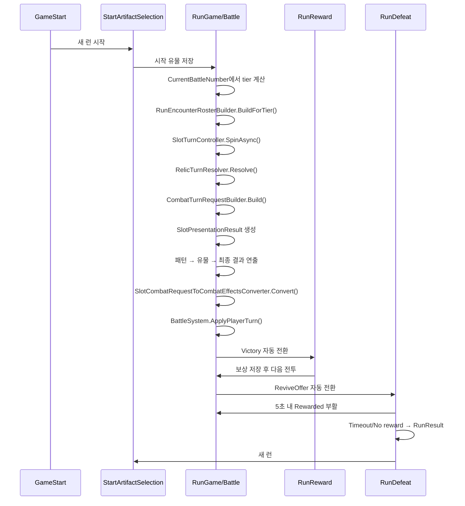

# 게임 플로우

**Status**: draft  
**Last updated**: 2026-06-19

## Purpose

게임 시작부터 시작 유물 선택, 전투, 보상, 다음 전투로 이어지는 무한모드 playable loop를 만든다. 슬롯과 전투는 각자의 책임을 유지하고, 실제 연결은 UI/GameFlow 계층에서 수행한다.

## Decisions

| # | 결정 | 요약 |
|---|------|------|
| F1 | [ADR-0002](../adr/0002-game-flow-is-scene-driven-ui-integration.md) | 씬 기반 플로우, 전투 비수정, UI/GameFlow 계층에서 슬롯 요청을 전투 Effect로 변환 |
| F2 | 전투 코어 수정 금지 | `BattleSystem`, 전투 Dev 하네스, 전투 테스트는 그대로 두고 public API만 사용한다. |
| F3 | 시작 유물은 요청 후처리 | 시작 유물은 `SlotPatternResult + SlotCombatRequest`를 받아 최종 요청을 조정한다. |
| F4 | 보상은 MVP 런 보너스 | 보상 씬은 회복, 피해 보너스, 방어 보너스 중 하나를 선택해 다음 전투에 반영한다. |
| F5 | v1 런은 무한모드 tier 기반 | 맵 노드/Encounter SO를 사용하지 않고 `CurrentBattleNumber`에서 tier를 계산해 다음 전투 roster를 생성한다. |
| F6 | [ADR-0008](../adr/0008-ui-strict-mvvm-boundary.md) | UI는 strict MVVM을 따른다. View는 화면 상태 렌더링과 입력 event만 담당하고 SceneRoot가 순수 ViewModel 및 Flow Controller를 연결한다. |
| F7 | 슬롯 결과 연출은 전투 적용 전 큐로 재생 | `RunGame` Battle 화면은 슬롯 계산과 유물 후처리를 먼저 끝내고, `SlotPresentationManager`가 패턴 → 유물 → 최종 결과 연출을 완료한 뒤 전투 Effect를 적용한다. |
| F8 | [ADR-0005](../adr/0005-relic-v23-runtime-model.md) | 시작 선택·보상·전투 효과는 v23 `RelicCatalog` 단일 모델을 사용한다. |
| F9 | [ADR-0014](../adr/0014-defeat-revive-window-and-relic-contribution.md) | 첫 패배는 5초 부활 유예 후 확정하고 최종 결과에 모든 보유 유물의 명목 기여량을 표시한다. |
| F10 | [ADR-0017](../adr/0017-first-run-tutorial-run-game-mode.md) | 최초 튜토리얼은 별도 Scene 복제가 아니라 `RunGame` 튜토리얼 모드로 실행한다. |

## Scene flow

```text
GameStart
├─ TutorialCompleted == false → RunGame / Tutorial Battle → RunGame / StartRelicSelect
└─ TutorialCompleted == true → RunGame / StartRelicSelect
RunGame / StartRelicSelect
→ RunGame / Battle
├─ Victory → RunGame / Reward → RunGame / Battle → ...
└─ Defeat → RunGame / ReviveOffer
   ├─ Rewarded → RunGame / Battle
   └─ Timeout/No reward → RunGame / RunResult → StartRelicSelect
```

전투는 별도 `RunBattle` 씬이 아니라 `RunGame` 씬 내부 `BattleView` 상태다. 승리 연출이 끝나면 추가 버튼 입력 없이 보상 상태로 자동 전환한다. 첫 패배이면서 부활권이 남아 있으면 패배 View가 5초간 몬스터 초상화·카운트다운·광고 부활 버튼을 표시한다. Rewarded 부활은 몬스터 상태와 행동 순서를 유지하고 플레이어 HP만 최대 HP의 절반으로 복구해 같은 전투를 재개한다. 시간 초과 또는 광고 보상 실패 뒤에 최종 결과를 확정하며, 결과 화면은 모든 보유 유물의 발동 횟수와 누적 피해·방어·회복 기여를 표시한다.

## Runtime flow



## System boundary

| 영역 | 책임 |
|------|------|
| `SlotRogue.Slot` | 슬롯 결과 생성, 패턴 판정, `SlotCombatRequest` 생성 |
| `SlotRogue.Core.Combat` | `CombatEffect[]` 적용, HP/Shield/승패 처리 |
| `SlotRogue.UI.Combat` | 기존 `SlotCombatRequestToCombatEffectsConverter` |
| `SlotRogue.UI.GameFlow` | 씬 전환, 런 상태, 시작 유물/보상 후처리, 전투 API 호출 |

`SlotRogue.UI.GameFlow`는 전투 코드를 수정하지 않고 `BattleSystem` public API만 사용한다.

## MVP content

### 시작 유물

시작 유물은 [`relic-system.md`](./relic-system.md)의 v23 S-01~S-06을 사용한다. 시작 등급에는 상태이상을 두지 않는다.
시작 화면은 6종 전체 중 중복 없는 3종을 제시한다.

| ID | 이름 | 조건 | 효과 |
|----|------|------|------|
| `S-01` | 체리 단검 | 체리 3개 이상 족보 | 피해 +3 |
| `S-02` | 클로버 방패 | 클로버 3개 이상 족보 | 방어도 +3 |
| `S-03` | 종 치료제 | 종 3개 이상 족보 | HP +2 회복 |
| `S-04` | 레몬 칼날 | 레몬 3개 이상 족보 | 피해 +5 |
| `S-05` | 다이아 갑옷 | 다이아 3개 이상 족보 | 방어도 +5 |
| `S-06` | 세븐 붕대 | 7 3개 이상 족보 | HP +4 회복 |

### 보상

| 전투 등급 | 보상 |
|-----------|------|
| 일반 | 슬롯 풀 심볼 추가(+1) 또는 제거(-1) |
| 엘리트 | Common + Uncommon 유물 선택 |
| 보스 | Uncommon 이상 유물 선택 |

일반 전투의 심볼 보상 카드는 `Symbol Sheet Highlight` Addressable 시트로 로드해 체리, 7, 다이아, 종, 네잎클로버, 레몬 순서로 표시한다. 같은 카드의 `CountImage`는 `ui/icons/reward-symbol-delta` Addressable 시트로 로드해 +1 또는 -1만 표시하며, 엘리트/보스 유물 보상에서는 숨긴다. 유물 선택 카드는 `Relic Sheet Highlight` Addressable 시트를 사용한다. 슬롯머신 릴 심볼은 전투 시작 조립 단계에서 `Symbol Sheet Normal`, 스핀 중 심볼은 `Symbol Sheet Animation` Addressable 시트를 로드해 `SlotPresentationManager`에 주입하며, 로드 실패 시 프리팹 직렬화 Sprite 배열을 유지한다.

Boot 단계는 `default` label Addressables를 먼저 로드한 뒤 시작 유물, 유물 보상, 심볼 보상, 심볼 +/- 배지, 슬롯머신 정적/스핀 심볼의 sub-sprite 키를 `AddressableSpriteCache`에 명시적으로 preload한다. RunGame의 아이콘 렌더러와 슬롯 심볼 로더는 이 cache를 먼저 조회하므로, Title에서 preload된 Sprite는 RunGame 진입 뒤 다시 비동기 교체되어 보이면 안 된다.

시작 유물 선택과 엘리트/보스 유물 보상 카드의 설명은 유물 원문 설명만 표시한다. 트리거 심볼 이름은 `Symbols-Sheet-TMP` Addressable `TMP_SpriteAsset`의 `<sprite index=...>` 태그와 심볼 대표색 텍스트로 치환한다. 카드의 메인 심볼 보상 이미지는 `Symbol Sheet Highlight`를 유지하며, `GameFlowOptionView`가 설명 TMP에 해당 SpriteAsset을 연결한다.

## UI image slots

MVP UI는 `Assets/_Project/Prefabs/UI/GameFlow/`의 View 프리팹으로 배치한다. 런타임 조립자는 배치된 UI를 참조해 텍스트, 버튼 이벤트, 상태 색상만 갱신한다. 이미지 교체 대상은 `GameFlowImageSlot` 컴포넌트의 `SlotId`로 찾는다.

| 씬/상태 | 주요 View | 런타임 조립 |
|---------|-----------|-------------|
| `StartRelicSelect` | `StartArtifactSelectionView` | `RunGameSceneRoot` + `StartRelicSelectViewModel` |
| `Battle` | `BattleView`, `RunBattleScreenView`, `RunInventoryView` | `RunGameSceneRoot` + `BattleSceneCompositionRoot` + `BattleFlowController` + `RunInventoryViewModel` |
| `Reward` | `RunRewardView` | `RunGameSceneRoot` + `RunRewardViewModel` |
| `Defeat` | `RunDefeatView` | `RunGameSceneRoot` + `RunDefeatViewModel` |

프리팹/씬 재생성이 필요하면 Unity 메뉴 `SlotRogue > Game Flow > Rebuild Scene UI Prefabs`를 실행한다. 해당 메뉴는 `GameFlowScenePrefabBuilder`가 제공한다.

| 씬 | 주요 SlotId |
|----|-------------|
| 공통 | `scene-background`, `<root>/frame` |
| `GameStart` | `start/hero`, `start/summary-panel` |
| `RunGame/StartRelicSelect` | `00_StartRelicSelectView`의 시작 유물 카드 3개. S-01~S-06 중 중복 없이 추첨 |
| `RunGame/Battle` | `battle/player-status-panel`, `battle/wave-panel`, `battle/arena`, `battle/slot-machine-panel`, `battle/slot-cell-00`~`battle/slot-cell-14`, `battle/attack-result-panel`, `battle/spin-button`, `battle/spin-result-panel`, `battle/status-panel`, `battle/energy-panel`, `battle/credits-panel`, `battle/presentation-overlay`, `battle/presentation/relic-inventory-origin` |
| `RunReward` | 보상 카드 3개. 유물/심볼 메인 아이콘은 `GameFlowImageSlot`, 일반전 심볼 추가/제거 배지는 `GameFlowOptionView`의 `CountImage` Image |

## Infinite Mode MVP

v1 런은 맵 노드 선택 없이 전투 번호 기반으로 무한 진행한다. `GameFlowSession.CurrentBattleNumber`가 1부터 증가하고, `GetTierForBattle()`이 보스 주기와 엘리트 주기를 기준으로 `EncounterTier`를 계산한다.

```text
BATTLE 1 (Normal)
→ BATTLE 2 (Normal)
→ ...
→ ELITE
→ ...
→ BOSS
→ ...
```

전투 진입 시 `BattleFlowController`는 `GameFlowSession.CurrentTier`와 `CurrentBattleNumber`를 `RunEncounterRosterBuilder.BuildForTier()`에 전달한다. 현재 builder는 tier + level만으로 적 1마리, 턴 스케줄, formation slot 0을 생성한다. `MonsterDefinition`/portrait/개별 몬스터 asset 연동은 기획 확정 후 별도 생성기로 다시 도입한다.

## Battle MVP

`RunGame`의 Battle 화면은 세로 모바일 한 화면을 기준으로 다음 영역을 고정 배치한다. 전투 로직은 수정하지 않고, 기존 `BattleSystem` 상태를 HUD에 표시한다. `BattleSceneCompositionRoot`는 씬 참조와 객체 조립만 담당하고, `BattleFlowController`가 슬롯 → 유물 → 요청 합산 → 전투 적용 → Replay 순서를 관리한다. HUD·입력은 `BattleScreenController`, 적 선택은 `BattleTargetSelectionController`, 런 승패 반영은 `RunBattleResultRecorder`가 담당한다. 세부 계산은 각각 `SlotTurnController`, `RelicTurnResolver`, `CombatTurnRequestBuilder`, `BattlePresentationController`로 위임한다.

`BattleFlowController`는 `GameFlowSession`, Unity View, ViewModel을 직접 참조하지 않는다. `BattleSceneCompositionRoot`가 `BattleFlowContext`를 만들어 입력하고, 완료 시 받은 `BattleFlowResult`를 `RunBattleResultRecorder`에 전달한다.

```text
플레이어 HP/Shield HUD        Wave / 설정
몬스터 이름 + HP
몬스터 이미지 슬롯
5 x 3 슬롯 보드
공격 결과 / SPIN / 다음 공격
상태 / Energy / Credits
```

슬롯 셀은 `battle/slot-cell-00`~`battle/slot-cell-14`의 고정 크기 칸으로 배치한다. 몬스터 formation은 Overlay Canvas 밖의 월드 `BattleArenaRoot` 아래 `EnemyFormationSlot` 3개로 표시하며, 각 슬롯은 World Space Canvas HUD를 가진다. 현재 v1 전투 생성 경로는 몬스터 asset/portrait를 공급하지 않으므로 초상화 연동은 비활성이다. 플로팅 데미지 spawn parent는 `battle/presentation-overlay`이고, 위치 기준은 각 월드 슬롯 자식 `DamageAnchor`이다.

스핀 결과는 패턴 성공 시 `PATTERN HIT!` 문구와 매칭된 슬롯 셀 색상 강조로 보여준다. 패턴이 없으면 `BASE ATTACK`으로 표시하고 기본 공격 피해를 적용한다.

`40_SlotMachineArea` 하위 `Relic Inventory Origin`은 전투 중 런 인벤토리 열기 버튼으로 사용한다. `RunInventoryViewModel`은 `GameFlowSession.SlotPool`과 `OwnedRelics`를 읽어 심볼 풀 탭에는 6종 심볼의 현재 개수를, 유물 탭에는 시작 유물과 보상 유물을 획득 순서대로 표시한다. View는 버튼/탭/닫기 입력 event와 렌더링만 담당하고, 탭 상태와 데이터 스냅샷은 SceneRoot가 ViewModel을 통해 갱신한다.

### 슬롯 결과 연출

`SlotRogue.UI.SlotPresentation`은 실제 계산 로직과 분리된 표시 계층이다. `SlotTurnController`는 스핀 결과, 패턴 목록, 최종 `SlotCombatRequest`를 읽어 연출용 DTO를 만든다. 이 DTO는 전투 수치를 다시 계산하지 않는다. 큐 진행은 Coroutine으로 관리하고, 각 UI 이동/확대 애니메이션은 DOTween으로 재생한다.

슬롯 심볼은 `Symbol Sheet Normal`과 `Symbol Sheet Animation` Addressable Sprite에 `Image.SetNativeSize()`를 적용했을 때의 크기를 기준으로 1.25배 표시한다. 족보 연출은 `SlotPatternResolver.ResolveAll()`이 반환한 작은 족보 순서를 유지하며, 각 단계에서 해당 칸을 확대했다가 원래 크기로 복귀한 뒤 다음 단계로 이동한다. 유물이 해당 족보에서 발동하면 패턴 복귀 직후 유물 카드와 `공격력 이전값 → 적용값 (+증가량)`을 표시한 다음 다음 족보를 재생한다.

```text
SlotMachineViewModel.Spin()
→ RelicTurnResolver.Resolve()
→ CombatTurnRequestBuilder.Build()
→ SlotPresentationResult 생성
→ SlotPresentationQueue 재생
   1. PatternPresentationView (작은 족보부터 확대 → 원복)
   2. 해당 패턴의 RelicPresentationView
   3. 다음 PatternPresentationView 반복
   4. FinalResultView
→ Completed callback
→ BattleSystem.ApplyPlayerTurn()
```

MVP 슬롯 판정은 현재 대표 패턴 1개만 반환하지만, `SlotPresentationResult.Patterns`와 `RelicTriggers`는 배열 기반이라 여러 패턴/여러 유물 발동으로 확장 가능하다. `SlotPatternPresentationResult.IsFinale`가 켜진 패턴은 일반 패턴을 대체하지 않고, 일반 패턴 정산 연출이 모두 끝난 뒤 추가 특별 연출로 재생한다.

연출만 확인할 때는 Unity 메뉴 `SlotRogue > Slot Presentation > Rebuild Demo Scene`으로 `Dev_SlotPresentation` 씬을 생성한다. 이 씬은 전투/런 상태를 사용하지 않고 `SlotPresentationDemoController`가 더미 패턴, 더미 유물, 최종 결과 DTO를 만들어 `SlotPresentationManager`에 직접 넣는다. 데모 결과는 15칸이 모두 체리 아이콘인 보드에서 작은 패턴, 가로 패턴 3줄, 세로 패턴, 대각선 패턴, 큰 패턴을 낮은 족보부터 순차 재생하고, 마지막에 `Perfect Spin x15`를 `IsFinale` 특별 패턴으로 재생한다. 패턴 SFX는 `Assets/Resources/Sounds`의 `SFX_C_Low`부터 `SFX_C_High`까지 단계적으로 연결한다. 배경은 `Assets/Resources/Textures/Background_Outside.png`와 `Background_Inside.png`를 사용하고, 슬롯 칸 및 유물 카드 아이콘은 `Icon_Slot.png`의 sub-sprite를 사용한다.

## Open questions

| ID | 질문 | 비고 |
|----|------|------|
| Q1 | 몬스터/인카운터 생성 방식 | 현재는 tier + level 기반 코드 생성. 추후 `MonsterDefinition`/encounter asset/카탈로그 중 하나로 명시적 재도입 후보. |
| Q2 | 유물 카탈로그 외부 데이터화 | 현재는 ADR-0005에 따라 코드 카탈로그. 밸런스 반복 비용이 커지면 별도 ADR로 재결정. |
| Q3 | 전투 화면 시각화 | RunGame Battle 몬스터 formation은 월드 2D, 슬롯머신·플레이어 HUD·버튼·플로팅 텍스트는 Overlay UI로 유지한다. |
| Q4 | 런 종료/세이브 | 패배 View에서 결과를 표시하고 새 런만 제공한다. 저장은 추후. |

## Alternatives considered

### 기존 `BattleDevHarness` 재사용

Dev 하네스는 인스펙터 테스트에는 좋지만 슬롯 스핀과 씬 플로우를 직접 연결하기 어려워 본편 플로우에는 채택하지 않았다. 본편 통합 후 `Dev_Battle` 씬이 제거되어 참조가 끊긴 `BattleDevHarness`도 2026-06-12 삭제했다.
RunGame Battle overlay의 전투 텍스트 anchor/prefab 계약은 [`feature-floating-combat-text`](../exec-plans/completed/feature-floating-combat-text.md)에서 정리했다.

### 슬롯 View 재사용

`SlotMachineView`는 독립 슬롯 테스트용이다. 전투 턴 처리까지 묶으려면 상태 표시가 달라지므로 `RunGame` Battle 전용 UI를 만든다. 슬롯 계산은 동일하게 `SlotMachineViewModel`을 재사용한다.
