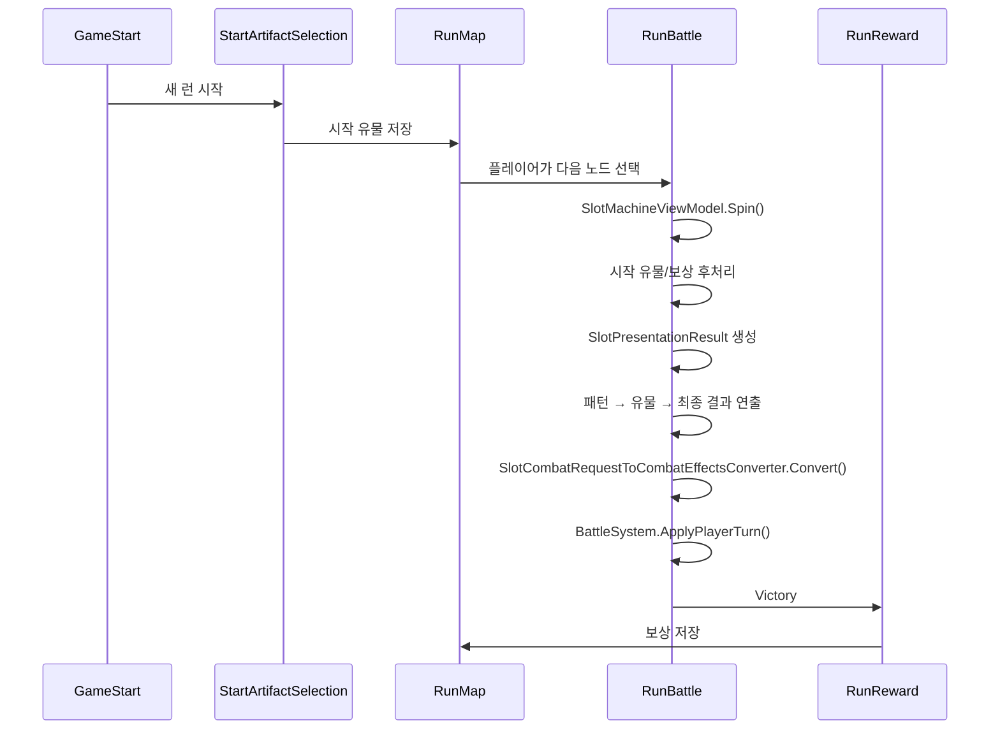

# 게임 플로우

**Status**: draft  
**Last updated**: 2026-06-05

## Purpose

게임 시작부터 시작 유물 선택, 맵, 전투, 보상, 다시 맵으로 돌아오는 playable loop를 만든다. 슬롯과 전투는 각자의 책임을 유지하고, 실제 연결은 UI/GameFlow 계층에서 수행한다.

## Decisions

| # | 결정 | 요약 |
|---|------|------|
| F1 | [ADR-0002](../adr/0002-game-flow-is-scene-driven-ui-integration.md) | 씬 기반 플로우, 전투 비수정, UI/GameFlow 계층에서 슬롯 요청을 전투 Effect로 변환 |
| F2 | 전투 코어 수정 금지 | `BattleSystem`, 전투 Dev 하네스, 전투 테스트는 그대로 두고 public API만 사용한다. |
| F3 | 시작 유물은 요청 후처리 | 시작 유물은 `SlotPatternResult + SlotCombatRequest`를 받아 최종 요청을 조정한다. |
| F4 | 보상은 MVP 런 보너스 | 보상 씬은 회복, 피해 보너스, 방어 보너스 중 하나를 선택해 다음 전투에 반영한다. |
| F5 | 맵 MVP는 전체 그래프 선택 기반 | 맵은 전체 경로, 연결선, 현재 위치, 다음 선택 가능 노드를 한 화면에 보여주고, 플레이어가 연결된 노드를 선택해야 다음 전투로 이동한다. |
| F6 | UI는 프리팹 + 이미지 슬롯 기반 | 각 씬은 View 프리팹에 배치된 `Image`/`Button`/`Text`를 Controller가 제어한다. 이미지 교체 지점은 `GameFlowImageSlot`으로 찾는다. |
| F7 | 슬롯 결과 연출은 전투 적용 전 큐로 재생 | `RunBattle`은 슬롯 계산과 유물 후처리를 먼저 끝내고, `SlotPresentationManager`가 패턴 → 유물 → 최종 결과 연출을 완료한 뒤 전투 Effect를 적용한다. |

## Scene flow

```text
GameStart
→ StartArtifactSelection
→ RunMap
→ RunBattle
→ RunReward
→ RunMap
→ ...
```

`RunBattle`에서 패배하면 `GameStart`로 돌아간다. 승리하면 현재 HP를 런 상태에 저장하고 `RunReward`로 이동한다.

## Runtime flow



## System boundary

| 영역 | 책임 |
|------|------|
| `SlotRogue.Slot` | 슬롯 결과 생성, 패턴 판정, `SlotCombatRequest` 생성 |
| `SlotRogue.Core.Combat` | `CombatEffect[]` 적용, HP/Shield/승패 처리 |
| `SlotRogue.UI.Combat` | 기존 `SlotCombatRequestToCombatEffectsConverter` |
| `SlotRogue.UI.GameFlow` | 씬 전환, 런 상태, 시작 유물/보상 후처리, 전투 API 호출 |

`SlotRogue.UI.GameFlow`는 전투 코드를 수정하지 않고 `BattleSystem` public API만 사용한다.

## MVP content

### 시작 유물

| 이름 | 조건 | 효과 |
|------|------|------|
| 체리 | 체리 아이콘 3개 이상 | 피해 +5 |
| 포도 | 포도 아이콘 3개 이상 | 회복 +4 |
| 세븐 | 세븐 아이콘 3개 이상 | 방어 +6 |
| 레몬 | 레몬 아이콘 3개 이상 | 화염 3턴 (턴당 피해 2) |
| 종 | 종 아이콘 3개 이상 | 빙결 1턴 (적 행동 스킵) |
| 네잎클로버 | 네잎클로버 아이콘 3개 이상 | 독 스택 +1 |

### 보상

| 이름 | 효과 |
|------|------|
| Field Ration | HP 8 회복 |
| Sharpening Stone | 이후 스핀 피해 +2 |
| Guard Polish | 이후 스핀 방어 +2 |

## UI image slots

MVP UI는 `Assets/_Project/Prefabs/UI/GameFlow/`의 View 프리팹으로 배치한다. 런타임 Controller는 배치된 UI를 참조해 텍스트, 버튼 이벤트, 상태 색상만 갱신한다. 이미지 교체 대상은 `GameFlowImageSlot` 컴포넌트의 `SlotId`로 찾는다.

| 씬 | View 프리팹 | Controller |
|----|-------------|------------|
| `GameStart` | `GameStartView.prefab` | `GameStartController` |
| `StartArtifactSelection` | `StartArtifactSelectionView.prefab` | `StartArtifactSelectionController` |
| `RunMap` | `RunMapView.prefab` | `RunMapController` |
| `RunBattle` | `RunBattleView.prefab` | `RunBattleController` |
| `RunReward` | `RunRewardView.prefab` | `RunRewardController` |

프리팹/씬 재생성이 필요하면 Unity 메뉴 `SlotRogue > Game Flow > Rebuild Scene UI Prefabs`를 실행한다. 해당 메뉴는 `GameFlowScenePrefabBuilder`가 제공한다.

| 씬 | 주요 SlotId |
|----|-------------|
| 공통 | `scene-background`, `<root>/frame` |
| `GameStart` | `start/hero`, `start/summary-panel` |
| `StartArtifactSelection` | `artifact/summary-panel`, `artifact/cherry`, `artifact/grape`, `artifact/seven`, `artifact/lemon`, `artifact/bell`, `artifact/clover` |
| `RunMap` | `map/board`, `map/summary-panel`, `map/node/<nodeId>`, `map/edge/<fromNodeId>-<toNodeId>` |
| `RunBattle` | `battle/player-status-panel`, `battle/wave-panel`, `battle/arena`, `battle/slot-machine-panel`, `battle/slot-cell-00`~`battle/slot-cell-14`, `battle/attack-result-panel`, `battle/spin-button`, `battle/spin-result-panel`, `battle/status-panel`, `battle/energy-panel`, `battle/credits-panel`, `battle/presentation-overlay` |
| `RunReward` | `reward/chest`, `reward/summary-panel`, `reward/Heal`, `reward/DamageBonus`, `reward/DefenseBonus` |

## Map MVP

`RunMap`은 Slay the Spire / Peglin 계열처럼 전체 맵 그래프를 한 화면에 표시한다. 자동 진입은 하지 않는다.

```text
Boss
  ╱ │ ╲
F5 Node - Node - Node
  ╲ │ ╱
F4 Node - Node - Node
  ╱ │ ╲
Start
```

초기 MVP는 고정 그래프를 사용한다. 모든 노드와 연결선은 보이지만, `CurrentMapNode`에서 edge로 직접 연결된 다음 노드만 클릭 가능하다. 현재 노드는 노란색, 방문한 경로는 녹색, 선택 가능한 다음 경로는 금색으로 강조한다. 노드를 선택하면 `GameFlowSession.CurrentMapNode`와 `CurrentEncounterNode`가 갱신되고 `RunBattle`로 이동한다.

맵 노드·그래프는 `RunMapNodeDefinition` / `RunMapGraphDefinition` ScriptableObject(`Resources/DefaultRunMapGraph`)로 관리한다. 각 노드 asset이 `RunEncounterDefinition`을 직접 참조하며, 전투 진입 시 `RunEncounterRosterBuilder`가 roster를 구성한다. 구현·검증 노드 목록은 [`feature-map-encounter-so`](../exec-plans/completed/feature-map-encounter-so.md) 참조. 에디터 재생성: `SlotRogue > Game Flow > Build Default Map Graph Assets`.

## Battle MVP

`RunBattle`은 세로 모바일 한 화면을 기준으로 다음 영역을 고정 배치한다. 전투 로직은 수정하지 않고, 기존 `BattleSystem` 상태를 HUD에 표시한다.

```text
플레이어 HP/Shield HUD        Wave / 설정
몬스터 이름 + HP
몬스터 이미지 슬롯
5 x 3 슬롯 보드
공격 결과 / SPIN / 다음 공격
상태 / Energy / Credits
```

슬롯 셀은 `battle/slot-cell-00`~`battle/slot-cell-14`의 고정 크기 칸으로 배치한다. 몬스터 formation은 Overlay Canvas 밖의 월드 `BattleArenaRoot` 아래 `EnemyFormationSlot` 3개로 표시하며, 각 슬롯은 `SpriteRenderer` portrait와 World Space Canvas HUD를 가진다. 초상화는 `RunEncounterEntry.monster` → `MonsterDefinition.portrait`를 슬롯 배열 참조로 `SetPortrait`한다. portrait 미할당·`monster == null`이면 placeholder 텍스트를 유지한다. 플로팅 데미지 spawn parent는 `battle/presentation-overlay`이고, 위치 기준은 각 월드 슬롯 자식 `DamageAnchor`이다.

스핀 결과는 패턴 성공 시 `PATTERN HIT!` 문구와 매칭된 슬롯 셀 색상 강조로 보여준다. 패턴이 없으면 `BASE ATTACK`으로 표시하고 기본 공격 피해를 적용한다.

### 슬롯 결과 연출

`SlotRogue.UI.SlotPresentation`은 실제 계산 로직과 분리된 표시 계층이다. `RunBattleController`는 스핀 결과, 대표 패턴, 시작 유물 발동, 런 보너스, 최종 `SlotCombatRequest`를 읽어 연출용 DTO를 만든다. 이 DTO는 전투 수치를 다시 계산하지 않는다. 큐 진행은 Coroutine으로 관리하고, 각 UI 이동/확대 애니메이션은 DOTween으로 재생한다.

```text
SlotMachineViewModel.Spin()
→ RunCombatRequestResolver.Resolve()
→ SlotPresentationResult 생성
→ SlotPresentationQueue 재생
   1. PatternPresentationView
   2. RelicPresentationView
   3. FinalResultView
→ Completed callback
→ BattleSystem.ApplyPlayerTurn()
```

MVP 슬롯 판정은 현재 대표 패턴 1개만 반환하지만, `SlotPresentationResult.Patterns`와 `RelicTriggers`는 배열 기반이라 여러 패턴/여러 유물 발동으로 확장 가능하다. `SlotPatternPresentationResult.IsFinale`가 켜진 패턴은 일반 패턴을 대체하지 않고, 일반 패턴 정산 연출이 모두 끝난 뒤 추가 특별 연출로 재생한다.

연출만 확인할 때는 Unity 메뉴 `SlotRogue > Slot Presentation > Rebuild Demo Scene`으로 `Dev_SlotPresentation` 씬을 생성한다. 이 씬은 전투/런 상태를 사용하지 않고 `SlotPresentationDemoController`가 더미 패턴, 더미 유물, 최종 결과 DTO를 만들어 `SlotPresentationManager`에 직접 넣는다. 데모 결과는 15칸이 모두 체리 아이콘인 보드에서 작은 패턴, 가로 패턴 3줄, 세로 패턴, 대각선 패턴, 큰 패턴을 낮은 족보부터 순차 재생하고, 마지막에 `Perfect Spin x15`를 `IsFinale` 특별 패턴으로 재생한다. 패턴 SFX는 `Assets/Resources/Sounds`의 `SFX_C_Low`부터 `SFX_C_High`까지 단계적으로 연결한다. 배경은 `Assets/Resources/Textures/Background_Outside.png`와 `Background_Inside.png`를 사용하고, 슬롯 칸 및 유물 카드 아이콘은 `Icon_Slot.png`의 sub-sprite를 사용한다.

## Open questions

| ID | 질문 | 비고 |
|----|------|------|
| Q1 | 맵 그래프 생성 방식 | 현재는 고정 그래프 MVP. 추후 런마다 seed 기반 랜덤 그래프, 이벤트/상점/휴식 노드 추가 후보. |
| Q2 | 시작 유물/보상 데이터 위치 | MVP는 코드 카탈로그. 추후 ScriptableObject 이전 후보. |
| Q3 | 전투 씬 시각화 | RunBattle 몬스터 formation은 월드 2D, 슬롯머신·플레이어 HUD·버튼·플로팅 텍스트는 Overlay UI로 유지한다. |
| Q4 | 런 종료/세이브 | 패배 시 시작 화면 복귀만 처리. 저장은 추후. |

## Alternatives considered

### 기존 `BattleDevHarness` 재사용

Dev 하네스는 인스펙터 테스트에는 좋지만, 슬롯 스핀과 씬 플로우를 직접 연결하기 어렵다. 전투 코드를 수정하지 않는 조건도 있으므로 본편 플로우용 별도 presenter를 둔다.
RunBattle overlay의 전투 텍스트 anchor/prefab 계약은 [`feature-floating-combat-text`](../exec-plans/completed/feature-floating-combat-text.md)에서 정리했다.

### 슬롯 View 재사용

`SlotMachineView`는 독립 슬롯 테스트용이다. 전투 턴 처리까지 묶으려면 상태 표시가 달라지므로 `RunBattle` 전용 UI를 만든다. 슬롯 계산은 동일하게 `SlotMachineViewModel`을 재사용한다.
