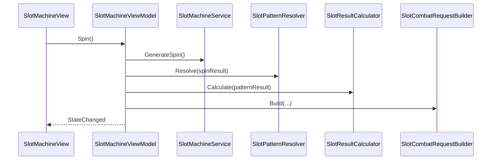

# 슬롯 코어 (Slot Core)

**Status**: draft  
**Last updated**: 2026-05-28

## Purpose

`Dev_Slot` 씬에서 전투와 분리된 슬롯 MVP를 검증한다. 5 x 3 보드 결과 생성, 간단한 패턴 판정, 전투 요청 데이터 변환, Unity UI 표시를 서로 분리해 슬롯 담당자가 독립적으로 테스트할 수 있게 한다.

## Decisions

_(ADR 없음 — MVP 초안. 슬롯 RNG / 페이아웃 모델이 확정되면 ADR 추가 검토.)_

| # | 결정 | 요약 |
|---|------|------|
| S1 | **Unity-friendly lightweight MVVM** | View는 입력·표시만 담당하고, ViewModel은 UI 상태와 명령, Service/Model은 슬롯 계산을 담당한다. Unity 자동 바인딩은 쓰지 않고 C# event로 단순 연결한다. |
| S2 | **5 x 3 고정 보드** | MVP 슬롯 결과는 5열 x 3행으로 고정한다. 보드 크기는 `SlotSpinResult`의 상수로 노출한다. |
| S3 | **Service 계층에서 결과 생성** | View는 랜덤·패턴·데미지 계산을 모른다. `SlotMachineService`가 결과 생성, `SlotPatternResolver`가 패턴 판정, `SlotResultCalculator`가 수치 계산을 맡는다. |
| S4 | **전투 직접 호출 금지** | Slot은 Battle/Core 전투 타입을 참조하지 않는다. `SlotCombatRequest` DTO만 준비하고, 실제 전투 연동은 전투 design-doc 확정 후 별도 plan에서 진행한다. |
| S5 | **MVP 패턴은 간단한 가로 매칭** | 각 row에서 같은 심볼이 3개 이상 연속되면 패턴으로 판정한다. 여러 패턴 중 가장 높은 점수 패턴 하나를 대표 결과로 쓴다. |
| S6 | **테스트 가능한 RNG** | `System.Random`을 주입 가능하게 두어 EditMode 테스트에서 seed를 고정한다. 런타임 기본 생성자는 비결정론적 seed를 사용한다. |
| S7 | **NoMatch도 기본 공격으로 처리** | 초반 전투 템포를 위해 족보가 없어도 `Base Attack` 피해 4, 공격 횟수 1을 생성한다. |

## Flow

## Runtime data

| 데이터 | 역할 |
|--------|------|
| `SlotSpinResult` | 5 x 3 심볼 배열과 보드 조회 API |
| `SlotPatternResult` | 매칭된 패턴 이름, 심볼, 길이, 행, 점수 |
| `SlotCalculationResult` | 데미지, 방어, 공격 횟수, 회복량, 크리티컬 여부 |
| `SlotCombatRequest` | 추후 전투 연동용 Slot 측 요청 DTO (MVP UI 표시·로그) |

`SlotPatternResult.NoMatch`는 패턴 실패 상태를 유지하되, `SlotResultCalculator`는 기본 공격 수치를 반환한다. `SlotCombatRequestBuilder`는 이 경우 요청 이름을 `Base Attack`으로 변환한다.

전투 시스템은 재설계 중이다. `AttackCount`, `HealAmount`, `IsCritical`, `PatternName`은 `SlotCombatRequest`에 보존하고, Battle 계약은 새 design-doc에서 정의한다.

## UI boundary

- `SlotMachineView`: Spin 버튼 입력 전달, cell/result UI 갱신, ViewModel 이벤트 구독.
- `SlotCellView`: 단일 슬롯 셀 표시.
- `SlotResultView`: 결과 텍스트 표시와 개발용 Console 로그 출력. 패턴 성공은 `PATTERN HIT`, 실패는 `NO PATTERN - Base Attack`으로 구분한다.
- `SlotMachineViewModel`: `Spin`, `CanSpin`, 현재 결과 상태, 변경 이벤트.

View는 슬롯 계산, 데미지 계산, Battle 호출을 하지 않는다.

## Open questions

| ID | 질문 | 비고 |
|----|------|------|
| Q1 | 최종 RNG / 페이아웃 모델 | 밸런스 확정 시 ADR 후보. |
| Q2 | 심볼별 확률과 수치 위치 | MVP는 코드 상수, 추후 `ScriptableObject` 데이터로 이동 검토. |
| Q3 | 전투 계약 확장 | `SlotCombatRequest` → `CombatEffect[]` 변환은 [`combat-core.md`](./combat-core.md) Q1. `AttackCount`, `IsCritical` 반영 여부 |
| Q4 | 릴 애니메이션과 로직 확정 시점 | MVP는 버튼 즉시 결과 확정. 연출 도입 시 순서 재검토. |

## Alternatives considered

### MVC — 거절

Controller가 입력, 상태, UI 갱신을 함께 들고 가기 쉬워 슬롯 계산 로직이 UI 쪽으로 새어 나갈 위험이 크다.

### Full MVVM framework — 거절

Unity UGUI에는 WPF식 자동 바인딩이 없고, MVP 범위에서는 프레임워크가 구조보다 비용을 더 만든다. C# event 기반의 가벼운 MVVM으로 제한한다.

### MVP — 보류

Unity UI에는 자연스럽지만, 이번 요구사항은 `ViewModel` 상태와 명령을 명시하고 EditMode 테스트 가능한 순수 계층을 확보하는 것이 중요하다. 구현은 MVP처럼 단순한 이벤트 연결을 유지하되 이름과 책임은 MVVM으로 둔다.

### Slot에서 Battle 직접 호출 — 거절

팀 분리 규칙에 맞게 Slot은 `SlotCombatRequest` DTO만 만들고, 실제 Battle 연결은 전투 design-doc·exec-plan 확정 후 진행한다.
