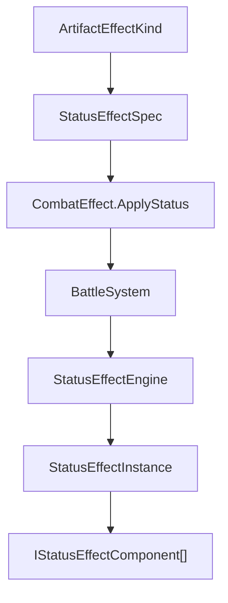

# 속성과 전투 연결

**Status**: active  
**Started**: 2026-06-05  
**Owner**: _(전투 담당)_  
**Related design-docs**: [`combat-core.md`](../../design-docs/combat-core.md), [`game-flow.md`](../../design-docs/game-flow.md)

## Goal

속성 유물이 만든 화염·빙결·독 효과를 실제 전투 코어까지 전달하고, 이후 상태이상이 늘어나도 `BattleSystem`에 종류별 분기가 누적되지 않도록 컴포넌트 조합 구조를 만든다.

## 설계 방향

상태이상 종류는 `StatusEffectKind`로 식별하고, 실제 행동은 `IStatusEffectComponent` 조합으로 실행한다.

## 현재 상태이상 조합

| 상태이상 | 조합 컴포넌트 | 동작 |
|---|---|---|
| `Burn` | `PeriodicDamageComponent` + `DurationComponent` | 턴 시작에 고정 피해, 턴 종료에 duration 감소 |
| `Freeze` | `SkipActionComponent` + `DurationComponent` | 행동 직전에 skip 판정, 턴 종료에 duration 감소 |
| `Poison` | `StackLimitComponent` + `PeriodicDamageComponent` | 최대 5스택, 턴 시작에 stack 수만큼 피해 |

## Checklist

- [x] Core/Combat: `CombatEffectKind.ApplyStatus` 추가
- [x] Core/Combat: `StatusEffectKind`, `StatusStackMode`, `StatusEffectSpec`, `StatusEffectInstance` 추가
- [x] Core/Combat: `IStatusEffectComponent`, `StatusEffectComponent` 기반 기능 컴포넌트 구조 추가
- [x] Core/Combat: `PeriodicDamageComponent`, `SkipActionComponent`, `DurationComponent`, `StackLimitComponent` 추가
- [x] Core/Combat: `StatusEffectFactory`, `StatusEffectEngine` 추가
- [x] Core/Combat: `CombatParticipant.StatusEffects` 추가
- [x] Core/Combat: `CombatEventKind`에 `StatusApplied`, `StatusTicked`, `StatusExpired`, `ActionSkipped` 추가
- [x] Core/Combat: `BattleSystem`에 턴 시작 tick, 행동 skip, 턴 종료 duration/expire 처리 연결
- [x] UI/GameFlow: `RunCombatRequestResult.StatusEffectToApply` 추가
- [x] UI/GameFlow: `RunCombatRequestResolver`에서 `ApplyBurn/ApplyFreeze/ApplyPoison`을 `StatusEffectSpec`으로 변환
- [x] UI/Combat: `SlotCombatRequestToCombatEffectsConverter`에서 `ApplyStatus` effect 추가
- [x] UI/GameFlow: `RunBattleController`에서 `StatusEffectToApply`를 전투 effect 변환에 전달
- [x] UI/GameFlow: enemy slot에 상태이상 아이콘 prefab 동적 생성/갱신 연결
- [x] Tests/Core: Burn tick, Freeze skip/expire, Poison stack cap 테스트 추가
- [x] Tests/UI: 유물 resolver와 converter 연결 테스트 추가
- [x] `dotnet build SlotRogue.slnx` 통과
- [x] `dotnet build SlotRogue.UI.csproj` 통과
- [x] `dotnet build SlotRogue.UI.Tests.csproj` 통과
- [ ] Unity Editor에서 EditMode 테스트 결과 확인

## Notes

- `BattleSystem`은 상태이상 종류별 세부 동작을 알지 않는다. 적용 시점과 턴 훅만 관리한다.
- `StatusEffectFactory`가 현재 3종 상태이상의 컴포넌트 조합을 만든다. 새 상태이상은 factory 조합과 필요한 컴포넌트만 추가한다.
- `Poison`은 duration 없이 유지되는 stack형 상태이상으로 둔다. 해제/정화가 필요해지면 별도 component 또는 effect로 추가한다.
- `dotnet test ... --no-build`는 종료 코드 0을 반환했지만 Unity Test Runner 결과를 출력하지 않았다. 최종 테스트 권위는 Unity Editor EditMode 테스트다.

## Completion

_(completed/로 옮길 때 채움.)_

- **Finished**:
- **Outcome**:
- **Follow-ups**:
