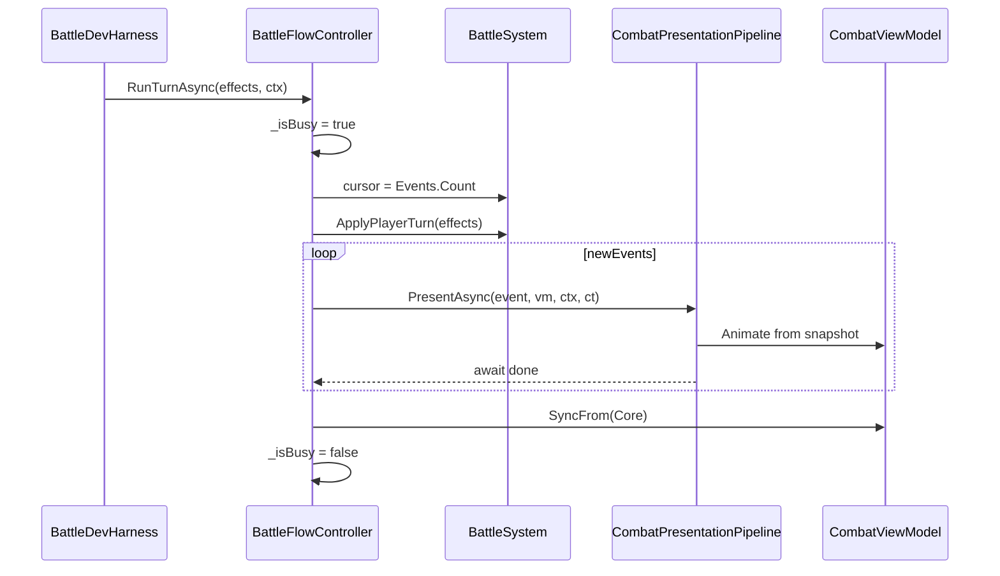

# 전투 연출 (Combat Presentation — Replay)

**Status**: active  
**Started**: 2026-05-31  
**Owner**: _(전투·UI 담당)_  
**Contributors**: _(없음)_  
**Related design-docs**: [`combat-core.md`](../../design-docs/combat-core.md)  
**Related ADR**: [ADR-0001](../../adr/0001-combat-turn-effect-pipeline.md), [ADR-0002](../../adr/0002-combat-presentation-replay.md)  
**Depends on**: [`feature-combat-core`](../../exec-plans/completed/feature-combat-core.md), [`feature-combat-dev-scene`](../../exec-plans/completed/feature-combat-dev-scene.md) (완료)

## Goal

`CombatEffect` 1건(및 `ShieldReset` / `PhaseChanged` / `BattleEnded`)마다 이펙트·UI·연출이 **끝날 때까지 await** 한 뒤 다음 이벤트로 진행한다. Core `ApplyPlayerTurn`은 **동기 유지**(ADR-0002 Replay). Dev_Battle에서 버튼 1회 → 턴 이벤트가 **순차 연출**되는 것을 Play Mode로 확인한다.

**범위 밖 (Later):** `Dev_Slot`↔전투 통합, Addressables VFX, 연출 스킵/2x, `BattleTurnSession`(Step API), 본편 전투 씬 UI 풀셋.

## Phases

---

### Phase 1 — Core 이벤트 스냅샷

- [x] ADR-0002, `combat-core.md` Presentation 섹션 재확인
- [x] `EffectApplied`용 대상 Participant **Before/After** (`Hp`, `Shield`) — `CombatParticipantSnapshot` + `CombatEvent.TargetBefore`/`TargetAfter`
- [x] `BattleSystem.ApplyEffects` 적용 전·후 스냅샷 기록 (`EffectApplicator` 변경 없음)
- [x] EditMode: 기존 `BattleSystemTests` green + 스냅샷 assert 2건 (`Damage` shield 소진, `Heal` 상한)
- [x] `CombatEventConsoleLogger` — `hp before->after`, `shield before->after` 로그

**🔍 Review:** 테스트만으로 스냅샷이 Effect 순서·shield 소진과 일치하는지 확인.

---

### Phase 2 — UI 파이프라인 뼈대

**구현 메모 (2026-05-31, 구현 전 확정):**

- **선행:** `Packages/manifest.json`에 UniTask UPM 추가 ([`unity-setup.md`](../../guides/unity-setup.md) URL). `SlotRogue.UI.asmdef`에 `UniTask` 참조. Core asmdef는 UniTask **미참조**.
- **폴더:** `Assets/_Project/Scripts/UI/Combat/Presentation/` — Flow·Pipeline·ViewModel·Presenter·Context. `.meta` 동반 커밋.
- **`BattleFlowController`:** `sealed` **plain class** (MonoBehaviour 아님). `BattleDevHarness`가 필드로 소유. `CancellationToken`은 Harness `OnDestroy`에서 `CancellationTokenSource.Cancel()` 후 Flow에 전달.
- **`RunTurnAsync`:** `(BattleSystem battle, IReadOnlyList<CombatEffect> effects, PresentationContext ctx, CancellationToken ct) → UniTask<BattleApplyResult>`. `_isBusy` 가드 → `startIndex = battle.Events.Count` → `ApplyPlayerTurn` → `for (i = startIndex; i < Events.Count; i++)` 순차 `await pipeline.PresentAsync` → `viewModel.SyncFrom(battle)` → `_isBusy = false`. 거부 시 즉시 return.
- **이벤트 slice:** 별도 List 복사 없음. 인덱스 루프만 (`CombatEventSlice` static helper는 선택).
- **`CombatViewModel`:** `PlayerHp`, `PlayerShield`, `MonsterHp`, `MonsterShield` (표시용 int). `SyncFrom(BattleSystem)`, `ApplySnapshot(CombatEvent)` — `EffectApplied` 시 스냅샷으로 표시값 갱신(애니는 Phase 3).
- **`PresentationContext`:** `bool IsCritical`, `string PatternName` (Harness·Converter에서 채움). Core·`CombatEffect` 비확장 (ADR-0002).
- **`ICombatEventPresenter`:** 단일 인터페이스 `UniTask PresentAsync(CombatEvent, CombatViewModel, PresentationContext, CancellationToken)`. **`CombatPresentationPipeline`:** `CombatEventKind` + (`EffectApplied`일 때 `CombatEffectKind`) 라우팅. Phase 2 Review용 **`CombatDummyPresenter`** 하나가 모든 Kind 처리 → `UniTask.CompletedTask`.
- **Phase 2 Review 연동:** Harness `Apply Turn` 정식 교체는 Phase 4. Review 전까지 Harness에 **임시** `ApplyTurnWithPresentationAsync().Forget()` 호출 경로 1개(기존 동기 `ApplyTurn` 옆) 또는 동일 버튼에서 Flow 분기 — Play Mode에서 Dummy 순차·연타 거부만 확인.
- **테스트:** Presentation 계층 PlayMode/EditMode 자동 테스트 **필수 아님** (AGENTS §5 UI). Phase 2는 Play 수동 Review.

- [x] `SlotRogue.UI.asmdef` — UniTask 패키지 참조
- [x] `CombatViewModel` — Player/Monster 표시용 HP·Shield
- [x] `PresentationContext` — crit, patternName 등 sidecar (Core·`CombatEffect` 무관)
- [x] `BattleFlowController` — `RunTurnAsync`, `_isBusy`, `CancellationToken` (OnDestroy)
- [x] 턴 전 `Events.Count` cursor → `ApplyPlayerTurn` → 새 이벤트 slice 유틸
- [x] `CombatPresentationPipeline` + `ICombatEventPresenter` (또는 Kind별 인터페이스)
- [x] `DummyPresenter` — 즉시 `UniTask.CompletedTask` (큐 순서 검증용)
- [x] 턴 종료 `viewModel.SyncFrom(battle)`

**🔍 Review:** Dev 씬에서 Dummy만으로 이벤트 N개가 순차 호출·`_isBusy` 중복 Apply 거부.

---

### Phase 3 — Damage 연출 MVP

**구현 메모 (2026-05-31, 구현 전 확정):**

- **선행:** DOTween 프로젝트 설치 + Utility Panel Setup ([`unity-setup.md`](../../guides/unity-setup.md)). 미설치 시 Phase 3 시작 전 처리. `SlotRogue.UI.asmdef`에 DOTween asmdef 참조(패키지 구조에 맞게).
- **Dev HUD 범위 (MVP):** 별도 HP Bar prefab/Slider **없음**. `BattleDevHarness`의 `_statusText` 문자열 중 Player/Monster HP 줄만 ViewModel 기반으로 갱신·트윈. Phase 4 이후 본편 UI는 별도 plan.
- **`DamagePresenter`:** `EffectApplied` + `CombatEffectKind.Damage`만 처리. `event` 스냅샷 `HpBefore`→`HpAfter`로 표시 HP tween (`DOVirtual` 또는 `DOTween.To`). **Effect 내부** `await UniTask.WhenAll(hudTween, vfxStub, sfxStub)` — VFX/SFX stub은 `UniTask.Delay(50~100ms)` 또는 `CompletedTask`.
- **Floating damage stub:** Canvas에 임시 `Text` 1줄 spawn 후 fade·destroy, 또는 Console `Debug.Log`만 (시각 검증은 HP 줄 tween 우선). crit는 `PresentationContext.IsCritical`이 true일 때 로그 접두 또는 텍스트 색만 구분.
- **`ShieldPresenter` / `HealPresenter`:** 짧은 tween(100~200ms) 또는 `CompletedTask`. 스냅샷 `Shield`/`Hp` 반영.
- **`ShieldResetPresenter`:** shield 0 표시 즉시 또는 100ms blink. `ShieldReset` Kind 전용.
- **`PhaseChangedPresenter`:** MVP **생략 가능** — Pipeline에서 no-op `CompletedTask` (이벤트 순서 유지).
- **`BattleEndedPresenter`:** 최소 — `_statusText`에 EndReason 강조 1줄 또는 300ms pause 후 `SyncFrom` 보장. **사망 순서:** Core가 이미 `EffectApplied` 후 `BattleEnded` 순으로 이벤트 append → Replay 큐상 마지막 Damage 연출 **await 완료 후** `BattleEnded` presenter 실행 (추가 정렬 불필요).
- **공통:** `CombatPresenterBase` 또는 static helper — tween `SetLink(harnessGameObject)`, Harness `OnDestroy`/`OnDisable`에서 해당 GO `DOKill(true)`. `OperationCanceledException` 삼킴 금지 — `ct` throw 전파.
- **인과 연출:** MVP는 투사체 체인 **없음** — 전부 WhenAll. Later에 Damage만 순차 서브시퀀스 추가.
- **Review 시나리오:** `AttackCount=3`, `Damage>0` Request → Console/화면에서 3회 순차 간격·최종 HP = Core `Participant`와 `SyncFrom` 후 일치.

- [ ] `DamagePresenter` — `_statusText` HP 줄 tween + floating damage stub (별도 HP bar 없음)
- [ ] Effect **내부** `UniTask.WhenAll`(VFX stub, SFX stub, HUD tween)
- [ ] `ShieldPresenter` / `HealPresenter` — 최소 stub (즉시 완료 또는 짧은 tween)
- [ ] `ShieldResetPresenter`, `BattleEndedPresenter` — 최소 연출
- [ ] 사망: 마지막 Damage `await` 후 `BattleEnded` 재생 순서 확인
- [ ] DOTween `SetLink` / `DOKill` 패턴 — Presenter base 또는 공통 helper

**🔍 Review:** Play Mode — Request multi-hit → 타격이 순차로 보이고 최종 HP는 턴 끝 sync와 일치.

---

### Phase 4 — Dev Harness 연동

- [ ] `BattleDevHarness` — `Apply Turn` → `BattleFlowController.RunTurnAsync` (또는 parallel 경로; Console 로거 유지)
- [ ] 연출 중 Apply 버튼 비활성 또는 무시
- [ ] `CombatEventConsoleLogger` — 연출과 병행 로그(디버그) 유지 여부 확정

**🔍 Review:** Start Battle → Apply Turn 여러 번 → Phase·Ended·중복 입력 없음.

---

## 아키텍처 스케치 (구현 참고)

### 레이어 (네임스페이스 가이드)

| 타입 | asmdef | 역할 |
|------|--------|------|
| `BattleFlowController` | UI.Combat | UniTask 오케스트레이션, 입력 잠금 |
| `CombatPresentationPipeline` | UI.Combat | `CombatEvent` → Presenter 라우팅 |
| `ICombatEventPresenter` | UI.Combat | Kind/EffectKind별 `PresentAsync` |
| `CombatViewModel` | UI.Combat | HUD 표시 HP/Shield |
| `PresentationContext` | UI.Combat | crit, patternName sidecar |
| `BattleSystem` | Core.Combat | 동기 계산, 이벤트 append |

### 연출 규칙 (ADR-0002)

| 범위 | 규칙 |
|------|------|
| 이벤트 간 | 항상 순차 `await` |
| Effect 1건 내 | 기본 `UniTask.WhenAll` |
| 인과 연출 | 투사체 → 명중 → HUD 순차 |
| 사망 | 마지막 Damage 후 `BattleEnded` |

## 리스크 & 완화

| 리스크 | 완화 |
|--------|------|
| Core HP vs 화면 HP 불일치 | HUD는 ViewModel만; 턴 끝 `SyncFrom` |
| 연타·중복 턴 | `_isBusy` + Phase gate |
| UniTask 누수 | `async void` 금지; Destroy `CancellationToken` |
| DOTween Destroy 후 콜백 | `SetLink(gameObject)` / `DOKill` |
| Presenter 폭증 | Pipeline + Registry; Phase/Effect 인터페이스 분리는 구현 시 선택 |

## Later (본 plan 범위 밖)

- `BattleTurnSession` / Step API — 스킵·리플레이·네트워크 필요 시
- `Dev_Slot` 스핀 완료 → `RunTurnAsync` 자동 호출
- crit/pattern 전용 VFX — `PresentationContext` 소비
- 연출 스킵·2x speed

## Notes

- 외부 검토 2건 합의: MVP Replay + event snapshot + ViewModel (2026-05-31).
- Phase 2·3 **구현 메모**는 구현 시작 전 확정안; 구현 중 바뀌면 해당 Phase 메모·체크를 **같은 커밋**에 갱신 (GOVERNANCE C).
- Console 로거(`CombatEventConsoleLogger`)는 연출 MVP와 **공존** 가능 — cursor 패턴 동일. Phase 4에서 `ApplyPlayerTurn` **후** 동기 로그 유지 vs 연출 **후** 로그 — **연출 후 1회 로그** 권장(스냅샷·최종 HP 일치).

## Completion

_(completed/로 옮길 때 채움.)_

- **Finished**:
- **Outcome**:
- **Follow-ups**:
