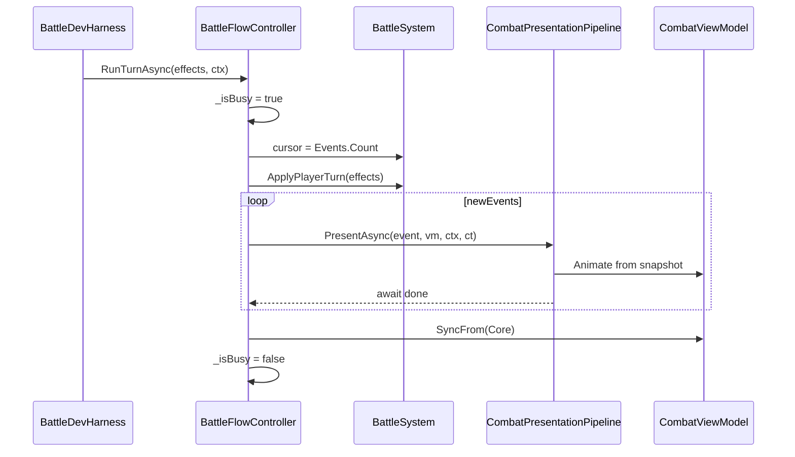

# 전투 연출 (Combat Presentation — Replay)

**Status**: active  
**Started**: 2026-05-31  
**Owner**: _(전투·UI 담당)_  
**Contributors**: _(없음)_  
**Related design-docs**: [`combat-core.md`](../../design-docs/combat-core.md)  
**Related ADR**: [ADR-0001](../../adr/0001-combat-turn-effect-pipeline.md), [ADR-0002](../../adr/0002-combat-presentation-replay.md)  
**Depends on**: [`feature-combat-core`](../../exec-plans/completed/feature-combat-core.md), [`feature-combat-dev-scene`](../../exec-plans/completed/feature-combat-dev-scene.md) (완료)

## Goal

`CombatEffect` 1건(및 `ShieldReset` / `PhaseChanged` / `BattleEnded`)마다 이펙트·UI·연출이 **끝날 때까지 await** 한 뒤 다음 이벤트로 진행한다. Core `ApplyPlayerTurn`은 **동기 유지**(ADR-0002 Replay). Dev_Battle에서 버튼 1회 → 턴 이벤트가 **순차 연출**되는 것을 Play Mode로 확인한다.

**범위 밖 (Later):** `Dev_Slot`↔전투 통합, Addressables VFX, 연출 스킵/2x, `BattleTurnSession`(Step API), 본편 전투 씬 UI 풀셋.

## Phases

---

### Phase 1 — Core 이벤트 스냅샷

- [ ] ADR-0002, `combat-core.md` Presentation 섹션 재확인
- [ ] `EffectApplied`용 대상 Participant **Before/After** (`Hp`, `Shield`) — `CombatEvent` 또는 nested snapshot struct
- [ ] `BattleSystem` / `EffectApplicator` 적용 시점에 스냅샷 기록
- [ ] EditMode: 기존 `BattleSystemTests` green + 스냅샷 값 assert 1~2건 추가
- [ ] `CombatEventConsoleLogger` 포맷에 스냅샷 필드 반영(선택)

**🔍 Review:** 테스트만으로 스냅샷이 Effect 순서·shield 소진과 일치하는지 확인.

---

### Phase 2 — UI 파이프라인 뼈대

- [ ] `SlotRogue.UI.asmdef` — UniTask 패키지 참조
- [ ] `CombatViewModel` — Player/Monster 표시용 HP·Shield
- [ ] `PresentationContext` — crit, patternName 등 sidecar (Core·`CombatEffect` 무관)
- [ ] `BattleFlowController` — `RunTurnAsync`, `_isBusy`, `CancellationToken` (OnDestroy)
- [ ] 턴 전 `Events.Count` cursor → `ApplyPlayerTurn` → 새 이벤트 slice 유틸
- [ ] `CombatPresentationPipeline` + `ICombatEventPresenter` (또는 Kind별 인터페이스)
- [ ] `DummyPresenter` — 즉시 `UniTask.CompletedTask` (큐 순서 검증용)
- [ ] 턴 종료 `viewModel.SyncFrom(battle)`

**🔍 Review:** Dev 씬에서 Dummy만으로 이벤트 N개가 순차 호출·`_isBusy` 중복 Apply 거부.

---

### Phase 3 — Damage 연출 MVP

- [ ] `DamagePresenter` (또는 `EffectApplied` + `Damage` 라우팅) — HP bar DOTween, floating damage stub
- [ ] Effect **내부** `UniTask.WhenAll`(VFX stub, SFX stub, HUD tween)
- [ ] `ShieldPresenter` / `HealPresenter` — 최소 stub (즉시 완료 또는 짧은 tween)
- [ ] `ShieldResetPresenter`, `BattleEndedPresenter` — 최소 연출
- [ ] 사망: 마지막 Damage `await` 후 `BattleEnded` 재생 순서 확인
- [ ] DOTween `SetLink` / `DOKill` 패턴 — Presenter base 또는 공통 helper

**🔍 Review:** Play Mode — Request multi-hit → 타격이 순차로 보이고 최종 HP는 턴 끝 sync와 일치.

---

### Phase 4 — Dev Harness 연동

- [ ] `BattleDevHarness` — `Apply Turn` → `BattleFlowController.RunTurnAsync` (또는 parallel 경로; Console 로거 유지)
- [ ] 연출 중 Apply 버튼 비활성 또는 무시
- [ ] `CombatEventConsoleLogger` — 연출과 병행 로그(디버그) 유지 여부 확정

**🔍 Review:** Start Battle → Apply Turn 여러 번 → Phase·Ended·중복 입력 없음.

---

## 아키텍처 스케치 (구현 참고)

### 레이어 (네임스페이스 가이드)

| 타입 | asmdef | 역할 |
|------|--------|------|
| `BattleFlowController` | UI.Combat | UniTask 오케스트레이션, 입력 잠금 |
| `CombatPresentationPipeline` | UI.Combat | `CombatEvent` → Presenter 라우팅 |
| `ICombatEventPresenter` | UI.Combat | Kind/EffectKind별 `PresentAsync` |
| `CombatViewModel` | UI.Combat | HUD 표시 HP/Shield |
| `PresentationContext` | UI.Combat | crit, patternName sidecar |
| `BattleSystem` | Core.Combat | 동기 계산, 이벤트 append |

### 연출 규칙 (ADR-0002)

| 범위 | 규칙 |
|------|------|
| 이벤트 간 | 항상 순차 `await` |
| Effect 1건 내 | 기본 `UniTask.WhenAll` |
| 인과 연출 | 투사체 → 명중 → HUD 순차 |
| 사망 | 마지막 Damage 후 `BattleEnded` |

## 리스크 & 완화

| 리스크 | 완화 |
|--------|------|
| Core HP vs 화면 HP 불일치 | HUD는 ViewModel만; 턴 끝 `SyncFrom` |
| 연타·중복 턴 | `_isBusy` + Phase gate |
| UniTask 누수 | `async void` 금지; Destroy `CancellationToken` |
| DOTween Destroy 후 콜백 | `SetLink(gameObject)` / `DOKill` |
| Presenter 폭증 | Pipeline + Registry; Phase/Effect 인터페이스 분리는 구현 시 선택 |

## Later (본 plan 범위 밖)

- `BattleTurnSession` / Step API — 스킵·리플레이·네트워크 필요 시
- `Dev_Slot` 스핀 완료 → `RunTurnAsync` 자동 호출
- crit/pattern 전용 VFX — `PresentationContext` 소비
- 연출 스킵·2x speed

## Notes

- 외부 검토 2건 합의: MVP Replay + event snapshot + ViewModel (2026-05-31).
- Console 로거(`CombatEventConsoleLogger`)는 연출 MVP와 **공존** 가능 — cursor 패턴 동일.

## Completion

_(completed/로 옮길 때 채움.)_

- **Finished**:
- **Outcome**:
- **Follow-ups**:
