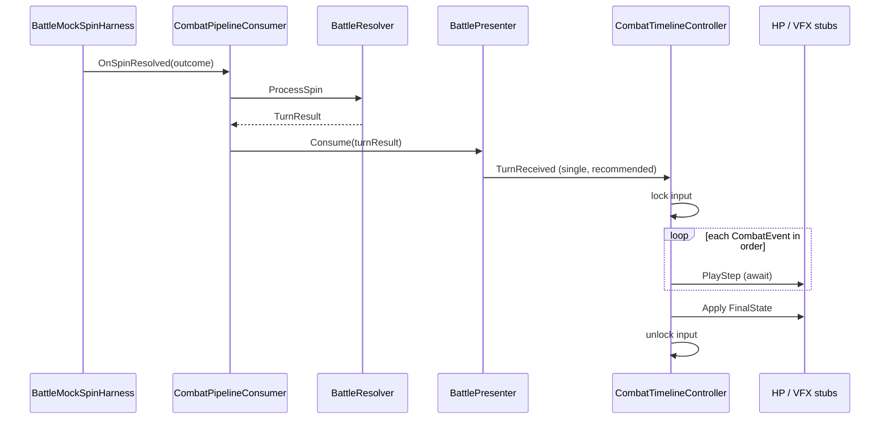

# 전투 UI 타임라인 (`CombatTimelineController`)

**Status**: active  
**Started**: 2026-05-28  
**Owner**: _(UI/전투 담당 — GitHub id 기입)_  
**Contributors**: _(슬롯 담당 — 릴 연출 선후·입력 잠금 연동, 필요 시)_  
**Related design-docs**: [`combat-core.md`](../../design-docs/combat-core.md) (C10, UI 타임라인), [`ADR-0001`](../../adr/0001-combat-turn-event-log.md)  
**Predecessor**: [`feature-combat-turn-events`](../completed/feature-combat-turn-events.md)

## Goal

`BattlePresenter`가 전달하는 `TurnResult`를 UI 레이어에서 **이벤트 순서대로 순차 재생**하고, 재생이 끝날 때까지 **스핀/전투 입력을 잠근다**. `BattleTest` 씬에서 Mock 스핀 버튼으로 “한 번 누르면 → 플레이어 피해 연출 → 몬스터 행동 연출 → HP 최종 동기화”가 **한 프레임에 몰리지 않고** 체감 가능한 간격으로 보이는 상태가 “완료”다.

**완료 기준 (Acceptance)**

- `CombatEventKind` MVP 4종(`PlayerDamageToMonster`, `MonsterActionExecuted`, `MonsterDamageToPlayer`, `BattleEnded`)에 대해 kind별 최소 연출(또는 로그+대기 스텁)이 **큐 순서**대로 재생된다.
- 연출 중 `BattleMockSpinHarness` 버튼(또는 동일 역할 입력)이 비활성화되고, 턴 연출 종료 후 다시 활성화된다(전투 종료 `BattleEnded` 포함).
- `TurnCompleted` 시 `FinalState`로 HP 표시(텍스트/슬라이더 등 MVP 1종)가 **최종값과 일치**한다.
- Core 규칙·이벤트 순서는 기존 EditMode 테스트(`BattleResolverTests`, `BattlePresenterTests`)를 깨지 않는다.

## 배경

- 완료: [`feature-combat-turn-events`](../../exec-plans/completed/feature-combat-turn-events.md) — Resolver가 `TurnResult.Events` 순서를 기록, Presenter가 `Consume`으로 전달.
- 문제: 현재 `BattlePresenter.Consume`은 `foreach` 안에서 `CombatEventEmitted`를 **동기·연속 호출**한다. 구독자가 UniTask로 “다음 이벤트까지 대기”할 수 없어, UI 타임라인이 ADR-0001 의도(순차 연출)를 만족하지 못한다.
- 역할 분리 ([`combat-core.md`](../../design-docs/combat-core.md) C10):
  - **순서·내용**: `TurnResult.Events` (Core, 이미 확정)
  - **타이밍·연출·입력 잠금**: `CombatTimelineController` (UI)
  - **최종 HP 동기화**: `TurnResult.FinalState` at `TurnCompleted`

## 사전 결정 (구현 착수 전 1회 합의)

아래는 plan Notes에 기록하고, 첫 PR에서 코드에 반영한다. ADR이 필요하면 `docs/adr/`에 추가(입력 잠금만으로는 design-doc Notes로도 가능).

| ID | 주제 | 권장 (MVP) | 대안 |
|----|------|------------|------|
| D1 | Presenter → UI 전달 형태 | `Consume`이 **단일** `TurnReceived(TurnResult)`(또는 Timeline에 `Play(TurnResult)` 직접 호출). **동기 foreach `CombatEventEmitted` 제거** | Timeline만 `CombatEventEmitted` 구독 — **불가**(동일 스택에서 전 이벤트 소진) |
| D2 | 입력 잠금 범위 | 타임라인 `Play` 시작~종료. Mock: `Button.interactable = false` | 전역 static gate — MVP 금지 |
| D3 | `BattleDebugLogListener` | `TurnResult.Events`를 타임라인 **완료 후** 한 번에 로그, 또는 Timeline의 step 콜백에서 로그 | Presenter foreach 유지 |
| D4 | 슬롯 릴 vs 전투 연출 선후 | **본 plan 범위 밖**. Mock 스핀만. `slot-core.md` 확정 시 Timeline 앞단에 “릴 대기” 훅 추가 | — |
| D5 | asmdef | `SlotRogue.UI` 신설 → `SlotRogue.Core` 참조. UniTask 사용 | Timeline을 Core에 두기 — **거절**(UI 연출·입력이 Core 오염) |

## Checklist

### 문서

- [ ] 본 plan + [`STATUS.md`](../../STATUS.md) Active 등록 (시작 커밋)
- [ ] D1~D3 합의 내용을 본 plan **Notes**에 확정 기록
- [ ] (선택) `combat-core.md` C10 — Presenter API가 타임라인 친화적으로 바뀐 경우 1~2문단 갱신

### 인프라

- [ ] `Assets/_Project/Scripts/UI/SlotRogue.UI.asmdef` — `SlotRogue.Core` 참조, Tests에서 UI 테스트 필요 시 별도 asmdef
- [ ] `CombatTimelineController` — `MonoBehaviour`, `[SerializeField] BattleBootstrap` 또는 Presenter 주입

### Core 연동 (D1)

- [ ] `BattlePresenter.Consume` — 동기 `foreach` 제거; `TurnReceived` 단일 이벤트(이름은 구현 시 확정) 또는 Timeline 전용 진입점
- [ ] `CombatPipelineConsumer` / `BattleBootstrap` — Timeline이 씬에서 Presenter와 함께 구독·해제(`OnDisable`)
- [ ] `BattlePresenterTests` — 단일 턴 수신·이벤트 순서 검증으로 갱신
- [ ] `BattleDebugLogListener` — D3 방식으로 동작 유지

### 타임라인 재생

- [ ] `PlayTurnAsync(TurnResult)` (가칭) — `Events`를 **for** 순회, kind별 `PlayStepAsync` 분기
- [ ] `PlayerDamageToMonster` — 최소 연출(숫자 팝업 / 로그 + `UniTask.Delay`)
- [ ] `MonsterActionExecuted` — 행동 라벨·아이콘 스텁
- [ ] `MonsterDamageToPlayer` — 피해 연출 스텁
- [ ] `BattleEnded` — 승패 메시지 또는 로그; 이후 입력 잠금 해제 정책 확정(재시작 전까지 잠금 등은 follow-up)
- [ ] `PlayerHealed` / `MonsterHealed` — no-op 또는 로그만 (MVP 예약 타입)
- [ ] `TurnCompleted` — `FinalState`로 HP UI 1회 갱신
- [ ] 재진입 방지 — 연출 중 추가 `OnSpinResolved` 무시 또는 큐(본 plan은 **무시** 권장)

### 입력 잠금 (D2)

- [ ] `ICombatInputGate` (가칭) — `SetLocked(bool)` 또는 `Lock`/`Unlock`
- [ ] `BattleMockSpinHarness` — gate 구현; Timeline이 lock/unlock 호출
- [ ] Play Mode: 연출 중 연타해도 턴이 중첩되지 않음

### 씬·수동 검증

- [ ] `BattleTest.unity` — Timeline 컴포넌트 배치, HP 표시 1종 연결
- [ ] Play Mode 체크리스트: Attack → 몬스터 행동 → (피해) → HP 최종값; Pass/Defend 케이스 1회씩

### 테스트

- [ ] EditMode: Timeline **순서 로직**은 순수 C# helper로 분리해 kind 시퀀스 검증 (DOTween/MonoBehaviour 없이)
- [ ] (선택) PlayMode: 1 시나리오 스모크 — plan Notes에 수동 결과 기록

## 범위 밖 (Follow-ups)

- DOTween 피격·카메라 쉐이크, 사운드, 풀링 VFX
- 슬롯 `SpinController`와 릴 연출 선후 (`slot-core.md`, D4)
- `BattleEnded` 후 메타 화면·재시작 UX
- SO Event Channel로 Presenter 분리 ( [`combat-core.md`](../../design-docs/combat-core.md) 대안)
- 전투 중 UI가 `BattleState`를 직접 mutate — **금지 유지**

## Notes

- **블로커(해결 필요)**: Presenter 동기 foreach와 순차 UI 연출은 양립하지 않는다. D1을 첫 PR 최우선으로 처리한다.
- `BattleMockSpinHarness`는 현재 `OnSpinResolved`를 즉시 호출한다. 규칙(C1)상 **로직은 즉시 확정**되어도 되고, **표시만** 지연하는 현 구조와 일치한다.
- 연출 길이 상수는 Timeline `SerializeField`로 두어 튜닝 가능하게 한다.
- `dotnet build`만으로 UI/asmdef 검증이 안 될 수 있음 — Unity Test Runner 기준으로 최종 확인 ([`feature-combat-turn-events`](../completed/feature-combat-turn-events.md) Notes와 동일).

## Completion

_(plan 완료 시 채움.)_

- **Finished**:
- **Outcome**:
- **Follow-ups**:
