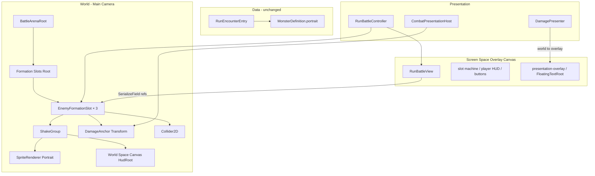

# RunBattle 적 포메이션 슬롯 — 2D 월드 전환

**Status**: active  
**Started**: 2026-06-05  
**Owner**: _(미정)_  
**Contributors**: _(없음)_  
**Related design-docs**: [`game-flow.md`](../../design-docs/game-flow.md), [`combat-core.md`](../../design-docs/combat-core.md)  
**Related ADR**: [ADR-0003](../../adr/0003-combat-presentation-replay.md)  
**Depends on**: [`feature-enemy-formation-slot`](../completed/feature-enemy-formation-slot.md) (완료), [`feature-floating-combat-text`](../completed/feature-floating-combat-text.md) (완료), [`feature-map-encounter-so`](../completed/feature-map-encounter-so.md) (완료)

## Background

[`feature-enemy-formation-slot`](../completed/feature-enemy-formation-slot.md)에서 `EnemyFormationSlot` UI 프리팹(`Image`/`Button`/`RectTransform`)으로 몬스터 초상화·HUD·데미지 앵커를 한 트리에 묶었다. RunBattle Canvas는 **Screen Space Overlay**라 Main Camera 흔들림(추후 카메라 셰이크)과 **연동되지 않는다**.

요청: 스파이크 없이 **2D Sprite(월드)** 로 전환하고, 이후 카메라 셰이크 시 몬스터·(선택) HUD가 같이 진동할 수 있는 구조를 마련한다. HUD 흔들림 on/off 비교는 **본 plan 이후** 별도 plan(`feature-battle-shake` 등)에서 `ShakeGroup`/`HudRoot` 분리를 이용한다.

## Locked decisions (구현 전 확정)

| # | 결정 |
|---|------|
| 스파이크 | **없음** — UI→2D 본 구현으로 바로 진행 |
| RunBattle 구조 | **하이브리드**: 슬롯머신·플레이어 HUD·버튼·플로팅 텍스트 = Overlay UI 유지; 몬스터 formation = **월드 2D** |
| 초상화 | `SpriteRenderer` + `MonsterDefinition.portrait` (SO·Controller 바인딩 경로 유지) |
| HUD | **World Space Canvas** 자식 (`HudRoot`) — Text·HP bar uGUI 재사용 |
| 슬롯 수·매핑 | `FormationHudSlotCount = 3`, `formationSlot` → HUD 인덱스 **기존과 동일** |
| 배치 | `SlotRogue > Game Flow > Rebuild Scene UI Prefabs`가 **월드 슬롯 3개 + Arena root**까지 생성·`RunBattleView`에 연결 |
| Hierarchy | `ShakeGroup`(Portrait + HudRoot) / `DamageAnchor`(ShakeGroup **밖**) / `ClickCollider` — 셰이크·HUD 토글은 **Later** |
| DamageAnchor | 월드 `Transform` 기준점; 플로팅 텍스트 spawn은 **overlay** 유지; `DamagePresenter`는 월드→overlay 좌표 변환(**기존 contract 확장**) |
| 클릭 | UI `Button` 제거 → **`Collider2D`** (+ Physics2D 또는 `IPointerClickHandler` on World Space Canvas raycast) |
| `RunBattleView` API | `SetEnemySlot`, `SetEnemyPortrait`, `GetEnemyDamageAnchor` 등 **시그니처 유지**, 내부만 2D |
| `monster == null` / portrait null | placeholder 유지 (Hud 텍스트 / portrait sprite clear) |
| Arena UI 패널 | `battle/arena` **장식용 Overlay 패널**은 유지 가능; 몬스터 슬롯은 패널 **밖** 월드 `BattleArenaRoot` |
| 마이그레이션 | UI `EnemyFormationSlot` 프리팹 **교체**; Rebuild **필수**; hierarchy fallback **없음** |
| Dev_Battle | **범위 밖** |

## Requirements

1. `EnemyFormationSlotView` — Portrait: `SpriteRenderer`; HUD: World Space Canvas 하위 `Text`/`Image`; `SetPortrait`/`SetHud`/`SetHpFill`/`SetSelected`/`SetInteractable`/`SetClickHandler`/`SetActive` 유지.
2. `EnemyFormationSlot` 월드 프리팹 — 경로 예: `Assets/_Project/Prefabs/World/GameFlow/EnemyFormationSlot.prefab` (또는 `Prefabs/Battle/` — 팀 폴더 규칙에 맞게 Rebuild 시 확정).
3. `GameFlowScenePrefabBuilder.BuildRunBattle` — `BattleArenaRoot`(월드) + formation 슬롯 3개 배치·위치(spacing 상수 1곳); Overlay Canvas에서 **UI 몬스터 슬롯 생성 제거**.
4. `RunBattleView` — `_formationSlots[]` SerializeField; 월드 슬롯 참조; `GetEnemyDamageAnchor` → overlay용 브리지 `RectTransform` 또는 `Transform`→변환 지점.
5. `RunBattleController` — `BindEnemySlots`/`RefreshEnemySlots` diff 최소; `CombatPresentationHost.SetEnemyDamageAnchor` per-enemy 맵 유지.
6. `DamagePresenter` — 앵커가 월드 `Transform`이어도 overlay에 올바르게 배치 (월드 중심 → `FloatingTextRoot` 로컬).
7. Rebuild 후 `RunBattleView.prefab`, `RunBattle.unity`, 월드 슬롯 프리팹·`.meta` 갱신.
8. Main Camera orthographic·`BattleArenaRoot` 위치가 1080×1920 Overlay 레이아웃과 **시각적으로 정렬** (튜닝 상수 SerializeField 또는 builder 상수).
9. 범위 밖: 카메라 셰이크 Presenter, HUD shake on/off 토글 UI, Core/`BattleSystem`, Dev_Battle 통일, 보스 Variant, Addressables.

## Goal

RunBattle에서 몬스터 formation이 **월드 2D Sprite**로 표시되고, Overlay UI(슬롯머신·플레이어·플로팅 데미지)와 공존한다. Rebuild 한 번으로 UI 몬스터 슬롯이 월드 슬롯으로 교체되며, encounter·portrait·타겟 선택·플로팅 데미지 위치가 기존 [`feature-enemy-formation-slot`](../completed/feature-enemy-formation-slot.md) 동작을 유지한다. `ShakeGroup`/`HudRoot` 분리로 이후 카메라 셰이크·HUD 흔들림 A/B plan이 코드 churn 없이 이어진다.

## Baseline (현재 vs 목표)

| 항목 | 현재 (formation-slot 완료) | 목표 (본 plan) |
|------|---------------------------|----------------|
| Portrait | UI `Image` + `GameFlowImageSlot` | `SpriteRenderer` |
| HUD | Overlay `RectTransform` 패널 | World Space Canvas `HudRoot` |
| 슬롯 parent | Canvas Arena UI 하위 | `BattleArenaRoot` (월드) |
| 클릭 | `Button` on slot root | `Collider2D` (+ 입력 라우팅) |
| 카메라 셰이크 연동 | 불가 (Overlay) | 월드 `ShakeGroup` 이동 가능 |
| 플로팅 데미지 | 슬롯 `RectTransform` 앵커 → overlay 변환 | 월드 앵커 → overlay 변환 (동일 UX) |
| Rebuild | UI `EnemyFormationSlot` | **월드** 슬롯 + Arena root + Overlay RunBattleView |

## Architecture (목표)



## World slot hierarchy (프리팹)

```text
EnemyFormationSlot (root Transform)
├─ ShakeGroup
│   ├─ Portrait (SpriteRenderer)
│   └─ HudRoot (Canvas: World Space)
│       ├─ StatusPanel (Image + Text + HP Fill)
│       └─ Placeholder Text (optional)
├─ DamageAnchor (empty Transform — ShakeGroup 밖)
└─ ClickCollider (BoxCollider2D on root or portrait bounds)
```

## Portrait / HUD / anchor policy

- **Portrait:** `MonsterDefinition.portrait` → `SpriteRenderer.sprite`; null이면 sprite clear + placeholder on.
- **HUD:** 기존 `SetHud`/`SetHpFill`/`SetSelected` semantics 유지; World Space Canvas scale는 프리팹에서 고정.
- **DamageAnchor:** 월드 고정점; **ShakeGroup과 분리** — 플로팅 숫자 가독성·이후 “앵커만 고정” 연출.
- **플로팅 텍스트:** spawn parent는 `FloatingTextRoot`(overlay) only; `DamagePresenter.AlignFloatingTextToAnchor` 월드/RectTransform 모두 처리.
- **클릭:** `RunBattleController` `SetEnemySlotClickHandler` → collider/이벤트로 동일 콜백.

## Phases

---

### Phase 1 — EnemyFormationSlotView 2D + 월드 프리팹 스키마

- [x] `EnemyFormationSlotView` — `SpriteRenderer` portrait; World Space HUD refs; `DamageAnchor` `RectTransform` bridge; `ShakeGroup`/`HudRoot` SerializeField
- [x] `SetPortrait`/`SetHud`/… API 유지; UI `Button`/`GameFlowImageSlot` 의존 제거
- [ ] 월드 프리팹 수동 또는 임시 builder로 1슬롯 검증 (Play 전 Inspector)

**🔍 Review:** Portrait sprite·HUD·HP fill·선택 색이 Play 없이 Inspector에서 연결되는지 확인.

---

### Phase 2 — GameFlowScenePrefabBuilder (Rebuild = 월드 슬롯)

- [x] `BuildRunBattle` — `BattleArenaRoot` + `FormationSlotsRoot` + 슬롯 프리팹 ×3 (spacing·orthographic 정렬 상수)
- [x] Overlay `CreateBattleArena` 내 **UI 몬스터 슬롯 루프 제거** (arena 배경 패널만 유지)
- [x] `EnsureEnemyFormationSlotPrefab` — 월드 hierarchy로 재생성; prefab 경로 확정
- [x] `RunBattleView.Bind` — `_formationSlots` 월드 `EnemyFormationSlotView[]` 연결
- [ ] `RunBattle.unity` 저장 시 월드 root가 씬에 포함되는지 확인

**🔍 Review:** `SlotRogue > Game Flow > Rebuild Scene UI Prefabs` 후 `_formationSlots` 길이 3, 월드 위치·카메라 프레이밍 acceptable.

---

### Phase 3 — 입력·앵커·RunBattleController

- [ ] 슬롯 클릭 — `Collider2D` + `RunBattleController` 타겟 선택 (Overlay 버튼과 레이캐스트 충돌 테스트)
- [ ] `GetEnemyDamageAnchor` — overlay용 `RectTransform` 브리지 또는 `DamagePresenter`가 `Transform` 직접 지원
- [ ] `DamagePresenter` — 월드 `Transform` 앵커 → `FloatingTextRoot` 로컬 (기존 `RectTransform` 경로 유지)
- [ ] `BindEnemySlots`/`RefreshEnemySlots` — portrait/HUD/Host anchor **회귀 없음**

**🔍 Review:** 1/2/3마리 encounter, 클릭 타겟, 플로팅 데미지가 슬롯별 DamageAnchor 근처.

---

### Phase 4 — Play Mode 체크리스트

**담당:** Unity Play Mode 수동 테스트.

| # | 시나리오 | 기대 |
|---|----------|------|
| 1 | Rebuild 후 RunBattle | 월드 슬롯 3, Overlay UI 정상, 컴파일 오류 없음 |
| 2 | Encounter 1마리 | formation 슬롯만 활성, Sprite portrait |
| 3 | Encounter 3 + formationSlot | 위치·선택·SO portrait 일치 |
| 4 | portrait null / monster null | placeholder |
| 5 | Spin 피격 | 플로팅 숫자 overlay, 위치는 해당 슬롯 앵커 기준 |
| 6 | 슬롯 클릭 | 타겟 변경, HUD 선택 색 |
| 7 | 해상도 | 1080×1920 reference에서 슬롯·슬롯머신 겹침 없음 (1차) |

**🔍 Review:** UI 몬스터 슬롯 잔재 없음; Rebuild 없이 구 prefab만으로는 실패(의도).

---

### Phase 5 — 문서 정리와 완료 처리

- [ ] [`game-flow.md`](../../design-docs/game-flow.md) — Battle MVP: RunBattle 몬스터 = 월드 2D formation; Overlay 예외 한 줄; Q3 갱신
- [ ] 본 plan → `docs/exec-plans/completed/`; [`STATUS.md`](../../STATUS.md), [`active/README.md`](./README.md) 갱신
- [ ] UI `Prefabs/UI/GameFlow/EnemyFormationSlot.prefab` deprecate/remove 정책 기록 (Rebuild가 월드로 대체)

**🔍 Review:** design-doc F6(전역 UI Image 슬롯)과 RunBattle 월드 예외가 모순 없음.

---

## Alternatives considered

| 대안 | 장점 | 단점 | 판단 |
|------|------|------|------|
| feel 스파이크 후 2D | HUD shake 조기 결정 | 일정 +1, UI 이중 작업 | **거절** (요청: 스파이크 없이 2D) |
| Overlay UI + 수동 sync shake | migration 작음 | 카메라 연동 “가짜”, 월드감 부족 | **거절** |
| HUD도 `SpriteRenderer`/TMP 월드 | 완전 2D | HP bar·텍스트 재구현 비용 | **거절** — World Space Canvas 채택 |
| DamageAnchor overlay 복귀 | 플로팅 좌표 단순 | 슬롯 이동·셰이크 시 숫자 따로 맞춤 | **거절** — 슬롯 자식 유지 |
| World Space Canvas 슬롯 전체 | uGUI 유지 | 카메라 셰이크 시 Canvas도 같이 움직임(의도와 일치) | Portrait만 Sprite로 **거절** — HUD WS Canvas + Sprite 혼합 채택 |

새 ADR: 필수 아님. design-doc Q3(전투 시각화) 갱신으로 충분. ADR-0003 Presenter·Core 경계 불변.

## Later (본 plan 범위 밖)

- [`feature-battle-camera-shake`](./feature-battle-camera-shake.md) (가칭) — 카메라 셰이크 + `ShakeGroup`; **HUD 흔들림 on/off** Inspector 토글
- 보스/엘리트 슬롯 Prefab Variant
- Dev_Battle 월드 슬롯 통일
- Portrait 애니메이션·히트 VFX
- Addressables portrait 로드

## Notes

- Core, `BattleSystem`, `CombatEvent`, encounter roster **변경 없음**.
- 기존 UI `EnemyFormationSlot.prefab`은 Rebuild 후 삭제 또는 `World/`로 이동 — **수동 편집 금지** 정책은 월드 프리팹에도 동일.
- 입력: Overlay `GraphicRaycaster`와 2D collider **동시 hit** 여부 Play에서 확인; 필요 시 Physics2D 레이어 분리.
- `GameFlowImageSlot`은 RunBattle 몬스터 portrait에서 **제거**; 다른 씬(GameStart 등)은 F6 유지.

## Completion

_(completed/로 옮길 때 채움.)_

- **Finished**:
- **Outcome**:
- **Follow-ups**:
