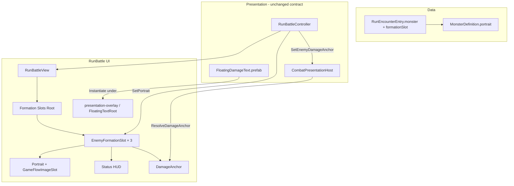

# RunBattle 적 포메이션 슬롯 프리팹

**Status**: active  
**Started**: 2026-06-04  
**Owner**: _(미정)_  
**Contributors**: _(없음)_  
**Related design-docs**: [`game-flow.md`](../../design-docs/game-flow.md), [`combat-core.md`](../../design-docs/combat-core.md)  
**Related ADR**: [ADR-0003](../../adr/0003-combat-presentation-replay.md)  
**Depends on**: [`feature-floating-combat-text`](../completed/feature-floating-combat-text.md) (완료), [`feature-map-encounter-so`](../completed/feature-map-encounter-so.md) (완료), [`feature-run-battle-presentation`](../completed/feature-run-battle-presentation.md) (완료)

## Background

`RunBattle` 전투 UI에서 몬스터 **초상화**, **상태 HUD**, **데미지 앵커**가 `RunBattleView` / `GameFlowScenePrefabBuilder` 안에 형제 오브젝트로 흩어져 있다. `RunBattleView`는 `"Monster N Status HUD"` 이름 검색, 시드 HUD **런타임 Clone**, HP Fill 이름 검색 등 hierarchy fallback에 의존한다. 클릭 버튼은 초상화에 붙고 `EnemyHudSlot.Root`는 HUD 패널이라 참조가 갈라져 있다.

플로팅 데미지는 [`feature-floating-combat-text`](../completed/feature-floating-combat-text.md)에서 `FloatingDamageText.prefab` + `CombatPresentationHost` per-enemy anchor 맵으로 이미 분리되어 있다. 본 plan은 **슬롯 단위 UI + `MonsterDefinition` 초상화**를 묶는다.

## Locked decisions (구현 전 확정)

| # | 결정 |
|---|------|
| 범위 | UI 구조 + `MonsterDefinition` / `RunEncounterEntry` → 초상화 `SetSprite` |
| 슬롯 수 | HUD **최대 3** 고정 (`FormationHudSlotCount`), Encounter `formationSlot` 매핑 유지 |
| 배치 | Rebuild 시 `RunBattleView` 아래 **3개 미리 배치** (런타임 Instantiate × N 아님) |
| 레이아웃 | **프리팹 내부** (Portrait / Status HUD / DamageAnchor 상대 위치) |
| DamageAnchor | **슬롯 프리팹 자식**; 플로팅 텍스트 **spawn parent**는 `presentation-overlay` / `FloatingTextRoot` 유지 |
| 클릭 | **슬롯 Root 하나의 `Button`** |
| 초상화 데이터 | `MonsterDefinition` SO에 portrait; 런타임 **슬롯 배열 참조**만 (`SlotId` 검색 안 함) |
| `monster == null` | **placeholder / 빈 초상화** (inspector fallback 없음) |
| 프리팹 종류 | **단일** `EnemyFormationSlot` (보스 Variant는 레이아웃 확정 후) |
| 마이그레이션 | 이름 파싱·시드 Clone **완전 제거**; Rebuild **공식 1회**; **fallback 없음** |
| Dev_Battle | **범위 밖** (RunBattle만) |

## Requirements

1. `EnemyFormationSlot.prefab` — Portrait(`GameFlowImageSlot`) + Status HUD(Text, HP bar) + `DamageAnchor` 자식, Root `Button`.
2. `EnemyFormationSlotView` — `SetPortrait(Sprite)`, `SetHud`, `SetHpFill`, `SetSelected`, `SetInteractable`, `SetClickHandler`, `SetActive`, `DamageAnchor` 노출.
3. `MonsterDefinition` — `Sprite` portrait 필드 추가 (에디터에서 몬스터별 아트 할당).
4. `RunBattleView` — `EnemyFormationSlotView[]` SerializeField; 기존 public API (`SetEnemySlot`, `GetEnemyDamageAnchor` 등)는 Controller diff 최소화를 위해 **위임 유지** 가능.
5. `RunBattleController` — `BindEnemySlots` / `RefreshEnemySlots`에서 `RunEncounterEntry.monster` → `ResolveHudSlotIndex` → `SetPortrait`; `CombatPresentationHost.SetEnemyDamageAnchor`에 슬롯 `DamageAnchor` 전달.
6. `GameFlowScenePrefabBuilder` — `CreateBattleArena`의 분리 Portrait/HUD 루프 제거; Formation Slots Root 아래 슬롯 프리팹 3회 배치; overlay `monster-N-damage-anchor` 생성 루프 **제거**.
7. Rebuild 후 `RunBattleView.prefab`, `RunBattle.unity` 갱신; `.meta` 동반.
8. `entry.monster == null` 또는 portrait 미할당 시 placeholder 텍스트 유지 / Image sprite clear.
9. 범위 밖: Core/`BattleSystem` 변경, 보스 슬롯 Variant, Dev_Battle 슬롯 프리팹 통일, Addressables, `FloatingDamageText` 구조 변경, SlotId 런타임 검색, hierarchy fallback 복원.

## Goal

디자이너가 `MonsterDefinition` SO에 portrait만 넣으면 RunBattle에서 formation 슬롯에 맞는 초상화·HUD·플로팅 데미지 위치가 함께 움직인다. 프로그래머는 `RunBattleView`의 이름 파싱/Clone 없이 SerializeField 슬롯 배열만 다루고, Rebuild 한 번으로 씬/프리팹을 마이그레이션한다.

## Baseline (현재 vs 목표)

| 항목 | 현재 | 목표 |
|------|------|------|
| 몬스터 UI 구조 | Arena 아래 Portrait + Status HUD 형제; overlay damage anchor | `EnemyFormationSlot` 프리팹 1트리 × 3 |
| 슬롯 discovery | `"Monster N Status HUD"` 이름, 시드 Clone | `_formationSlots[]` SerializeField only |
| 타겟 클릭 | Portrait `Button` | 슬롯 Root `Button` |
| 초상화 | placeholder / SlotId만 (런타임 미연동) | `MonsterDefinition.portrait` → `SetPortrait` |
| `monster == null` | (미정) | placeholder / 빈 초상화 |
| Damage anchor | overlay `monster-N-damage-anchor` | 슬롯 자식; Host 맵은 동일 API |
| Fallback | runtime anchor 생성, hierarchy 검색 | **없음** — Rebuild 필수 |

## Architecture (목표)

## Portrait binding policy

- **진실의 원천:** `RunEncounterEntry.monster` → `MonsterDefinition.portrait`.
- **UI 경로:** `formationSlot` → HUD 슬롯 인덱스 (`RunEncounterRosterBuilder.ResolveFormationSlot` + `RunBattleController.ResolveHudSlotIndex`) → `_formationSlots[slotIndex].SetPortrait(sprite)`.
- **`GameFlowImageSlot.SlotId`:** Rebuild 시 에디터/문서용 라벨만. **런타임에 SlotId로 Image를 찾지 않는다.**
- **`monster == null` 또는 portrait null:** Image sprite 비움, placeholder Text 활성(프리팹 기본 상태).

## Phases

---

### Phase 1 — Data + EnemyFormationSlotView

- [ ] `MonsterDefinition` — `Sprite` portrait (또는 `battlePortrait`) 필드 + 기존 몬스터 SO 샘플 1~2개 할당
- [ ] `EnemyFormationSlotView.cs` — SerializeField: Root, Button, Portrait(`GameFlowImageSlot` 또는 Image), Hud Text, Hp Fill, DamageAnchor, optional placeholder Text
- [ ] `SetPortrait(Sprite)` — null 시 clear + placeholder on; non-null 시 `SetSprite` + placeholder off
- [ ] HUD/선택/클릭 API — 기존 `EnemyHudSlot` 동작 이전 (`SetSelected` 색상 등)

**🔍 Review:** 임시 씬에서 View만 붙여 Play 없이 Inspector 참조 누락 없는지 확인.

---

### Phase 2 — EnemyFormationSlot prefab + Builder

- [ ] `Assets/_Project/Prefabs/UI/GameFlow/EnemyFormationSlot.prefab` 생성 (`.meta` 동반)
- [ ] 프리팹 hierarchy: Root(Button) → Portrait, StatusPanel(HUD+HP), DamageAnchor
- [ ] `GameFlowScenePrefabBuilder.BuildRunBattle` — Formation Slots Root + 슬롯 프리팹 3개 배치; `CreateBattleArena` 분리 생성 제거
- [ ] overlay `monster-N-damage-anchor` 루프 제거
- [ ] `RunBattleView.Bind` — `EnemyFormationSlotView[]` 전달

**🔍 Review:** Rebuild 후 `RunBattleView.prefab`에 `_formationSlots` 길이 3, 참조 연결 확인.

---

### Phase 3 — RunBattleView 리팩터 (fallback 제거)

- [ ] `EnemyHudSlot` 중첩 클래스 제거 (또는 View로 완전 대체)
- [ ] 제거: `TryCollectFormationSlotsFromHierarchy`, `ParseMonsterStatusHudIndex`, `FindSeedEnemyHudSlot`, `BuildFormationSlotsFromSeed`, `ResolveHpFill` 이름 검색
- [ ] `LayoutFormationHudSlots` — Formation Slots Root 기준 가로 배치만 (spacing은 SerializeField 또는 상수 1곳)
- [ ] `GetEnemyDamageAnchor` → `_formationSlots[i].DamageAnchor`
- [ ] 슬롯 배열 비었거나 길이 < 3 시 **에러 로그 + Rebuild 안내** (자동 복구 없음)

**🔍 Review:** 구 `RunBattleView.prefab`을 Rebuild 없이 열면 에러가 나는지 확인(의도된 마이그레이션).

---

### Phase 4 — RunBattleController portrait + Host anchor

- [ ] `BindEnemySlots` / `RefreshEnemySlots` — roster entry → `SetPortrait(entry.monster?.portrait)` + 기존 HUD 텍스트/HP
- [ ] `ResolveEnemyDamageAnchor` — 슬롯 `DamageAnchor` only; `runtime-monster-N-damage-anchor` fallback **삭제**
- [ ] `InitializePresentationStack` — default `monster-damage-anchor` overlay fallback 정책 정리 (per-enemy 맵만 사용)
- [ ] `entry.monster == null` — portrait clear/placeholder (확정 정책)

**🔍 Review:** 1마리/2마리/3마리 Encounter에서 슬롯 on/off, 클릭 타겟, HUD formation 인덱스가 [`feature-map-encounter-so`](../completed/feature-map-encounter-so.md)와 일치하는지 확인.

---

### Phase 5 — Play Mode 체크리스트

**담당:** Unity Play Mode 수동 테스트.

| # | 시나리오 | 기대 |
|---|----------|------|
| 1 | Rebuild 후 RunBattle 진입 | 컴파일·씬 로드 오류 없음, 슬롯 3개 배치 |
| 2 | Encounter 1마리 | 해당 formation 슬롯만 활성, portrait 표시 |
| 3 | Encounter 3마리 + formationSlot | 슬롯 위치·선택·초상화가 entry별 SO와 일치 |
| 4 | `monster` null entry (테스트용) | 빈 초상화/placeholder, 전투는 기존 roster 정책대로 |
| 5 | portrait 미할당 SO | placeholder 유지 |
| 6 | 몬스터 피격 Spin | 플로팅 숫자가 해당 슬롯 DamageAnchor 근처, overlay spawn |
| 7 | 슬롯 Root 클릭 | 타겟 변경, 선택 색상 HUD 반영 |

**🔍 Review:** Dev_Battle 회귀는 범위 밖; RunBattle Spin + map encounter 경로만 통과.

---

### Phase 6 — 문서 정리와 완료 처리

- [ ] [`game-flow.md`](../../design-docs/game-flow.md) — Battle MVP / image slots: formation slot prefab + `MonsterDefinition.portrait` 한 줄
- [ ] 본 plan 체크리스트·Notes·Completion 갱신 후 `git mv` → `docs/exec-plans/completed/`
- [ ] [`docs/STATUS.md`](../../STATUS.md) Active 제거, Recently completed 추가
- [ ] [`exec-plans/active/README.md`](./README.md) 표 갱신

**🔍 Review:** design-doc SlotId 설명과 “런타임 portrait는 SO+배열 참조”가 모순 없는지 확인.

---

## Alternatives considered

| 대안 | 장점 | 단점 | 판단 |
|------|------|------|------|
| SlotId로 portrait 검색 | design-doc 문구와 직관적 매칭 | SO에 sprite 있는데 이중 매핑; 3슬롯 시 id 충돌 | **거절** |
| 런타임 `Instantiate` 슬롯 | 적 수 유연 | 3고정 MVP와 불필요한 spawn 로직 | **거절** |
| DamageAnchor overlay 유지 | 기존 YAML | 슬롯 이동 시 앵커 따로 맞춤 | **거절** (슬롯 자식 채택) |
| `monster == null` → inspector fallback | 항상 그림 있음 | SO 단일 출처 흐림 | **거절** (placeholder 채택) |
| hierarchy fallback 유지 | 수동 프리팹도 동작 | 이름 규칙·이중 코드 경로 | **거절** |

새 ADR 없음. ADR-0003 Presenter 경계·Core API 불변.

## Later (본 plan 범위 밖)

- `EnemyFormationSlot` 보스/엘리트 **Prefab Variant**
- `BattleDevHarness` / Dev_Battle 동일 슬롯 프리팹
- 4+ 적 formation / 동적 슬롯 수
- Addressables로 portrait 로드
- 초상화 애니메이션·히트 VFX on Portrait

## Notes

- Core, `BattleSystem`, `CombatEvent`, asmdef 변경 없음.
- `FloatingDamageText.prefab` / `DamagePresenter` / HP tween 구조 변경 없음.
- 팀은 Rebuild 후 `RunBattleView` **수동 hierarchy 편집 금지** (SerializeField 깨짐). 튜닝은 `EnemyFormationSlot.prefab` 또는 Rebuild.
- 기존 `battle/monster-N-portrait` SlotId는 프리팹 인스턴스별로 Rebuild가 부여해도 되고, 통일 id도 가능 — **코드는 검색하지 않음**.

## Completion

_(completed/로 옮길 때 채움.)_

- **Finished**:
- **Outcome**:
- **Follow-ups**:
