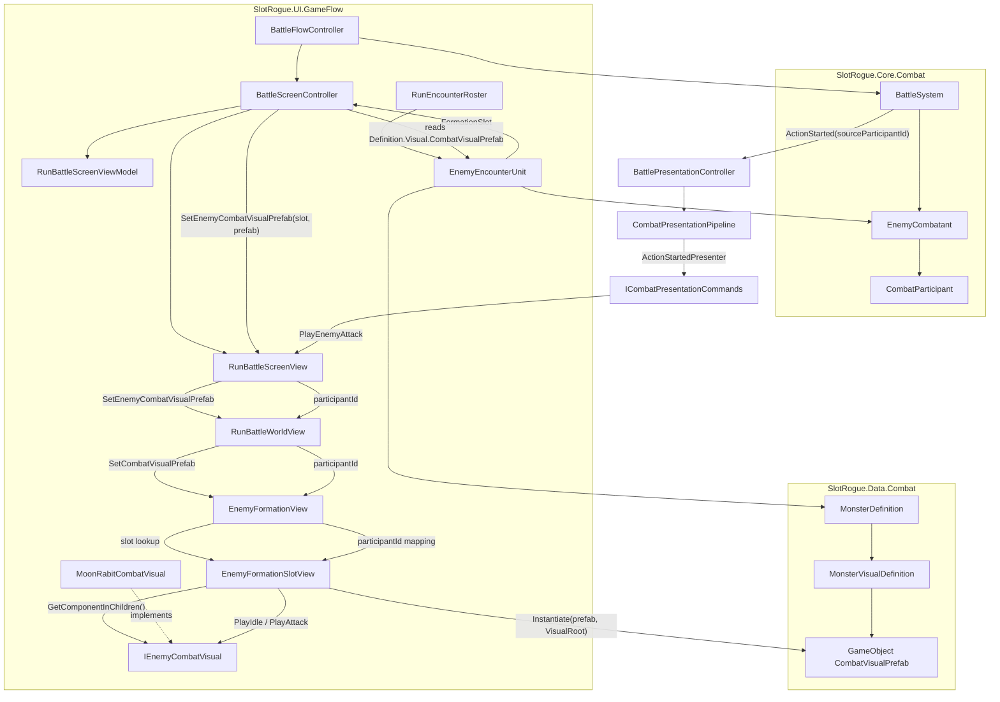
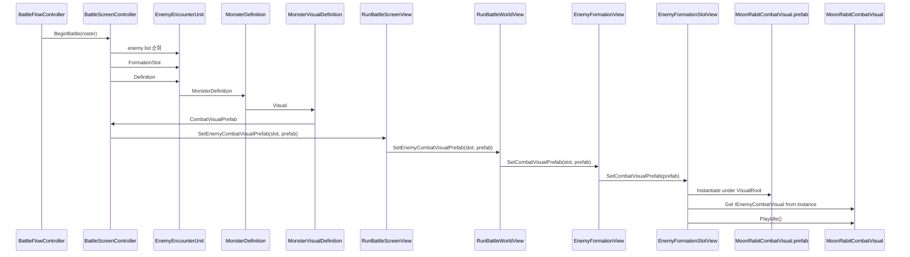

# Monster Battle View 연결

**Status**: active  
**Started**: 2026-06-16  
**Owner**: _(전투/UI 담당)_  
**Related design-docs**: [`../../design-docs/game-flow.md`](../../design-docs/game-flow.md), [`../../design-docs/combat-core.md`](../../design-docs/combat-core.md), [`../../adr/0003-combat-presentation-replay.md`](../../adr/0003-combat-presentation-replay.md), [`../../adr/0006-runtime-asset-loading-boundary.md`](../../adr/0006-runtime-asset-loading-boundary.md)

## Goal

`MonsterDefinition`에서 선택한 몬스터 전투 외형 프리팹을 RunGame 전투 화면의 올바른 `EnemyFormationSlotView` 아래에 생성한다. 기존 HP, Shield, Intent, 클릭 선택, Damage Anchor 동작은 유지하고, 실제 적 행동 presentation 흐름에서 해당 몬스터의 Idle과 Attack 애니메이션을 재생할 수 있는 기본 경로를 완성한다.

## Checklist

- [x] `MonsterVisualDefinition` ScriptableObject 추가 및 `MonsterDefinition`에 visual 참조 연결
- [x] 기존 `MonsterDefinition.portrait` 사용처 확인 후 presentation 기반 경로로 이전
- [x] `EnemyEncounterUnit`이 `BuildFromMonsterDefinition()` 경로의 원본 `MonsterDefinition`을 보관하도록 확장
- [x] `BuildForTier()` 경로는 definition 공급자가 없음을 명시하고 null/fake definition 없이 실패하도록 정리
- [ ] HUD, 클릭 선택, combat visual binding이 같은 slot을 쓰도록 formation slot resolver 공통화
- [x] `BattleScreenController.BeginBattle()`에서 기존 combat visual 정리 후 roster 기반 prefab binding 수행
- [x] `RunBattleScreenView` → `RunBattleWorldView` → `EnemyFormationView` → `EnemyFormationSlotView` combat visual 전달 API 추가
- [x] `EnemyFormationSlotView`에 `VisualRoot`와 combat visual prefab instance 수명 관리 추가
- [x] `IEnemyCombatVisual`과 `MoonRabitCombatVisual` 추가로 Animator 참조 검증 및 Idle/Attack 요청 API 준비
- [x] 기존 combat presentation command 경로에 enemy attack animation 명령 연결
- [x] 관련 EditMode 테스트 추가 및 `dotnet build SlotRogue.sln --no-restore` 검증
- [ ] Unity Editor에서 VisualRoot, MoonRabit visual SO, combat visual prefab, Animator, Idle/Attack clip wiring 수동 검증

## Notes

- 이번 작업은 Addressables 기반 prefab 로딩, Hit/Death 애니메이션, 애니메이션 완료 대기, 스킨 교체, tier 기반 외형 결정 정책을 포함하지 않는다.
- `MonsterVisualDefinition`은 Data assembly가 UI 타입을 직접 참조하지 않도록 `GameObject CombatVisualPrefab`을 저장한다. 실제 `IEnemyCombatVisual` 컴포넌트 검사는 View 계층에서 수행한다.
- `Render()`는 HP, Shield, Intent, 선택 상태처럼 반복 갱신되는 상태만 다룬다. combat visual prefab 생성과 제거는 전투 시작 binding과 slot 수명 관리에서 처리한다.
- Attack 애니메이션은 별도 병렬 전투 이벤트 시스템을 만들지 않고 ADR-0003의 Replay/presentation command 흐름에 붙인다. 이번 단계에서는 애니메이션 완료를 기다리지 않는다.
- 2026-06-16: 데이터 연결 1차 범위로 `MonsterVisualDefinition`, `MonsterDefinition.Visual`, `EnemyEncounterUnit.Definition`을 추가한다. 코드에서 기존 `MonsterDefinition.portrait` 직접 사용처는 없고 asset YAML에만 남아 있어 visual SO로 이전한다. `BuildForTier()`는 `MonsterDefinition` 공급자가 없어 null/fake definition을 만들지 않고 명시적으로 실패시키며, production 호출 위치는 `BattleSceneCompositionRoot.CreateEncounterRoster()`의 dev override 미설정 경로다.
- 2026-06-16: `dotnet build SlotRogue.slnx --no-restore`는 경고 0개, 오류 0개로 통과했다. `dotnet build SlotRogue.sln --no-restore`는 기존 `Assembly-CSharp-firstpass.csproj`의 `System.Net.Http` 버전 충돌 경고 1개가 남지만 오류 0개로 통과했다.
- 2026-06-16: 전투 시작 시 `BattleScreenController.BeginBattle()`에서 각 `EnemyEncounterUnit`의 `Definition.Visual.CombatVisualPrefab`을 읽어 `RunBattleScreenView` → `RunBattleWorldView` → `EnemyFormationView` → `EnemyFormationSlotView`로 전달한다. 이번 단계는 prefab 참조만 보관하고 `Instantiate`, `VisualRoot`, combat visual component, 애니메이션 재생은 추가하지 않았다. `BattleTargetSelectionController.Bind()`의 `SetEnemyPortrait(index, null)` 초기화는 선택 책임과 섞여 제거했다. `dotnet build SlotRogue.sln --no-restore`는 기존 `Assembly-CSharp-firstpass.csproj`의 `System.Net.Http` 버전 충돌 경고 1개가 남지만 오류 0개로 통과했다.
- 2026-06-16: 명칭을 `MonsterPresentationDefinition`/`BattleViewPrefab`에서 `MonsterVisualDefinition`/`CombatVisualPrefab`으로 정리했다. 전투 이벤트 연출 계층의 `Presentation` 용어는 기존 의미가 달라 유지한다.
- 2026-06-16: `EnemyFormationSlotView`가 전달받은 `CombatVisualPrefab`을 `VisualRoot` 아래에 생성하고, 같은 슬롯 재바인딩 시 이전에 생성한 인스턴스만 제거하도록 변경했다. `EnemyFormationSlot` prefab에는 HUD/Intent/DamageAnchor/ClickCollider와 분리된 `VisualRoot`를 추가했고, 기존 portrait placeholder와 SpriteRenderer는 fallback 표시를 막기 위해 비활성화했다. `GoblinCombatVisual`, `MoonRabitCombatVisual` 최소 SpriteRenderer prefab을 추가해 각 `MonsterVisualDefinition.CombatVisualPrefab`에 연결했다.
- 2026-06-16: 전투 외형 공통 요청 인터페이스 `IEnemyCombatVisual`과 MoonRabit 전용 `MoonRabitCombatVisual`을 추가했다. `EnemyFormationSlotView`는 생성한 combat visual instance에서 인터페이스를 찾아 보관하고, 생성 직후 `PlayIdle()`을 한 번 호출하며, `PlayCombatVisualAttack()` 전달 API만 준비했다. 당시 실제 적 행동과 Attack 애니메이션 연결은 후속으로 남겼고, Animation Clip/Animator Controller/prefab component wiring은 Unity Editor 작업으로 남겼다.
- 2026-06-16: `RunBattleWorldViewTests`의 combat visual prefab 생성 테스트를 확장해 `IEnemyCombatVisual` 보관, 생성 직후 Idle 1회 요청, Attack 전달 API, 재바인딩 시 참조 초기화를 검증했다. `dotnet build SlotRogue.sln --no-restore`는 기존 `Assembly-CSharp-firstpass.csproj`의 `System.Net.Http` 버전 충돌 경고 1개가 남지만 오류 0개로 통과했다.
- 2026-06-17: `MonsterVisualDefinition.CombatVisualPrefab`은 `GameObject` 참조로 유지하고, `EnemyFormationSlotView`가 prefab 생성 직후 `IEnemyCombatVisual`을 1회 조회하는 방식을 유지한다. `EnemyCombatVisual` typed prefab 참조를 Data 또는 중립 assembly로 올리는 방식도 검토했지만, 전투 외형 제어 컴포넌트는 UI/View 책임에 가깝고 Data가 UI 타입을 알지 않도록 현재 구조를 유지한다. 별도 visual registry는 중복 wiring과 catalog 책임을 만들기 때문에 이번 범위에서는 도입하지 않는다. 조회는 반복 렌더링 경로가 아니라 prefab 생성 직후 1회만 수행한다.
- 2026-06-17: 적 행동 시작 시 `CombatEventKind.ActionStarted`를 기록하고, `ActionStartedPresenter`가 `ICombatPresentationCommands.PlayEnemyAttackAsync()`로 변환해 `RunBattleScreenView` → `RunBattleWorldView` → `EnemyFormationView` → `EnemyFormationSlotView.PlayCombatVisualAttack()` 경로로 전달한다. 이 요청은 공격 애니메이션을 시작만 하고 완료를 기다리지 않는다. 타격 프레임 및 애니메이션 종료 동기화는 후속 작업으로 남긴다.

## Current Flow

현재 전투 시작 시 `MonsterDefinition`에서 선택한 combat visual prefab이 formation slot까지 전달되고, `EnemyFormationSlotView`가 생성된 instance에서 `IEnemyCombatVisual`을 조회해 Idle 요청을 보낸다. 적 행동 시작 시에는 기존 CombatEvent Replay와 presentation command 경로를 통해 해당 participant에 대응하는 슬롯의 `PlayAttack()`을 호출한다. 공격 애니메이션 타격 프레임과 종료 대기는 후속 작업으로 남긴다.

## Completion

- **Finished**:
- **Outcome**:
- **Follow-ups**:
