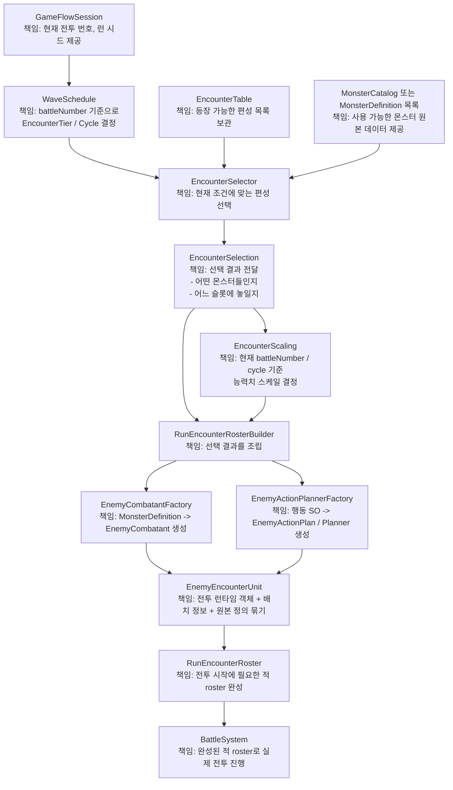
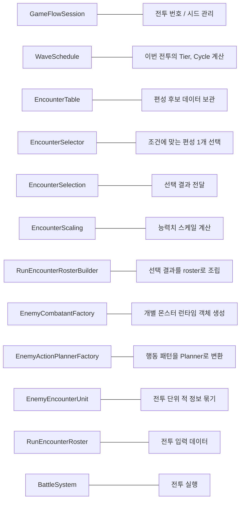
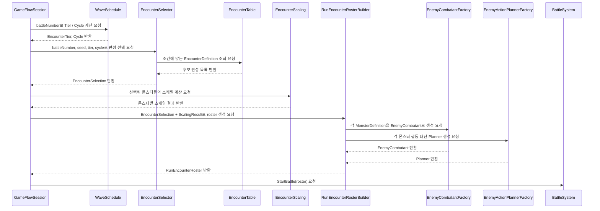

# 규칙 기반 Encounter 선택

**Status**: active  
**Started**: 2026-06-18  
**Owner**: Codex  
**Contributors**: _(전투 담당: 검토)_  
**Related design-docs**: [`game-flow.md`](../../design-docs/game-flow.md), [`combat-core.md`](../../design-docs/combat-core.md)

## Goal

기존 `MonsterDefinition` → `EnemyCombatantFactory` → `EnemyEncounterUnit` → `RunEncounterRoster` 생성 흐름은 유지하고, 그 앞단에 규칙 기반 Encounter 선택 레이어를 추가한다. 1차 완료 상태는 `EncounterTable`에서 Tier/Cycle/Weight 조건으로 1마리 편성을 결정적으로 선택하고, `BattleSceneCompositionRoot`가 Dev Override를 유지한 채 선택 결과를 기존 전투 roster 생성 경로로 전달하는 것이다.

## Scope

이번 plan은 1차 작업만 다룬다.

- 포함: EncounterTable 데이터 타입, EncounterSelection 경계 타입, EncounterSelector, selector EditMode 테스트, `RunEncounterRosterBuilder` 선택 결과 입력, `BattleSceneCompositionRoot` 연결, `WaveSchedule` 데이터화, HP 전용 `EncounterScaling`, 기존 1마리 전투 유지
- 제외: 공격력/행동 Effect 수치 스케일링, 2~3마리 편성 실제 활성화, 보스 페이즈, MonsterCatalog, 기존 `EnemyActionPlan` 구조 변경

## Design Notes

선택 레이어는 "이번 전투에 어떤 몬스터가 어느 FormationSlot에 등장하는가"만 결정한다. 생성 레이어는 선택 결과를 받아 기존 Factory로 `EnemyCombatant`와 `RunEncounterRoster`를 조립한다.

```text
GameFlowSession
    -> EncounterSelector
    -> EncounterSelection
    -> RunEncounterRosterBuilder
    -> EnemyCombatantFactory
    -> RunEncounterRoster
    -> BattleSystem
```

의존 방향은 기존 asmdef 경계를 따른다. Core는 `ScriptableObject`, `MonsterDefinition`, `EncounterTable`을 알지 않는다. `EncounterSelection`은 `MonsterDefinition`을 포함하므로 UI/GameFlow 계층에 둔다.

### 전체 책임 구조



### 객체별 책임



### 요청 흐름

최종 구현에서 `BattleSceneCompositionRoot` 같은 상위 조립 계층이 아래 흐름을 호출한다. 다이어그램의 `Session`은 런 상태 제공자를 뜻하며, 실제 호출 위치가 반드시 `GameFlowSession` 내부 메서드여야 한다는 의미는 아니다.



### 핵심 경계

선택 규칙 레이어는 `WaveSchedule`, `EncounterTable`, `EncounterSelector`이며, "무엇을 등장시킬지"만 결정한다. 런타임 생성 레이어는 `RunEncounterRosterBuilder`, `EnemyCombatantFactory`, `EnemyActionPlannerFactory`이며, "결정된 몬스터를 실제 전투 객체로 변환"하는 책임만 가진다.


## Phase 0 - 최신 코드 기준 생성 흐름 조사

조사일: 2026-06-18. 문서 설명이 아니라 실제 코드 기준으로 확인했다.

### 호출 흐름 요약

현재 정상 생성 경로는 `BattleSceneCompositionRoot`의 `_devMonsterDefinitionOverride`가 설정된 경우에만 끝까지 이어진다.

```text
BattleSceneCompositionRoot.CreateEncounterRoster()
    -> RunEncounterRosterBuilder.BuildFromMonsterDefinition()
    -> EnemyCombatantFactory.CreateWithPresentation()
    -> EnemyActionPlannerFactory.Build()
    -> new EnemyEncounterUnit(...)
    -> new RunEncounterRoster(...)
    -> BattleFlowController.BeginBattle()
    -> BattleSystem.StartBattle(player, enemyCombatants)
```

Override가 없으면 `BattleSceneCompositionRoot.CreateEncounterRoster()`가 `RunEncounterRosterBuilder.BuildForTier(GameFlowSession.CurrentTier, GameFlowSession.CurrentBattleNumber)`를 호출하지만, 현재 `BuildForTier()`는 `NotSupportedException`을 던진다. 즉 최신 코드 기준으로 tier 기반 직접 생성은 비활성이다.

### 클래스별 책임과 연결 지점

| 클래스 | 파일 경로 | 현재 책임 | 입력 | 출력 | 다음 호출 위치 |
|--------|-----------|-----------|------|------|----------------|
| `BattleSceneCompositionRoot` | `Assets/_Project/Scripts/UI/GameFlow/BattleSceneCompositionRoot.cs` | RunGame 전투 씬 참조와 controller 조립, 플레이어/적 roster를 `BattleFlowContext`로 구성 | scene 직렬화 참조, `GameFlowSession`, 선택적 `_devMonsterDefinitionOverride` | `BattleFlowContext`, 내부 `BattleFlowController` | `CreateEncounterRoster()`에서 `RunEncounterRosterBuilder` 호출, `BeginBattleAsync()`에서 `_battleFlowController.BeginBattle(CreateBattleFlowContext())` 호출 |
| `RunEncounterRosterBuilder` | `Assets/_Project/Scripts/UI/GameFlow/RunEncounterRosterBuilder.cs` | `MonsterDefinition` 기반 적 1마리를 `RunEncounterRoster`로 조립, formation slot 해석 | `MonsterDefinition`, `rosterIndex`, `formationSlot` | `RunEncounterRoster` | `BuildFromMonsterDefinition()`에서 `EnemyCombatantFactory.CreateWithPresentation()` 호출 |
| `EnemyCombatantFactory` | `Assets/_Project/Scripts/UI/GameFlow/EnemyCombatantFactory.cs` | `MonsterDefinition`을 전투 런타임 `EnemyCombatant`로 변환 | `MonsterDefinition`, `rosterIndex` | `EnemyCombatantBuildResult` 또는 `EnemyCombatant` | `CreateWithPresentation()`에서 `_plannerFactory.Build(definition.turnPattern)` 호출 |
| `EnemyActionPlannerFactory` | `Assets/_Project/Scripts/UI/GameFlow/EnemyActionPlannerFactory.cs` | `MonsterTurnPatternDefinition`을 `FixedSequenceEnemyActionPlanner`와 `EnemyActionPresentationMap`으로 변환 | `MonsterTurnPatternDefinition` 또는 tier 임시 `CombatEffect` 목록 | `EnemyActionPlannerBuildResult` 또는 `IEnemyActionPlanner` | `Build()` 내부에서 `EnemyActionPlan[]`, `EnemyPlannedAction[]`, `EnemyActionPresentationMap` 생성 |
| `EnemyEncounterUnit` | `Assets/_Project/Scripts/UI/GameFlow/EnemyEncounterUnit.cs` | 개별 적의 combatant, 원본 definition, formation slot, presentation map 보관 | `EnemyCombatant`, `MonsterDefinition`, `formationSlot`, optional `EnemyActionPresentationMap` | 불변 unit 객체 | `RunEncounterRosterBuilder.BuildFromMonsterDefinition()`에서 생성 |
| `RunEncounterRoster` | `Assets/_Project/Scripts/UI/GameFlow/RunEncounterRoster.cs` | 전투 시작에 필요한 적 unit 목록 보관, null unit 방어, 배열 복사 | `IReadOnlyList<EnemyEncounterUnit>` | `Enemies` 목록 | `BattleFlowContext`에 들어가고, `BattleFlowController.ExtractEnemyCombatants()`가 소비 |
| `BattleFlowController` | `Assets/_Project/Scripts/UI/GameFlow/BattleFlowController.cs` | roster에서 `EnemyCombatant` 배열을 추출해 `BattleSystem` 시작, 전투 턴과 연출 흐름 조율 | `BattleFlowContext` | 전투 진행 이벤트, UI 갱신, 완료 이벤트 | `BeginBattle()`에서 `_battle.StartBattle(_context.Player, ExtractEnemyCombatants(_context.EncounterRoster))` 호출 |
| `BattleSystem` | `Assets/_Project/Scripts/Core/Combat/BattleSystem.cs` | Core 전투 실행, 다수 enemy combatant 등록, enemy action planning, target/effect 처리 | `CombatParticipant player`, `IReadOnlyList<EnemyCombatant>` | phase, events, enemy/player state | `StartBattle()`에서 모든 enemy 등록 후 `PlanNextActionsForAllEnemies()` 호출 |

### MonsterDefinition 전달 경로

`MonsterDefinition`은 현재 Dev Override 경로에서만 공급된다.

```text
BattleSceneCompositionRoot._devMonsterDefinitionOverride
    -> RunEncounterRosterBuilder.BuildFromMonsterDefinition(definition, 0, 1)
    -> EnemyCombatantFactory.CreateWithPresentation(definition, 0)
    -> EnemyActionPlannerFactory.Build(definition.turnPattern)
    -> EnemyCombatantFactory.Create(0, definition.maxHp, planner)
    -> new EnemyEncounterUnit(combatant, definition, formationSlot, presentationMap)
    -> RunEncounterRoster.Enemies[0].Definition
    -> BattleScreenController.ResolveMonsterVisual(unit, rosterIndex)
```

`MonsterDefinition.maxHp`는 `EnemyCombatantFactory.CreateWithPresentation()`에서 `CombatParticipant`의 HP로 사용된다. `MonsterDefinition.turnPattern`은 같은 메서드에서 `EnemyActionPlannerFactory.Build()` 입력으로 전달된다. `MonsterDefinition.Visual`은 전투 시작 후 `BattleScreenController.BindEnemyCombatVisualPrefabs()`에서 portrait와 combat visual prefab 선택에 사용된다.

### FormationSlot 결정 위치

현재 formation slot은 선택 규칙으로 계산되지 않는다. Dev Override 경로에서 `BattleSceneCompositionRoot.CreateEncounterRoster()`가 고정값 `formationSlot: 1`을 넘긴다. `RunEncounterRosterBuilder.BuildFromMonsterDefinition()`은 이 값을 변경하지 않고 `EnemyEncounterUnit.FormationSlot`에 저장한다.

화면 표시 시에는 `RunBattleScreenStateUpdater.ResolveHudSlotIndex()`가 `RunEncounterRosterBuilder.ResolveFormationSlot()`을 호출해 view slot 범위 밖 값을 보정하고, 중복 slot은 roster index fallback으로 보정한다. 따라서 "배치 결정"은 현재 composition root의 고정 입력이고, "표시 안전 보정"은 screen state updater 쪽이다.

### Dev Monster Override 동작

`BattleSceneCompositionRoot`에는 `[SerializeField] private MonsterDefinition _devMonsterDefinitionOverride;`가 있다. 값이 있으면 `CreateEncounterRoster()`는 `BuildForTier()`를 우회하고 `BuildFromMonsterDefinition(_devMonsterDefinitionOverride, rosterIndex: 0, formationSlot: 1)`를 호출한다. 이 경로가 현재 실제로 전투를 시작할 수 있는 유일한 몬스터 생성 경로다.

### Override가 없을 때의 생성 경로

Override가 없으면 `CreateEncounterRoster()`는 `RunEncounterRosterBuilder.BuildForTier(GameFlowSession.CurrentTier, GameFlowSession.CurrentBattleNumber)`를 호출한다. 하지만 `BuildForTier()`는 현재 `NotSupportedException`을 던지며, 메시지는 tier 기반 생성에는 `MonsterDefinition` 공급자가 없으니 `BuildFromMonsterDefinition`을 사용하라는 내용이다.

관련 테스트 `EnemyCombatantFactoryTests.RunEncounterRosterBuilder_BuildForTier_RequiresMonsterDefinitionSource()`도 이 예외를 기대한다. 따라서 문서의 "tier + level만으로 적 1마리 생성" 설명은 최신 코드와 다르다.

### 다수 적을 이미 지원하는 부분

- `RunEncounterRoster`는 `EnemyEncounterUnit` 목록을 복사 보관하며 여러 unit을 받을 수 있다.
- `BattleFlowController.ExtractEnemyCombatants()`는 roster의 모든 enemy를 배열로 추출한다.
- `BattleSystem.StartBattle()`는 `IReadOnlyList<EnemyCombatant>`를 받고 모든 enemy를 등록한다.
- `BattleSystem.RunEnemyTurn()`은 모든 살아 있는 enemy combatant를 roster 순서대로 처리한다.
- `BattleSystem.AreAllEnemiesDefeated()`, `ResolveTargets()`, `TryGetUpcomingEnemyTurn()`은 다수 enemy를 기준으로 동작한다.
- `BattleScreenController`, `EnemyVisibleIntentState`, `RunBattleScreenStateUpdater`는 roster/battle enemy 목록을 순회하며 intent, portrait, visual, HUD slot을 처리한다.
- `RunBattleScreenStateUpdater.ResolveHudSlotIndex()`는 formation slot 중복과 범위 밖 값을 방어한다.

현재 부족한 부분은 "여러 `MonsterDefinition`을 선택해 `RunEncounterRosterBuilder`로 공급하는 선택 레이어"다. Builder에도 아직 `EncounterSelection` 또는 다수 `MonsterDefinition` 입력 API는 없다.

### 문서와 실제 코드 차이

- `docs/STATUS.md`와 `docs/design-docs/game-flow.md`는 v1 무한모드가 `CurrentBattleNumber`/`EncounterTier` 기반 `BuildForTier()`로 전투 roster를 생성한다고 설명한다.
- 실제 `RunEncounterRosterBuilder.BuildForTier()`는 `NotSupportedException`만 던진다.
- `docs/design-docs/combat-core.md`는 `RunEncounterRoster`가 현재 `MonsterDefinition`이 아니라 `EncounterTier + level`로 적 HP와 행동 패턴을 직접 만든다고 설명한다.
- 실제 코드는 `BuildFromMonsterDefinition()` 경로에서만 `RunEncounterRoster`를 만들고, `MonsterDefinition` 없이 생성하는 코드는 비활성이다.
- plan에서 말한 runSeed는 현재 `GameFlowSession`에 없다. 규칙 기반 selector를 구현할 때 seed 저장/제공 지점을 새로 정해야 한다.

### 규칙 기반 생성을 연결할 정확한 변경 지점

1차 연결 지점은 `BattleSceneCompositionRoot.CreateEncounterRoster()`다.

```text
Dev Override 있음
    -> 현재처럼 BuildFromMonsterDefinition(devMonster, 0, 1)

Dev Override 없음
    -> EncounterSelector.Select(...)
    -> EncounterSelection
    -> RunEncounterRosterBuilder.BuildFromSelection(...)
```

`RunEncounterRosterBuilder.BuildForTier()`는 현재 실패 경로이므로, 규칙 기반 선택이 들어오면 이 메서드를 대체하거나 내부에서 selector 결과를 받는 새 경로로 바꿔야 한다. 단, `BattleSystem`, `EnemyCombatantFactory`, `EnemyActionPlannerFactory`는 변경 지점이 아니다. 이들은 이미 선택된 `MonsterDefinition`을 런타임 객체로 바꾸는 생성 레이어로 유지한다.

`FormationSlot`은 `EncounterDefinition`에 저장하지 않는다. 추후 몬스터 마릿수와 배열 순서를 기준으로 별도 배치 규칙 객체가 결정하고, Builder는 전달받은 값을 `EnemyEncounterUnit`에 저장만 하는 구조가 맞다.

### 기존 동작 수동 검증 기준

- RunGame BattleScene의 `BattleSceneCompositionRoot._devMonsterDefinitionOverride`에 `MoonRabbit` 또는 `Goblin` `MonsterDefinition`이 할당되어 있어야 한다.
- 전투 시작 시 예외 없이 `BattleFlowController.BeginBattle()`까지 진입해야 한다.
- 적은 formation slot 1 위치에 표시되어야 한다.
- `MonsterDefinition.Visual.Portrait`와 `CombatVisualPrefab`이 formation slot에 반영되어야 한다.
- 첫 enemy intent가 `MonsterTurnPatternDefinition`의 첫 turn/action 기준으로 표시되어야 한다.
- 스핀 후 플레이어 턴이 적용되고, enemy turn에서 `ActionStarted`, `EffectApplied`, `ActionCompleted` 흐름이 재생되어야 한다.
- Override를 비우면 현재 기준으로 `BuildForTier()`의 `NotSupportedException`이 발생하는 것이 기대 동작이다.
- 다수 적 회귀는 단위 테스트 기준으로 `RunEncounterRoster_StoresEnemyUnitsInOrder()`와 Core `BattleSystemEnemyCombatantTests`가 기준이다. 실제 화면에서 2~3마리 선택 공급 경로는 아직 없다.

### Phase 0 완료 조건

- [x] 몬스터 생성 진입점을 찾았다.
- [x] `MonsterDefinition` 전달 경로를 확인했다.
- [x] `EnemyCombatant` 생성 위치를 확인했다.
- [x] 행동 Planner 생성 위치를 확인했다.
- [x] `FormationSlot` 결정 위치를 확인했다.
- [x] `RunEncounterRoster` 생성 위치를 확인했다.
- [x] Dev Override 동작을 확인했다.
- [x] Override가 없는 경로를 확인했다.
- [x] 규칙 기반 선택을 삽입할 위치를 결정했다.
- [x] 기존 동작의 수동 검증 기준을 정리했다.

## Checklist

- [x] Phase 0: 현재 `BattleSceneCompositionRoot.CreateEncounterRoster()`와 `RunEncounterRosterBuilder` 진입점, Dev Override 경로, MoonRabbit 1마리 기준 동작 확인
- [x] Phase 1: `EncounterTable`, `EncounterDefinition` 데이터 타입 추가 (`EncounterMonsterEntry` 제외)
- [x] Phase 1: Encounter 데이터 validation 규칙 정리 및 구현 (`MonsterDefinition` null, Weight, Cycle 범위, 1~3마리, ID 빈 값/중복)
- [ ] Phase 1: 초기 1마리 편성 데이터 작성 (`Normal`, `Elite`, `Boss` MoonRabbit)
- [x] Phase 2: `EncounterSelection`, `SelectedEncounterMonster` 경계 타입 추가
- [x] Phase 2: `EnemyFormationLayout`으로 1~3마리 formation slot 결정 규칙 분리
- [x] Phase 2: 선택 결과와 formation layout EditMode 테스트 추가
- [x] Phase 3: `EncounterSelector` 구현 (Tier/Cycle 필터, Weight 선택, runSeed + battleNumber 기반 결정적 선택)
- [x] Phase 3: 후보 없음 오류 메시지에 Tier, Cycle, BattleNumber, EncounterTable 이름 포함
- [x] Phase 4: `EncounterSelector` EditMode 테스트 추가 (결정성, Tier 제외, Cycle 하한/상한, `MaxCycle == -1`, Weight 경계, 후보 없음)
- [x] Phase 4 완료 조건: `EncounterSelector`가 Tier를 필터링한다.
- [x] Phase 4 완료 조건: `EncounterSelector`가 Cycle을 필터링한다.
- [x] Phase 4 완료 조건: Weight 기반으로 편성을 선택한다.
- [x] Phase 4 완료 조건: 같은 Seed와 BattleNumber에서 결과가 재현된다.
- [x] Phase 4 완료 조건: `EnemyFormationLayout`으로 슬롯을 결정한다.
- [x] Phase 4 완료 조건: `EncounterSelection`을 반환한다.
- [x] Phase 4 완료 조건: 후보가 없으면 명확히 실패한다.
- [x] Phase 4 완료 조건: EditMode 테스트가 통과한다.
- [x] Phase 4 완료 조건: 기존 전투 코드는 변경되지 않았다.
- [x] Phase 5: `RunEncounterRosterBuilder`에 `EncounterSelection` 기반 빌드 경로 추가
- [x] Phase 5: Builder가 여러 `SelectedEncounterMonster`를 순회할 수 있게 하되, 실제 연결은 후속 단계로 유지
- [x] Phase 5 완료 조건: 1마리 `EncounterSelection`으로 `EnemyEncounterUnit` 1개를 생성한다.
- [x] Phase 5 완료 조건: 2마리 `EncounterSelection`으로 `EnemyEncounterUnit` 2개를 생성한다.
- [x] Phase 5 완료 조건: `MonsterDefinition` 순서를 유지한다.
- [x] Phase 5 완료 조건: `SelectedEncounterMonster.FormationSlot`을 그대로 유지한다.
- [x] Phase 5 완료 조건: null `EncounterSelection`은 명확히 실패한다.
- [x] Phase 5 완료 조건: 각 몬스터가 별도 `EnemyCombatant`로 생성된다.
- [x] Phase 5 완료 조건: 기존 행동 Planner와 presentation map 정보를 유지한다.
- [x] Phase 5 완료 조건: `BattleSceneCompositionRoot`, `BattleSystem`, `WaveSchedule`, `EncounterScaling`은 변경하지 않았다.
- [x] Phase 6: `BattleSceneCompositionRoot`에서 Dev Override가 있으면 직접 selection 생성, 없으면 `EncounterSelector` 사용
- [x] Phase 6: 기존 `GameFlowSession.GetTierForBattle()` 결과와 임시 cycle 계산으로 selector 요청 구성
- [x] Phase 6: 같은 runSeed와 battleNumber에서 같은 Encounter가 선택되는지 코드 경로 구성
- [x] Phase 6 완료 조건: `BattleSceneCompositionRoot`에 `EncounterTable` 직렬화 참조를 추가했다.
- [x] Phase 6 완료 조건: Dev Override 경로를 유지하고 `EnemyFormationLayout.ResolveSlots(1)`로 slot을 결정한다.
- [x] Phase 6 완료 조건: Override가 없으면 `EncounterSelector.Select()` 결과를 `RunEncounterRosterBuilder.Build(selection)`에 전달한다.
- [x] Phase 6 완료 조건: `BattleSystem`, `WaveSchedule`, `EncounterScaling`, 전투 UI/타게팅은 변경하지 않았다.
- [ ] Phase 6: 기존 1마리 MoonRabbit 전투, Intent UI, Monster Presentation, Action Planner 동작 유지 확인
- [x] Phase 7: `WaveScheduleDefinition`, `WaveCyclePattern`, `WaveSchedule`, `WaveResult` 추가
- [x] Phase 7: `BattleSceneCompositionRoot`에서 직접 Tier/Cycle 계산 제거
- [x] Phase 7: `WaveResult.Tier`와 `WaveResult.Cycle`을 `EncounterSelectionRequest`에 전달
- [x] Phase 7 완료 조건: Battle 1/5/10/11/20의 기존 Normal/Elite/Boss 주기를 `WaveSchedule`로 표현한다.
- [x] Phase 7 완료 조건: 단일 Pattern 반복, 여러 Pattern Cycle별 선택, 마지막 Pattern 반복을 테스트한다.
- [x] Phase 7 완료 조건: 잘못된 battleNumber, 빈 Pattern, 서로 다른 Pattern 길이, null Pattern 실패를 테스트한다.
- [x] Phase 7 완료 조건: `GameFlowSession.GetTierForBattle()`, `ElitePeriod`, `BossPeriod`를 제거하고 `CurrentTier`는 기본 `WaveSchedule` 결과를 사용한다.
- [x] Phase 7 완료 조건: 임시 cycle 계산 `(battleNumber - 1) / 10`을 `BattleSceneCompositionRoot`에서 제거했다.
- [x] Phase 7 완료 조건: `BattleSystem`, EncounterScaling, Intent UI, 타게팅은 변경하지 않았다.
- [x] Phase 8: `EncounterBalanceSettings` SO와 Core `EncounterBalanceConfig` 변환 구조 추가
- [x] Phase 8: Core `EncounterScaleRequest`, `EncounterScaleResult`, `EncounterScaling` 추가
- [x] Phase 8: `RunEncounterRosterBuilder`가 `EncounterBuildContext`와 balance config를 받아 HP scaling 결과로 roster를 생성하는 경로 추가
- [x] Phase 8: `EnemyCombatantFactory.CreateWithPresentation()`에 scaled max HP 입력 overload 추가
- [x] Phase 8 완료 조건: Normal 기본 배율, Elite 배율, Boss 배율을 테스트한다.
- [x] Phase 8 완료 조건: BattleNumber 증가와 Cycle 증가를 테스트한다.
- [x] Phase 8 완료 조건: 잘못된 scaling 입력은 명확히 실패한다.
- [x] Phase 8 완료 조건: 실제 생성된 `EnemyCombatant.Participant.MaxHp`에 계산 결과가 적용된다.
- [x] Phase 8 완료 조건: `MonsterDefinition.maxHp`는 원본 base HP로 유지하고 수정하지 않는다.
- [x] Phase 8 완료 조건: 공격력 또는 행동 Effect 수치 스케일링은 구현하지 않았다.
- [ ] 문서 갱신: `game-flow.md`와 `combat-core.md`에 선택/생성 분리와 후속 WaveSchedule/Scaling 범위 반영
- [ ] 검증: `dotnet build` 또는 Unity compile, 관련 EditMode 테스트 실행 가능 여부 기록

## Notes

- 현재 `RunEncounterRosterBuilder.BuildForTier()`는 `MonsterDefinition` 공급자가 없으면 명시적으로 실패하도록 정리되어 있다. 이번 작업은 임시/fake definition fallback을 부활시키지 않고, 실제 `EncounterTable` 선택 결과로 `MonsterDefinition`을 공급한다.
- 2026-06-18 작업 2/9에서 `EncounterDefinition`은 `MonsterDefinition[]`만 보관하고 FormationSlot은 보관하지 않는 것으로 조정했다. FormationSlot은 후속 배치 규칙 객체가 몬스터 수와 배열 순서를 기준으로 결정한다.
- 2026-06-18 작업 2/9 검증: `dotnet build SlotRogue.sln --no-restore` 오류 0개. 기존 Unity/GDK 및 `System.Net.Http` 참조 경고는 남아 있다.
- 2026-06-18 작업 2/9에서는 `EncounterTable.asset`을 손으로 생성하지 않았다. Unity 직렬화 asset은 Inspector에서 `Create > SlotRogue > GameFlow > Encounter Table`로 만들고 `MoonRabbit` 등 `MonsterDefinition` 참조를 직접 연결한다.
- 2026-06-20 작업 3/9에서 `SelectedEncounterMonster`, `EncounterSelection`, `EnemyFormationLayout`을 `UI/GameFlow`에 추가했다. `EncounterSelection`은 선택된 몬스터 목록 전달만 담당하며 Weight, Tier, Cycle, Random, 런타임 생성 방법을 알지 않는다.
- 2026-06-20 작업 3/9 formation slot 구조: `EnemyFormationView`는 `_formationSlotViews` 배열 인덱스를 slot으로 사용하고, `RunEncounterRosterBuilder.ResolveFormationSlot()`은 이 값을 범위 검증한 뒤 그대로 사용한다. 현재 씬은 3개 slot을 보유하며 기존 Dev Override도 중앙 slot으로 `1`을 사용한다.
- 2026-06-20 작업 3/9 배치 규칙: 1마리는 `{ 1 }`, 2마리는 `{ 0, 2 }`, 3마리는 `{ 0, 1, 2 }`를 반환한다. `EncounterDefinition.Monsters[index]`와 반환 slot 배열의 같은 index를 대응시킨다.
- 2026-06-20 작업 3/9 검증: `dotnet build SlotRogue.sln --no-restore` 오류 0개. 기존 `System.Net.Http` 참조 경고는 남아 있다. Unity Test Runner는 실행하지 않았다.
- 2026-06-20 작업 4/9에서 `EncounterSelectionRequest`와 `EncounterSelector`를 추가했다. Selector는 `EncounterTable` 후보를 Tier와 Cycle 범위로 필터링한 뒤, `runSeed`와 `battleNumber`를 명시적인 unchecked FNV-1a 스타일 mixing 함수로 조합해 `0 <= roll < totalWeight` 값을 만들고 누적 Weight 범위로 후보 하나를 선택한다.
- 2026-06-20 작업 4/9에서 선택된 `EncounterDefinition.Monsters` 순서와 `EnemyFormationLayout.ResolveSlots(monsterCount)` 반환 순서를 index로 대응시켜 `SelectedEncounterMonster[]`를 만든다. Selector는 `EnemyCombatant`, `RunEncounterRoster`, Tier 계산, scaling, 전투 시작을 담당하지 않는다.
- 2026-06-20 작업 4/9 후보 없음 오류는 table 이름, Tier, Cycle, BattleNumber를 포함한다. 폴백 몬스터나 임시 definition은 만들지 않는다.
- 2026-06-20 작업 4/9 검증: `dotnet build SlotRogue.sln --no-restore` 오류 0개. 기존 `System.Net.Http` 참조 경고는 남아 있다. 사용자가 Unity EditMode 테스트 통과를 확인했다.
- 2026-06-20 작업 5/9에서 `RunEncounterRosterBuilder.Build(EncounterSelection selection)`을 추가했다. Builder는 선택, Tier/Cycle 계산, Weight/Random, FormationSlot 계산을 하지 않고 `SelectedEncounterMonster` 순서와 `FormationSlot` 값을 그대로 사용해 `RunEncounterRoster`를 조립한다.
- 2026-06-20 작업 5/9에서 기존 `BuildFromMonsterDefinition()`은 삭제하지 않고 새 private `BuildUnit()` helper를 공유하도록 정리했다. 이 helper는 기존처럼 `EnemyCombatantFactory.CreateWithPresentation(definition, rosterIndex)`를 호출하고, 반환된 `Combatant`와 `PresentationMap`을 `EnemyEncounterUnit`에 그대로 전달한다.
- 2026-06-20 작업 5/9에서 `EnemyCombatantFactoryTests`에 selection 기반 Builder 테스트를 추가했다. 1마리/2마리 생성, definition 순서, formation slot 유지, null selection 실패, 별도 enemy combatant 생성, presentation map 유지를 확인한다.
- 2026-06-20 작업 5/9 검증: `dotnet build SlotRogue.sln --no-restore` 오류 0개. 기존 `System.Net.Http` 참조 경고는 남아 있다. Unity Test Runner는 실행하지 않았다.
- 2026-06-20 기준 6/9 연결 대상은 `BattleSceneCompositionRoot`다. Dev Override가 있으면 기존 단일 경로를 유지하거나 selection으로 감싸 Builder에 넘기고, Override가 없으면 `EncounterSelector.Select()` 결과를 `RunEncounterRosterBuilder.Build(selection)`에 전달해야 한다.
- 2026-06-20 작업 6/9에서 `GameFlowSession.RunSeed`를 추가했다. `StartNewRun()`에서 `Environment.TickCount`로 런마다 한 번 생성하며, 같은 런 안에서는 `CurrentBattleNumber`와 함께 deterministic selector 입력으로 사용한다. 추후 시드 입력/저장 UX가 필요하면 `WaveSchedule` 또는 run setup 단계로 이동한다.
- 2026-06-20 작업 6/9에서 `BattleSceneCompositionRoot`에 `[SerializeField] private EncounterTable _encounterTable;`을 추가했다. Dev Override가 있으면 `_encounterTable` 없이도 단일 `EncounterSelection`을 만들어 `RunEncounterRosterBuilder.Build(selection)`을 호출한다. Dev Override가 없고 `_encounterTable`이 비어 있으면 명확한 `InvalidOperationException`을 던진다.
- 2026-06-20 작업 6/9 임시 cycle 계산은 `CurrentBattleNumber`가 1-base인 점에 맞춰 `(battleNumber - 1) / 10`을 사용한다. `battleNumber`는 방어적으로 1 이상으로 보정한다.
- 2026-06-20 작업 6/9에서 `BuildFromMonsterDefinition()`과 `BuildForTier()`는 제거하지 않았다. production 호출부는 `BattleSceneCompositionRoot`에서 selection 경로로 대체됐지만, 기존 테스트와 후속 정리 기준으로 남겨둔다. 제거는 7/9 이후 dead API 여부를 다시 확인한 뒤 결정한다.
- 2026-06-20 작업 6/9 검증: `dotnet build SlotRogue.sln --no-restore` 오류 0개. 기존 `System.Net.Http` 참조 경고는 남아 있다. Unity 수동 플레이 검증은 실행하지 않았다.
- 2026-06-20 작업 7/9에서 `WaveScheduleDefinition` SO와 `WaveCyclePattern` 데이터를 추가했다. 데이터 구조는 `WaveScheduleDefinition._patterns[]` 아래에 각 `WaveCyclePattern._tiers[]`를 보관하는 형태이며, 문자열 패턴 파싱은 사용하지 않는다.
- 2026-06-20 작업 7/9에서 `WaveSchedule`과 `WaveResult`를 `UI/GameFlow`에 추가했다. `WaveSchedule`은 1-base `battleNumber`를 받아 `cycle = (battleNumber - 1) / patternLength`, `positionInCycle = (battleNumber - 1) % patternLength`를 계산하고, `patternIndex = Min(cycle, patternCount - 1)`로 마지막 pattern을 반복한다.
- 2026-06-20 작업 7/9 기본 pattern은 기존 주기 보존을 위해 `Normal, Normal, Normal, Normal, Elite, Normal, Normal, Normal, Normal, Boss` 10칸이다. `Assets/_Project/Data/WaveScheduleDefault.asset`을 추가하고 `20_RunGameScene`의 `BattleSceneCompositionRoot._waveScheduleDefinition`에 연결했다.
- 2026-06-20 작업 7/9에서 `BattleSceneCompositionRoot`는 더 이상 `GameFlowSession.CurrentTier`나 임시 cycle 계산을 사용하지 않는다. Dev Override가 비어 있을 때 `WaveSchedule.FromDefinition(_waveScheduleDefinition).Evaluate(battleNumber)`를 호출하고, `wave.Tier`, `wave.Cycle`, `RunSeed`, `battleNumber`로 selector 요청을 만든다. `battleNumber`는 1-base 값을 그대로 넘기며 0 이하는 `WaveSchedule`에서 실패한다.
- 2026-06-20 작업 7/9에서 `GameFlowSession.GetTierForBattle()`, `ElitePeriod`, `BossPeriod`를 제거했다. 다른 호출부는 `CurrentTier`, `CurrentBattleGrantsArtifact`, `CurrentEncounterTitle`만 남아 있으며, 이들은 기본 `WaveSchedule`로 기존 5/10 주기 결과를 유지한다.
- 2026-06-20 작업 7/9 테스트로 `WaveScheduleTests`를 추가했다. Battle 1/5/10/11/20, 단일 pattern 반복, 여러 pattern의 cycle별 선택, 마지막 pattern 반복, battleNumber 유효성, 빈/null pattern, 서로 다른 pattern 길이 실패를 확인한다.
- 2026-06-20 작업 7/9 검증: `dotnet build SlotRogue.sln --no-restore`를 실행했으나 Unity가 생성한 `.csproj`가 신규 `.cs` 파일을 아직 include하지 않아 `WaveSchedule`, `WaveScheduleDefinition` 등을 찾지 못하는 컴파일 오류가 발생했다. `.csproj`는 프로젝트 규칙상 커밋 대상이 아니므로 수정하지 않았고, Unity 재생성 또는 Editor compile 후 재검증이 필요하다.
- 2026-06-20 작업 8/9에서 `EncounterBalanceSettings`를 `Data/GameFlow`에 추가했다. 설정값은 battle당 HP 증가 계수, cycle당 HP 증가 계수, Normal/Elite/Boss tier HP 배율이며, `CreateConfig()`로 Core의 `EncounterBalanceConfig` 값 객체를 만든다.
- 2026-06-20 작업 8/9에서 `EncounterScaling`은 Core 순수 계산으로 추가했다. 공식은 `round(baseMaxHp * (1 + (battleNumber - 1) * hpIncreasePerBattle + cycle * hpIncreasePerCycle) * tierHpMultiplier)`이며, 결과는 최소 1 이상이다.
- 2026-06-20 작업 8/9에서 Core가 `SlotRogue.Data`를 참조하지 않도록 `EncounterScaleRequest`는 `EncounterTier` enum 대신 이미 선택된 `tierHpMultiplier`를 입력으로 받는다. `EncounterBuildContext`는 UI/GameFlow 계층에서 `EncounterTier`, `BattleNumber`, `Cycle`을 묶고 config에서 tier 배율을 선택한다.
- 2026-06-20 작업 8/9에서 `BattleSceneCompositionRoot`는 `EncounterBalanceSettingsDefault.asset`을 받아 config를 만들고, Dev Override와 일반 selector 경로 모두 `RunEncounterRosterBuilder.Build(selection, buildContext, balanceConfig)`를 사용한다.
- 2026-06-20 작업 8/9에서 `EnemyCombatantFactory.CreateWithPresentation(definition, rosterIndex, maxHp)` overload를 추가했다. 기존 overload는 `definition.maxHp`를 그대로 사용하므로 기존 단위 테스트와 수동 생성 경로는 유지된다.
- 2026-06-20 작업 8/9에서는 공격력과 행동 Effect 수치 스케일링을 제외했다. 현재 행동 수치는 `MonsterTurnPatternDefinition`과 각 `EnemyEffectDefinition`의 authored 값에 남아 있으며, 공격 scaling은 후속 단계에서 effect별 정책과 원샷 방지/다수 적 분배 기준을 같이 정해야 한다.
- 2026-06-20 작업 8/9 검증: `dotnet build SlotRogue.sln --no-restore`를 실행했으나 Unity가 생성한 `.csproj`가 신규 `.cs` 파일(`EncounterBuildContext`, `EncounterBalanceConfig`, `EncounterBalanceSettings` 등)을 아직 include하지 않아 컴파일 오류가 발생했다. `rg -g "*.csproj"`로도 신규 타입이 프로젝트 파일에 없음을 확인했다. `.csproj`는 자동 생성물이므로 수정하지 않았고, Unity Editor에서 project file 재생성/compile 후 EditMode 테스트 재검증이 필요하다.
- `UnityEngine.Random` 전역 상태는 사용하지 않는다. 같은 run seed와 battle number에서 같은 편성이 재현되어야 한다.
- 후보가 없거나 데이터가 잘못된 상황은 빈 전투나 임시 몬스터로 숨기지 않고 설정 오류로 드러낸다.
- `RunEncounterRosterBuilder`는 selection을 roster로 조립만 하며, Tier 계산·Cycle 계산·가중치 추첨·밸런스 성장 공식은 담당하지 않는다.
- 2~3마리 데이터 구조는 허용하되 실제 활성화와 검증은 후속 plan에서 진행한다. 다수 적 활성화 전에는 타겟 선택, 사망 후 행동 취소, Intent 다중 표시, 애니메이션 동기화 검증이 필요하다.

## Follow-up Candidates

- `EncounterScaling`: Core 순수 공식 + Data `EncounterBalanceSettings` SO 변환 구조 추가
- 다수 적 편성 활성화: 1/2/3마리 편성 실전 검증과 타겟팅 UX 정리
- Encounter 데이터 authoring 보강: Inspector validation, 에디터 생성 메뉴, 샘플 table 확장

## Completion

_(completed/로 옮길 때 채움.)_

- **Finished**:
- **Outcome**:
- **Follow-ups**:
