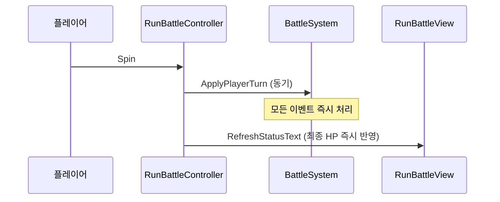
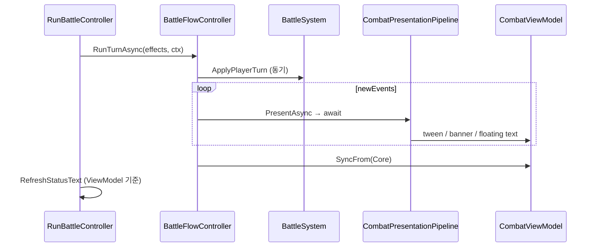

# Run Battle 전투 연출 연동

**Status**: completed  
**Started**: 2026-05-31  
**Finished**: 2026-06-01  
**Owner**: _(전투·UI 담당)_  
**Contributors**: _(없음)_  
**Related design-docs**: [`combat-core.md`](../../design-docs/combat-core.md), [`game-flow.md`](../../design-docs/game-flow.md)  
**Related ADR**: [ADR-0001](../../adr/0001-combat-turn-effect-pipeline.md), [ADR-0003](../../adr/0003-combat-presentation-replay.md)  
**Depends on**: [`feature-combat-presentation`](../completed/feature-combat-presentation.md) (완료), [`feature-game-flow-loop`](../active/feature-game-flow-loop.md) (RunBattle 씬 존재)

## Background (문제 상황)

[`feature-combat-presentation`](../completed/feature-combat-presentation.md)에서 Replay 연출 MVP(턴 배너, HP/Shield tween, 플로팅 데미지, `BattleFlowController`)를 **`Dev_Battle` + `BattleDevHarness`에만** 연동해 Play Mode 검증을 마쳤다.

실제 런 플레이 전투 씬 **`RunBattle`** 은 별도 Controller(`RunBattleController`)를 쓰며, Spin 시 **`BattleSystem.ApplyPlayerTurn`을 동기 호출**하고 Core `CombatParticipant` HP/Shield를 **즉시** HUD에 반영한다. 연출 파이프라인(`BattleFlowController`, `CombatViewModel`, Presenter)은 **전혀 연결되어 있지 않다**.

그 결과 **GameStart → 맵 → RunBattle** 경로에서 전투는 정상 진행되지만, 의도한 연출(턴 시작 배너, HP 트윈, 플로팅 데미지, 이펙트 간 순차 대기)은 **보이지 않는다**. 슬롯 패턴 하이라이트(`RunBattleView.SetSlotOutcomePresentation`)만 동작한다.

## Requirements (요구사항)

1. **RunBattle 씬**에서 Spin 1회 → 턴의 `CombatEvent`가 **순차 연출**된 뒤 다음 Spin 입력을 받는다 (ADR-0003 Replay).
2. Dev_Battle과 **동일한 presentation 스택**을 재사용한다 (`BattleFlowController`, `CombatPresentationPipeline`, Kind별 Presenter). Core/asmdef 변경 **없음**.
3. HUD HP/Shield는 **`CombatViewModel` 표시값** 기준으로 갱신·트윈한다. Core `CombatParticipant`에 UI 직접 바인딩하지 않는다.
4. **`PresentationContext`**에 crit·patternName을 전달한다 (`RunCombatRequestResolver` 결과의 `FinalRequest`에서).
5. 연출 중 **Spin 버튼 비활성** (`IsBusy` + phase gate). 연타·중복 턴 거부.
6. 턴 배너·플로팅 데미지용 **overlay root**를 RunBattle UI에 배치한다.
7. 승리/패배 후 Continue·Restart 흐름은 기존과 동일하게 유지한다.
8. **범위 밖:** Addressables VFX, 연출 스킵/2x, Core `BattleSystem` API 변경, 슬롯 릴 스핀 애니메이션.

## Goal

`RunBattle` 씬에서 Spin → 슬롯 결과 해석 → **`RunTurnAsync`** → 이벤트 순차 연출 → HUD sync까지 **Dev_Battle과 동일한 체감**을 제공한다. `GameStart`부터 Play Mode로 한 런 전투를 통과해 확인한다.

## Baseline (현재 상태 요약)

| 구성 | 역할 |
|------|------|
| `RunBattle.unity` + `RunBattleView.prefab` | 런 플레이 전투 UI (슬롯 5×3, HP 바, Spin/Continue/Restart) |
| `RunBattleController` | Spin → `ApplyPlayerTurn` 동기 → `RefreshStatusText` 즉시 갱신 |
| `RunBattleView` | UI 표시 (바 fill, 텍스트, 슬롯 패턴 강조) |
| `BattleDevHarness` | **참조 구현** — `RunTurnAsync`, ViewModel HUD, FloatingTextRoot |

**현재 Spin 흐름:** `HandleSpinClicked` → `_slotViewModel.Spin()` → `RunCombatRequestResolver` → `_converter.Convert` → **`_battle.ApplyPlayerTurn(playerEffects)` (동기)** → `RefreshStatusText()` (Core HP 즉시 반영).

**Dev_Battle vs Run Battle 차이:**

| 항목 | Dev_Battle | Run Battle (현재) |
|------|------------|-------------------|
| 턴 적용 | `await RunTurnAsync(...)` | `ApplyPlayerTurn(...)` 동기 |
| 연출 파이프라인 | O | **없음** |
| HUD 소스 | `CombatViewModel` | Core `CombatParticipant` |
| 턴 배너 / 플로팅 데미지 | `FloatingTextRoot` | **없음** |
| Spin 중 입력 잠금 | `_isBusy` | **없음** |

**목표 흐름 (구현 후):**

## Phases

---

### Phase 1 — Presentation 스택 wiring

- [x] `RunBattleController` — `CombatViewModel`, `CombatPresentationHost`, `BattleFlowController`, `CancellationTokenSource` 필드·초기화
- [x] `Awake`/`StartBattle` — `CombatPresentationPipeline.CreateDefault(host)` (`BattleDevHarness` 패턴)
- [x] `StartBattle` 직후 `_combatViewModel.SyncFrom(_battle)`
- [x] `CombatPresentationHost` — `LinkTarget`, status 갱신 콜백(`RefreshStatusText`), font 참조

**🔍 Review:** 컴파일 green. Play 진입 시 크래시 없음 (연출 미연동 상태 OK).

---

### Phase 2 — Spin → RunTurnAsync

- [x] `HandleSpinClicked` → `HandleSpinClickedAsync().Forget()` (또는 동등 async 경로)
- [x] `_flowController.RunTurnAsync(_battle, playerEffects, context, ct)` — 동기 `ApplyPlayerTurn` **제거**
- [x] `PresentationContext` — `FinalRequest.IsCritical`, `FinalRequest.PatternName`
- [x] Spin 버튼 — `CanApplyPlayerTurn && !IsBusy`일 때만 `interactable`
- [x] 연출 시작 시 즉시 비활성, `finally`에서 `RefreshStatusText`로 복구
- [x] `CombatEventConsoleLogger` — 연출 **완료 후** `LogEventsSince` (Dev Harness와 동일)
- [x] `OnDisable` / `OnDestroy` — `CancellationTokenSource.Cancel` + `#if DOTWEEN` `transform.DOKill(true)`

**🔍 Review:** Spin 연타 시 중복 턴 없음. Console 이벤트 로그는 연출 후 1회.

---

### Phase 3 — HUD·overlay (ViewModel + FloatingTextRoot)

- [x] `RefreshStatusText` — Player/Monster HP·Shield·HP fill을 **`_combatViewModel`** 값으로 표시
- [x] `RunBattleView` — 배너·플로팅 데미지용 **`Transform`/`RectTransform` root** 추가 (프리팹 + 씬)
- [x] `RunBattleController` — root를 `CombatPresentationHost.FloatingTextRoot`에 바인딩
- [x] prefab 재생성 필요 시 `SlotRogue > Game Flow > Rebuild Scene UI Prefabs` 후 diff 확인

**🔍 Review:** Spin 후 HP 바가 tween되며, 턴 배너·플로팅 데미지가 화면에 보임. multi-hit 시 순차 간격 확인.

---

### Phase 4 — Play 검증 (GameStart → RunBattle)

**담당:** Unity **Play Mode 수동 테스트** (프로그래머·담당자). 에이전트/CI는 Unity Play를 대체하지 않음. 코드 리뷰·단위 테스트 green은 Phase 4 전제 조건.

- [x] `GameStart` → 유물 → 맵 노드 → `RunBattle`: Resolving / EnemyTurn / PlayerTurn 배너 순서
- [x] 패턴 hit / base attack / heal / shield / 사망 시 연출·최종 HUD = Core state 일치
- [x] 승리 → Continue → 보상 씬 / 패배 → Restart 동작 유지
- [x] 연출 중 Spin 무시·버튼 비활성

**🔍 Review:** Dev_Battle과 체감이 유사한지 팀 Playtest 1회.

#### Play Mode 체크리스트 (RunBattle, 수동)

진입: Play **`GameStart`** → 유물 1개 선택 → **`RunMap`**에서 전투 노드(일반/Elite) 클릭 → **`RunBattle`** 로드.

| # | 시나리오 | 조작 | 기대 |
|---|----------|------|------|
| 1 | **플로우·배너** | Spin 1회 | 턴 배너 순서: Resolving(플레이어 전투) → (적 행동 시) EnemyTurn → PlayerTurn(룰렛). Console `[Combat]` 이벤트는 연출 **끝난 뒤** 1회 |
| 2 | **패턴 hit** | 패턴 매칭 Spin | 슬롯 셀·결과 텍스트 **즉시** 강조, 전투 연출은 순차. 플로팅 데미지·HP tween |
| 3 | **기본 공격** | 패턴 없음 Spin | Base attack 연출, HUD tween |
| 4 | **Shield / Heal** | 방패·하트 심볼 위주 Spin | Shield/Heal presenter, 바·HUD ViewModel 반영 |
| 5 | **multi-hit** | 고데미지·다타 Spin | 타격 순차 간격, 최종 HP = Console 스냅샷·화면 일치 |
| 6 | **연출 중 입력** | Spin 연타 | 중복 턴 없음, Spin `interactable` false |
| 7 | **승리** | 몬스터 HP 0까지 Spin | 연출 후 **CLAIM REWARD**, `RunReward` 씬 전환 |
| 8 | **패배** | 플레이어 HP 0 (적 턴 데미지) | **RETURN START**, `GameStart` 복귀 |
| 9 | **Dev 비교** (선택) | 동일 Request를 `Dev_Battle`에서 | 체감·이벤트 순서가 RunBattle과 유사 |

HUD 일치 확인: 턴 연출 **종료 직후** Player/Monster HP·Shield 텍스트·fill이 Core `CombatParticipant`와 같아야 함 (`SyncFrom` 후 `RefreshStatusText`).

Phase 4 전체 통과 후 체크리스트 `[x]` + Phase 5 문서 정리.

---

### Phase 5 — 문서 정리

- [x] 본 plan 체크리스트·Outcome·Follow-ups 갱신 후 `git mv` → `docs/exec-plans/completed/`
- [x] [`docs/STATUS.md`](../../STATUS.md) — Active 제거, Recently completed 추가
- [x] [`feature-combat-presentation`](../completed/feature-combat-presentation.md) Follow-ups — 본편 Run Battle 연동 완료 cross-ref
- [x] [`feature-game-flow-loop`](../active/feature-game-flow-loop.md) Notes — 전투 연출은 본 plan에서 처리 (Core 무변경 유지)
- [x] [`combat-core.md`](../../design-docs/combat-core.md) Presentation 섹션 — RunBattle 연동 한 줄 (필요 시)
- [x] inbound 참조 grep — `feature-run-battle-presentation` / active 경로 깨짐 없음

**🔍 Review:** `docs/INDEX.md`, `STATUS.md`, completed plan 상호 링크 일치.

---

## Notes

- **`feature-game-flow-loop`의 “전투 코드 수정 없음”** = Core·`BattleSystem`·asmdef 변경 없음. UI 계층 `RunBattleController` 수정은 본 plan 범위.
- **참조 구현:** `Assets/_Project/Scripts/UI/Combat/BattleDevHarness.cs` — `ApplyTurnAsync`, `RefreshStatusText`, `UpdateApplyTurnButtonState`, Host/Pipeline 초기화.
- Presenter·Tween 코드 **재작성 불필요** — wiring·HUD·prefab만.
- 슬롯 **릴 회전 연출**은 [`feature-slot-core`](../active/feature-slot-core.md) / 별도 plan. 본 plan은 **전투 이벤트 Replay**만.

## Completion

- **Finished**: 2026-06-01
- **Outcome**: `RunBattleController`에 Replay 스택 composition (`BattleFlowController`, `CombatViewModel`, Host/Pipeline). Spin → `RunTurnAsync`, ViewModel HUD·`presentation-overlay`, 턴 배너·플로팅 데미지·Spin 잠금. Core/asmdef 무변경. GameStart → RunBattle Playtest 통과.
- **Follow-ups**: ~~플로팅 데미지 prefab/SO 튜닝~~ ([`feature-floating-combat-text`](./feature-floating-combat-text.md), 2026-06-02 완료), ~~RunBattle `MonsterDefinition` SO 연동~~ (2026-06-02 반영), Addressables VFX, 연출 스킵·2x, `Dev_Slot` → `RunTurnAsync`
