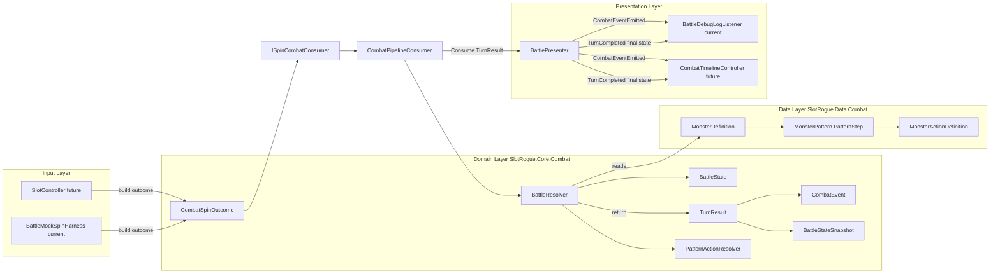
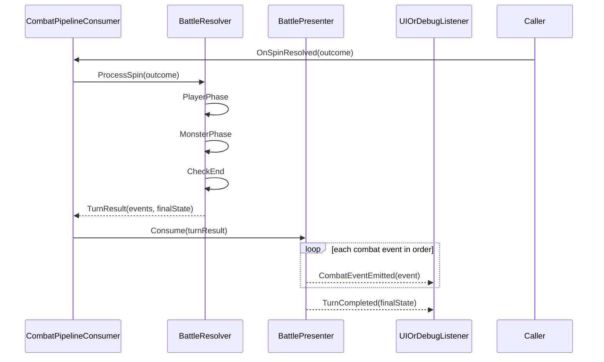

# Combat Core 이해 가이드 (개인용)

> **이 문서는 정규 거버넌스 대상이 아닙니다.**  
> `feature-combat-core` 구현을 스스로 따라 읽기 위한 메모입니다.  
> 공식 규칙·결정은 [`design-docs/combat-core.md`](../design-docs/combat-core.md), 구현 체크리스트는 [`exec-plans/completed/feature-combat-core.md`](../exec-plans/completed/feature-combat-core.md)를 봅니다.
>
> **2026-05-27 갱신:** 본 문서는 Phase B 스텁 이해용이다. 현재 구현은 [`feature-combat-turn-events`](../exec-plans/completed/feature-combat-turn-events.md) 기준(`TurnResult` / `CombatEvent`, ADR [`0001`](../adr/0001-combat-turn-event-log.md))으로 전환되었다. 최신 규칙은 `combat-core.md` C10을 우선한다.

---

## 이 가이드로 할 수 있는 것

- 전투 코어가 **왜** 슬롯/UI와 갈라져 있는지 이해하기
- `BattleResolver` → `BattlePresenter` → 씬(Mock)까지 **파일을 어떤 순서로** 열어볼지 정하기
- `BattleTest` 씬에서 버튼 한 번 누를 때 **숫자가 어떻게 바뀌는지** 따라가기
- EditMode 테스트 이름과 **설계 규칙 C1~C10**을 대응시키기

---

## 1. 한 줄 요약

**슬롯 1회 = 전투 1턴.**  
슬롯/Mock이 `attack`/`defense`를 넘기면 `ISpinCombatConsumer` 구현체(`CombatPipelineConsumer`)가 호출된다. 이 어댑터가 내부에서 `BattleResolver.ProcessSpin` 결과를 `BattlePresenter.Consume`에 전달하고, Presenter는 `CombatEvent` 스트림 + 턴 종료 스냅샷(`TurnCompleted`)을 UI에 전달한다.

지금은 **진짜 슬롯 UI·HP 바**가 없고, `BattleTest` 씬의 **Mock 버튼**으로 같은 경로를 검증한다.

---

## 2. Phase A / Phase B — 무엇을 나눴는가

| | Phase A | Phase B |
|---|---------|---------|
| **목표** | 규칙만 맞는지 증명 | Unity에서 한 턴이 도는지 확인 |
| **산출물** | `BattleResolver`, SO 타입, EditMode 테스트 | `ISpinCombatConsumer` 연결, `BattlePresenter`, Goblin SO, `BattleTest` 씬 |
| **완료 기준** | Test Runner 녹색 | Play Mode에서 Console 로그·버튼 동작 |

**왜 나눴나:** 로직을 `MonoBehaviour`에 넣지 않으면 테스트가 쉽고, 슬롯/UI 팀과 **경계(인터페이스·이벤트)** 가 명확해진다.

---

## 3. 아키텍처 — 누가 누구를 부르는가

```
[슬롯 (미래)] / [Mock 버튼 (지금)]
             │
             ▼
 ISpinCombatConsumer.OnSpinResolved(outcome)
             │
             ▼
 CombatPipelineConsumer
   ├─ resolver.ProcessSpin(outcome)
   └─ presenter.Consume(turnResult)
             │
             ├─ CombatEventEmitted (순서대로)
             └─ TurnCompleted(FinalState)
             │
             ▼
 [UI 타임라인 (미래)]  [BattleDebugLogListener (지금)]
```

### C10 — 가장 중요한 경계

| 방향 | 방식 | 금지 (MVP) |
|------|------|------------|
| 슬롯 → 전투 | `ISpinCombatConsumer.OnSpinResolved(CombatSpinOutcome)` **1회/스핀** | 슬롯↔전투 **전역 이벤트** |
| 전투 → UI | `TurnResult` 전달 + `BattlePresenter` C# `event` | Resolver가 UI 직접 참조 |

슬롯 팀은 **인터페이스만** 알면 되고, UI 팀은 **Presenter 이벤트만** 구독하면 된다.

### 레이어 다이어그램 (정적 구조)



### 한 스핀 시퀀스 (동적 흐름)



### 레이어 책임 요약

- Input Layer: 슬롯/Mock이 `CombatSpinOutcome`을 만들고 `ISpinCombatConsumer.OnSpinResolved`를 호출한다.
- Domain Layer: Resolver가 규칙 계산과 이벤트 기록을 수행하고 `TurnResult`를 반환한다.
- Data Layer: 몬스터 행동/패턴/수치를 SO로 제공한다.
- Presentation Layer: Presenter가 이벤트를 전달하고, UI/로그 리스너가 소비한다.

---

## 4. 코드 읽는 순서 (추천 45~60분)

| 순서 | 파일 | 볼 포인트 |
|------|------|-----------|
| 1 | `CombatSpinOutcome.cs` | 입력: `Attack`, `Defense` 두 정수 |
| 2 | `BattleState.cs` | 전투가 기억하는 필드 전부 |
| 3 | `CombatDamage.cs` | `max(0, atk - def)` (C2) |
| 4 | `BattleResolver.cs` | `ProcessSpin` → PlayerPhase → MonsterPhase → 승패 |
| 5 | `ISpinCombatConsumer.cs` | 슬롯이 호출할 계약 |
| 6 | `CombatPipelineConsumer.cs` | `OnSpinResolved`를 Resolver/Presenter 파이프라인으로 연결 |
| 7 | `BattlePresenter.cs` | `Consume(TurnResult)` → 이벤트 스트림 전달 |
| 7 | `BattleBootstrap.cs` | 씬에서 Resolver/Presenter 조립 |
| 8 | `BattleMockSpinHarness.cs` | Mock이 `OnSpinResolved` 호출하는 곳 |
| 9 | `BattleResolverTests.cs` | 규칙이 테스트로 고정된 예시 |
| 10 | `Assets/_Project/Data/Combat/Goblin*.asset` | 기획 데이터(SO) |
| 11 | `Assets/_Project/Scenes/BattleTest.unity` | Play Mode 수동 확인 |

경로 접두사: `Assets/_Project/Scripts/Core/Combat/` (전투 스크립트), `Assets/_Project/Scripts/Tests/Combat/` (테스트).

---

## 5. 핵심 타입 치트시트

| 타입 | 역할 |
|------|------|
| `CombatSpinOutcome` | 이번 스핀 결과 DTO (`readonly struct`) |
| `BattleState` | 현재 HP, `PatternIndex`, `PendingMonsterDefense`, `EndReason` |
| `BattleResolver` | 규칙 엔진. `ProcessSpin`으로 `TurnResult` 반환 |
| `CombatPipelineConsumer` | `ISpinCombatConsumer` 구현 어댑터(Resolver→Presenter 연결) |
| `MonsterDefinition` / `MonsterPattern` / `MonsterActionDefinition` | ScriptableObject — 수치·패턴은 **에셋**에서 |
| `BattlePresenter` | `TurnResult`를 받아 `CombatEventEmitted`/`TurnCompleted` 전달 |
| `BattleBootstrap` | `Awake`에서 Resolver + Presenter 생성 |
| `BattleMockSpinHarness` | 테스트용 가짜 스핀 (버튼) |
| `BattleDebugLogListener` | Presenter 이벤트 → `Debug.Log` |

### asmdef (폴더 경계)

- `SlotRogue.Core` — 전투 로직 (UnityEngine 최소 사용)
- `SlotRogue.Data` — SO 정의
- `SlotRogue.Core.Tests` — EditMode 테스트

---

## 6. 한 턴 안에서 일어나는 일 (C1, C3)

`BattleResolver.ProcessSpin` 흐름:

1. 이미 `IsBattleOver`면 **아무 것도 안 함**
2. **PlayerPhase** — `outcome.Attack > 0`일 때만 몬스터 HP 감소  
   - 몬스터 pending 방어(`PendingMonsterDefense`)를 C2식으로 소비
3. 플레이어 HP ≤ 0이면 **패배**로 턴 종료 이벤트를 기록하고 종료
4. **MonsterPhase** — 패턴 SO의 **현재** `PatternIndex` 행동 실행 후 인덱스 진행
5. **TryEndBattleFinal** — 몬스터 HP ≤ 0 → 승리, 플레이어 HP ≤ 0 → 패배
6. 턴 이벤트 목록 + 최종 상태를 `TurnResult`로 반환

**C3:** 같은 스핀 안에서 **플레이어 먼저, 몬스터 나중**.

**C9:** `attack == 0`이어도 턴은 진행된다 (몬스터 페이즈·패턴 인덱스는 돈다). PlayerPhase에서 몬스터 HP는 안 깎일 뿐.

---

## 7. Goblin 샘플로 숫자 따라가기

### 데이터 (에셋)

| 에셋 | 내용 |
|------|------|
| `Goblin.asset` | `MaxHp: 50` |
| `GoblinPattern.asset` | 0번 **Guard** → 1번 **Slash**, `Loop: true` |
| `Goblin_Guard.asset` | `Defend`, `DefendValue: 5` |
| `Goblin_Slash.asset` | `Attack`, `RawAttack: 10` |

`BattleBootstrap` 기본값: 플레이어 `MaxHp = 30`.

### Mock 버튼 (`BattleMockSpinHarness`)

| 버튼 | `CombatSpinOutcome` |
|------|---------------------|
| Attack 5 | `(5, 0)` |
| Pass 0 | `(0, 0)` |
| Defend 4 | `(0, 4)` — 플레이어 방어는 **몬스터가 Attack 할 때**만 소비 |

### 시나리오 A — 시작 후 **Attack 5** 한 번

**시작:** Player 30/30, Monster 50/50, `PatternIndex = 0`, pending = 0

| 단계 | 일 |
|------|-----|
| PlayerPhase | `damage = max(0, 5-0) = 5` → Monster **45** |
| MonsterPhase | 인덱스 0 = **Guard** → `PendingMonsterDefense = 5`, 인덱스 → **1** |
| 승패 | 없음 |

Console 예: Monster HP 45/50, Monster action: Defend (def=5).

### 시나리오 B — 이어서 **Attack 5** 한 번 더

**시작:** Monster 45, pending = 5, `PatternIndex = 1`

| 단계 | 일 |
|------|-----|
| PlayerPhase | `damage = max(0, 5-5) = 0` → Monster **45** 유지, pending **0** |
| MonsterPhase | 인덱스 1 = **Slash** → `max(0, 10-0) = 10` → Player **20** |
| 패턴 | 루프 → `PatternIndex` 다시 **0** |

### 시나리오 C — Slash 턴에 **Defend 4** 버튼

몬스터 Slash(10) vs 플레이어 defense 4:

- PlayerPhase: attack 0 → 몬스터 HP 변화 없음
- MonsterPhase: 플레이어 피해 `max(0, 10-4) = 6` → Player **24** (30에서 6만 깎임)

이게 테스트 `ProcessSpin_MonsterAttack_AppliesPlayerDefenseFromSpin`과 같은 규칙이다.

### 시나리오 D — Guard 직후 공격 없이 **Pass 0**

- PlayerPhase: attack 0 → 몬스터 HP 그대로
- **C7:** pending 5는 **소비되지 않고 유지** (다음 스핀까지)
- MonsterPhase: 패턴은 그대로 진행

테스트: `ProcessSpin_AttackZero_KeepsPendingDefense`.

---

## 8. 설계 규칙 ↔ 테스트 매핑

| 규칙 | 요약 | 테스트 (일부) |
|------|------|----------------|
| C2 | `max(0, atk - def)` | `ProcessSpin_MonsterAttack_AppliesPlayerDefenseFromSpin`, Defend 후 공격 시나리오 |
| C5 | 패턴 인덱스·루프 | `ProcessSpin_PatternIndex_AdvancesAndLoops` |
| C7 | 몬스터 Defend → **다음 스핀** PlayerPhase에서 소비 | `ProcessSpin_DefendThenAttack_...`, `ProcessSpin_AttackZero_KeepsPendingDefense` |
| C8 | HP≤0 승패, 동시 사망=패배 | `ProcessSpin_SimultaneousDeath_PrefersDefeat` 등 |
| C9 | attack 0이어도 턴·패턴 진행 | `ProcessSpin_AttackZero_StillAdvancesPatternIndex` |
| C10 | `OnSpinResolved` 경로 | `OnSpinResolved_MonsterHpZero_EndsWithVictory` |

테스트 실행: `Window > General > Test Runner > EditMode`, assembly `SlotRogue.Core.Tests`.

---

## 9. `BattlePresenter` — 지금 역할

현재 Presenter는 **상태 diff 계산기**가 아니라, `TurnResult`를 받아 UI 친화적으로 전달하는 **전달자**다.

동작:

1. `CombatPipelineConsumer.OnSpinResolved`가 `ProcessSpin` 결과를 `Consume`으로 전달
2. `Events`를 순서대로 `CombatEventEmitted`로 발행
3. 마지막에 `TurnCompleted(FinalState)` 발행

| 이벤트 | 언제 |
|--------|------|
| `CombatEventEmitted` | `TurnResult.Events`를 순회하며 순서대로 |
| `TurnCompleted` | 이벤트 발행이 끝난 뒤 1회 |

지금은 `BattleDebugLogListener`가 이를 Console에 출력한다. 실제 타임라인(대기/순차 재생)은 follow-up UI 작업에서 구현한다.

---

## 10. Play Mode 수동 확인

1. 씬 열기: `Assets/_Project/Scenes/BattleTest.unity`
2. Play
3. Console에서 `[Battle]` 로그 확인
4. Attack / Pass / Defend 버튼으로 시나리오 7절 재현

**EventSystem Missing Script:** Input System 패키지 GUID가 씬과 안 맞을 때 발생. exec-plan Notes 참고 — `GameObject > UI > Event System`으로 재생성.

---

## 11. 아직 안 된 것 (헷갈리지 말 것)

| 항목 | 상태 |
|------|------|
| 실제 슬롯 → `OnSpinResolved` | 슬롯 코어 연동 후 |
| HP 바, 피격/승패 연출 | `SlotRogue.UI` 등 별도 작업 |
| Buff / Special 몬스터 행동 | Resolver에 `case`만 있고 MVP 동작 없음 |
| 전역 이벤트 버스 | MVP에서 의도적으로 미사용 (C10) |

---

## 12. FAQ

**`ProcessSpin`과 `OnSpinResolved` 차이?**  
`OnSpinResolved`는 슬롯/Mock이 호출하는 인터페이스 진입점이고, 실제 규칙 계산은 내부에서 `ProcessSpin`이 한다.

**Resolver가 이벤트를 방송하지 않는 이유는?**  
B/B 선택 기준으로 Resolver는 `TurnResult`를 return만 한다. 호출자가 Presenter에 전달하고, Presenter가 UI 이벤트를 발행한다.

**몬스터 Defend는 왜 다음 스핀에 막히나? (C7)**  
C3 때문에 **같은 스핀**의 PlayerPhase는 Defend보다 **먼저** 끝난다. Guard는 “다음에 맞을 공격 1회”를 준비하는 행동이다.

**동시에 둘 다 HP 0이면? (C8)**  
패배 우선 (`ProcessSpin_SimultaneousDeath_PrefersDefeat`).

**전투 끝난 뒤 스핀을 넣으면?**  
`ProcessSpin` 초반에 return — 상태·패턴 인덱스 유지 (`ProcessSpin_WhenBattleOver_IsNoOp`).

---

## 13. 더 읽을 문서

| 문서 | 용도 |
|------|------|
| [`design-docs/combat-core.md`](../design-docs/combat-core.md) | C1~C10 규칙 전문 |
| [`exec-plans/completed/feature-combat-core.md`](../exec-plans/completed/feature-combat-core.md) | Phase A/B(초기) 구현 기록 |
| [`exec-plans/completed/feature-combat-turn-events.md`](../exec-plans/completed/feature-combat-turn-events.md) | `TurnResult`/`CombatEvent` 전환 구현 기록 |
| [`guides/unity-setup.md`](./unity-setup.md) | Unity 버전·폴더 컨벤션 |
| [`guides/coding-style.md`](./coding-style.md) | C# 스타일 |

---

## 14. 스스로 점검해 보기 (체크리스트)

- [ ] `CombatSpinOutcome`이 슬롯→전투 **유일 입력**인 이유를 말할 수 있다
- [ ] PlayerPhase / MonsterPhase 순서를 그림 없이 설명할 수 있다
- [ ] Goblin 1턴 Guard 후 2턴 Attack 5일 때 몬스터 HP가 왜 45인지 계산할 수 있다
- [ ] `TurnResult`를 왜 호출자가 Presenter에 전달하는지(B/B) 설명할 수 있다
- [ ] EditMode에서 실패한 테스트 이름만 보고 어느 규칙이 깨졌는지 짐작할 수 있다

---

*작성 목적: feature-combat-core 구현 복기용. 팀 온보딩 공식 문서로 승격하려면 GOVERNANCE·STATUS 반영 여부를 별도로 결정.*
